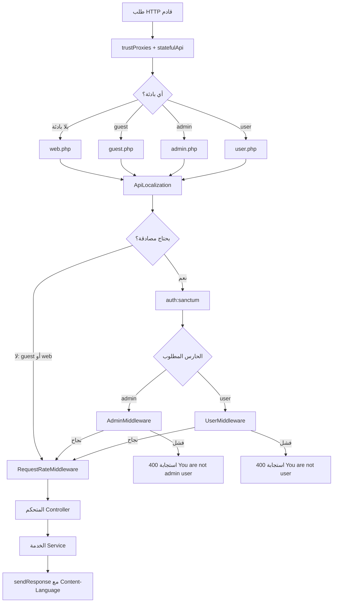
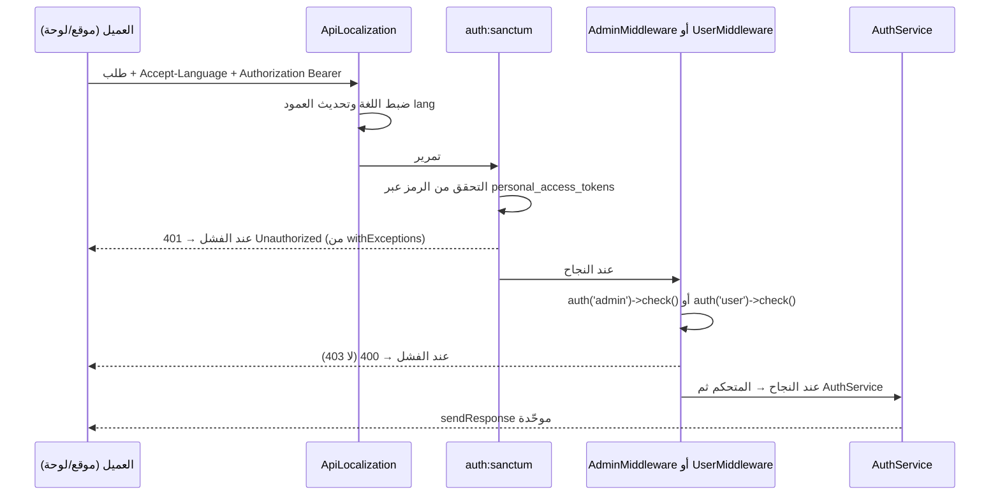
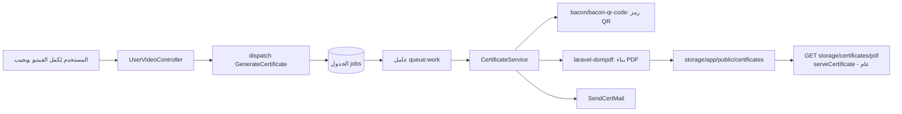

# الفصل الأول: نظرة عامة على الواجهة الخلفية (Backend) لمنصة «أمان»

## ما ستتعلمه في هذا الفصل

- ما هو مشروع «أمان» من منظور الواجهة الخلفية، وموقعه داخل الـ monorepo المكوّن من ثلاثة تطبيقات.
- التقنيات والحِزم (packages) المستخدمة فعليًا، ولماذا اختير كلٌّ منها.
- بنية المجلدات في `backend/`، وأين توضع كل مسؤولية (المتحكمات، الخدمات، المهام، القوالب البريدية…).
- كيف يعمل التوجيه (routing) في هذا المشروع، وهو توجيه **غير قياسي**: لا يوجد `routes/api.php` إطلاقًا.
- ما هي البرمجيات الوسيطة (middleware) الأربع المخصّصة، وترتيب تنفيذها، وما تفعله كل واحدة بالتفصيل.
- كيف تُعالَج الاستثناءات (exceptions) وتُوحَّد صيغة الاستجابة.
- ملفات الإعدادات (`config/*.php`) وما الذي يقرأه المشروع من `.env`.
- طريقة التشغيل محليًا، وتشغيل قائمة الانتظار (queue)، وتشغيل الاختبارات، وما المخاطر المعروفة في الإعداد الحالي.

---

## 1. تعريف المشروع وموقعه في الـ Monorepo

### المفهوم أولًا

الـ **monorepo** هو مستودع واحد يحتوي عدّة تطبيقات مستقلة في البناء (build) لكنها مترابطة في العقد (contract) الذي يجمعها. الفائدة أن تعديل «عقد» واحد — مثل شكل استجابة الـ API — يظهر أثره في مكان واحد قابل للمراجعة.

### التطبيق في «أمان»

المستودع يضم ثلاثة تطبيقات تتحدث إلى **واجهة برمجية واحدة**:

| المجلد | التقنية | المنفذ (port) | الجمهور |
|---|---|---|---|
| `backend/` | Laravel 11 + Vite (أصول Blade فقط) | `8000` | الواجهة البرمجية المشتركة |
| `dashboard/` | Vite + React 19 + TypeScript | `5173` | لوحة تحكم المشرفين |
| `website/` | Next.js 16 | `3000` | الموقع العام للمستخدمين |

الواجهة الخلفية هي **المصدر الوحيد للحقيقة**: المصادقة، الصلاحيات، الترجمة، توليد الشهادات، والتقارير. وهذا الفصل يخصّ `backend/` فقط.

---

## 2. التقنيات والإصدارات

### 2.1 المنصة الأساسية

| العنصر | القيمة |
|---|---|
| إطار العمل | `laravel/framework` بقيد `^11.9`، والمثبّت فعليًا **`v11.55.0`** |
| PHP المطلوب في `composer.json` | `^8.2` |
| PHP المثبّتة في `config.platform` | `8.3.32` (Composer يحلّ التبعيات على أساسها) |
| PHP في سطر الأوامر المحلي | `8.4.22` — **وهذا اختلاف يجب الانتباه له** |
| مكوّنات Symfony | `v7.4.x` |
| PHPUnit | `11.5.56` |

> ملاحظة مهمّة لطلاب Laravel: هذا مشروع **Laravel 11** بهيكل «مبسّط» (streamlined skeleton). لذلك **لا يوجد** `app/Http/Kernel.php` ولا `app/Exceptions/Handler.php`. كل ما كان يُسجَّل فيهما سابقًا انتقل إلى ملف واحد: `bootstrap/app.php`.

### 2.2 التحميل التلقائي (autoload)

في `composer.json`، مساحات الأسماء بمعيار PSR-4:

- `App\` → `app/`
- `Database\Factories\`
- `Database\Seeders\`

وإضافةً إلى ذلك يُحمَّل ملف واحد مباشرةً عبر مفتاح `files`:

```
app/Helpers/general.php
```

أي أن كل الدوال المعرَّفة في `general.php` متاحة عالميًا في كل المشروع دون استيراد.

### 2.3 الحِزم الإنتاجية (`require`) والغرض منها

| الحزمة | الإصدار المثبّت | الغرض |
|---|---|---|
| `laravel/sanctum` | `v4.3.3` | مصادقة الـ API برموز حاملة (bearer tokens)، مع تمكين `statefulApi()` |
| `laravel/telescope` | `v5.21.0` | واجهة تنقيح (debug) مرفوعة على مسار مخصّص: `tel513462` |
| `laravel/tinker` | `v2.11.1` | صدفة تفاعلية: `php artisan tinker` |
| `spatie/laravel-permission` | `6.25.0` | الأدوار والصلاحيات (`Role`، `Permission`) |
| `spatie/laravel-translatable` | `6.14.1` | أعمدة قابلة للترجمة مخزّنة كـ JSON |
| `maatwebsite/excel` | `3.1.69` | تصدير XLSX/CSV (انظر `app/Exports/CollectionExport.php`) |
| `barryvdh/laravel-dompdf` | `v3.1.2` (مع `dompdf/dompdf v3.1.6`) | توليد ملفات PDF للشهادات؛ إعداداته في `config/dompdf.php` |
| `bacon/bacon-qr-code` | `v3.1.1` | رموز QR على الشهادات |
| `league/csv` | `9.28.0` | قراءة وكتابة CSV |
| `laravel-lang/lang` | `15.32.0` | ترجمات جاهزة لرسائل التحقق والمصادقة |

من التبعيات غير المباشرة الجديرة بالذكر: `guzzlehttp/guzzle 7.15.1`، `nesbot/carbon 3.13.1`، `monolog 3.10.0`، `league/flysystem`، `ramsey/uuid`، `archtechx/enums`، `ezyang/htmlpurifier`، `dragonmantank/cron-expression`، `thecodingmachine/safe`، و`laravel/sentinel@v1.1.0`. مجموع حِزم الإنتاج **111** حزمة.

### 2.4 حِزم التطوير (`require-dev`)

`fakerphp/faker` (بيانات وهمية)، `laravel/pail` (متابعة السجلّات مباشرةً)، `laravel/pint` (منسّق كود)، `laravel/sail` (Docker)، `mockery/mockery`، `nunomaduro/collision` (عرض أخطاء أنيق في الطرفية)، `phpunit/phpunit ^11.0.1`، `squizlabs/php_codesniffer ^4.0`.

### 2.5 أصول الواجهة (frontend assets) داخل الواجهة الخلفية

ملف `backend/package.json` من نوع `"type": "module"`، وسكربتاته: `dev` = `vite`، و`build` = `vite build`. تبعيات التطوير: `laravel-vite-plugin ^1.0`، `vite ^5.0`، `tailwindcss ^3.4.13`، `postcss`، `autoprefixer`، `axios`، `concurrently`.

وملف `vite.config.js` يحتوي إضافة واحدة فقط:

```js
laravel({ input: ['resources/css/app.css', 'resources/js/app.js'], refresh: true })
```

لا إضافة React ولا أي إطار عمل — أصول **Blade فقط**. هذا يوضّح أن الواجهة الخلفية لا تُصيّر (render) واجهات SPA، بل تخدم JSON وقوالب Blade بسيطة (مثل `welcome` وقوالب الشهادات والبريد).

---

## 3. بنية المجلدات

### 3.1 داخل `app/`

```
app/
├── Console/Commands/        أوامر artisan مخصّصة
├── Enums/                   تعدادات (enums) لثوابت النطاق
├── Exports/                 أصناف تصدير Excel
├── Helpers/                 دوال ومساعدات عامة
├── Http/
│   ├── Controllers/
│   │   ├── Admin/Concerns/  متحكمات لوحة التحكم + سلوكيات مشتركة
│   │   └── User/            متحكمات المستخدم النهائي
│   ├── Middleware/API/      البرمجيات الوسيطة الخاصة بالـ API
│   ├── Requests/            أصناف FormRequest للتحقق
│   ├── Resources/           أصناف JsonResource لتشكيل المخرجات
│   └── Traits/
│       ├── Controller/      سمات (traits) تُستخدم في المتحكمات
│       └── Model/           سمات تُستخدم في النماذج
├── Jobs/                    مهام قائمة الانتظار
├── Mail/                    أصناف Mailable
├── Models/                  نماذج Eloquent
├── Providers/               مزوّدو الخدمة
└── Services/                منطق العمل (business logic)
```

### 3.2 قاعدة معمارية أساسية: المنطق في `Services` لا في المتحكمات

المتحكم مسؤول عن: قراءة الطلب، استدعاء خدمة، إرجاع استجابة. أما القواعد والحسابات فتعيش في `app/Services/`:

| الخدمة | المسؤولية |
|---|---|
| `app/Services/AuthService.php` | تسجيل الدخول/الخروج وإدارة الرموز |
| `app/Services/CertificateService.php` | بناء الشهادة (PDF + QR) |
| `app/Services/FailedValidation.php` | توحيد شكل أخطاء التحقق |
| `app/Services/SendUserOTPService.php` | إرسال رمز التحقق عبر SMS |
| `app/Services/SendEmailOTPService.php` | إرسال رمز التحقق عبر البريد |
| `app/Services/GeneralGraph.php` | بيانات المخططات العامة |
| `app/Services/UserGraph.php` | مخططات المستخدمين |
| `app/Services/ReportUserGraph.php` | تقارير المستخدمين |
| `app/Services/ReportCertificateGraph.php` | تقارير الشهادات |

### 3.3 التعدادات في `app/Enums/`

`AnswerOption`، `ContactStatus`، `ContactType`، `Lang`، `NotificationTitle`، `NotificationType`، `Sex`، `VideoPaymentStatus`، `VideoStatus`.

الفائدة التعليمية: بدل تمرير نصوص حرّة مثل `"paid"` في كل مكان، يُستخدم تعداد يمنع الأخطاء المطبعية ويجعل القيم المسموحة موثَّقة في الكود نفسه.

### 3.4 المهام والبريد

- `app/Jobs/GenerateCertificate.php` — المهمّة الوحيدة في المشروع، وهي **توليد الشهادة**. ولأنها مهمّة في قائمة انتظار فلا بد من تشغيل عامل (worker) وإلا لن تُولَّد أي شهادة.
- القوالب البريدية (Mailables): `SendCertMail`، `SendCodeMail`، `SendNotificationMail`، `SendReplyMail`.

### 3.5 الأوامر المخصّصة

`app/Console/Commands/CompressProjectFolders.php` و`app/Console/Commands/ConvertMsgJson.php`. وكلاهما **غير مجدول** — يُنفَّذان يدويًا.

---

## 4. التوجيه (Routing) — أهم ما يميّز هذا المشروع

### 4.1 المفهوم أولًا

في Laravel 11 يُعرَّف التوجيه داخل `bootstrap/app.php` عبر `withRouting()`. الافتراضي أن تُمرَّر ملفات `web:` و`api:`. لكن هذا المشروع اختار طريقًا آخر: مرّر `commands:` و`health:` فقط، وعرّف **كل** المسارات داخل الإغلاق (closure) الخاص بالمعامل `then:`.

### 4.2 الكود الفعلي

```php
return Application::configure(basePath: dirname(__DIR__))
    ->withRouting(
        commands: __DIR__.'/../routes/console.php',
        health: '/up',
        then: function () {
            Route::middleware([ApiLocalization::class, 'web', RequestRateMiddleware::class])
                ->group(base_path('routes/web.php'));

            Route::middleware([ApiLocalization::class, RequestRateMiddleware::class])
                ->prefix('guest')
                ->group(base_path('routes/guest.php'));

            Route::middleware([ApiLocalization::class, 'auth:sanctum', AdminMiddleware::class, RequestRateMiddleware::class])
                ->prefix('admin')
                ->group(base_path('routes/admin.php'));

            Route::middleware([ApiLocalization::class, 'auth:sanctum', UserMiddleware::class, RequestRateMiddleware::class])
                ->prefix('user')
                ->group(base_path('routes/user.php'));
        },
    )
```

**استنتاج جوهري: لا يوجد `routes/api.php` في هذا المشروع.** من يبحث عن مسار ما فليبحث في الملفات الأربعة أدناه فقط.

### 4.3 جدول مجموعات المسارات

| البادئة (prefix) | الملف | عدد الأسطر | مكدّس البرمجيات الوسيطة بالترتيب | الجمهور |
|---|---|---|---|---|
| *(لا بادئة)* | `routes/web.php` | — | `ApiLocalization`, `'web'`, `RequestRateMiddleware` | Telescope، الفحص الصحي، الشهادة العامة |
| `guest` | `routes/guest.php` | 84 | `ApiLocalization`, `RequestRateMiddleware` | الموقع واللوحة قبل الدخول |
| `admin` | `routes/admin.php` | 151 | `ApiLocalization`, `'auth:sanctum'`, `AdminMiddleware`, `RequestRateMiddleware` | لوحة التحكم |
| `user` | `routes/user.php` | 59 | `ApiLocalization`, `'auth:sanctum'`, `UserMiddleware`, `RequestRateMiddleware` | الموقع بعد الدخول |

### 4.4 مسارات `web.php` تحديدًا

| الطريقة | المسار | الوجهة | الاسم |
|---|---|---|---|
| `GET` | `/` | `view('welcome')` | — |
| `GET` | `storage/certificates/{pdf}` | `User\UserVideoController@serveCertificate` | `guest.storage.certificate` |
| `GET` | `/up` | الفحص الصحي المدمج في Laravel 11 | — |

المسار الثاني مهمّ لأنه **عام (public)**، أي يجب أن يعمل بلا مصادقة. وهذه النقطة سبّبت مشكلة حقيقية سنشرحها في قسم Telescope.

### 4.5 لا توجد أسماء مستعارة (aliases) للبرمجيات الوسيطة

الدالة `$middleware->alias()` **لم تُستدعَ أبدًا** في هذا المشروع. لذلك تُشار البرمجيات الوسيطة المخصّصة بالاسم الكامل المؤهَّل (FQCN) كما ترى في الكود أعلاه، والاستثناء الوحيد هو المجموعة المدمجة `'web'` والحارس `'auth:sanctum'`.

---

## 5. البرمجيات الوسيطة (Middleware)

### 5.1 ملاحظة تصميمية

جميع البرمجيات الوسيطة الأربع **ترث** من `App\Http\Controllers\BaseApiController`. السبب العملي: للوصول إلى الدالة `sendResponse()` وإرجاع استجابة موحّدة الشكل عند الرفض. (هذا اختيار غير تقليدي — القاعدة الشائعة أن تكون البرمجية الوسيطة صنفًا مستقلًا، لكن فهمَ الموجود أهم من نقده.)

### 5.2 `ApiLocalization` — تحديد اللغة

المسار: `app/Http/Middleware/API/ApiLocalization.php`

```php
$localeHeader = $request->header('Accept-Language');

if ($localeHeader) {
    $locale = explode(',', $localeHeader)[0];
    $locale = strtolower(explode('-', $locale)[0]);
} else {
    $locale = config('app.locale');
}

if (!in_array($locale, config('app.supported_languages'))) {
    $locale = config('app.locale');
}

app()->setLocale($locale);

if (auth()->check()) {
    auth()->user()->update(['lang' => $locale]);
}

$response = $next($request);
$response->headers->set('Content-Language', $locale);
```

خطواتها بالتفصيل:

1. تقرأ ترويسة `Accept-Language`، وتأخذ **العنصر الأول** ثم **الوسم الفرعي الأساسي** فقط — أي `ar-SA,en;q=0.9` تصبح `ar`.
2. تتحقق أن اللغة ضمن `config('app.supported_languages')` = `['en','ar']`، وإلا ترجع إلى `config('app.locale')`.
3. تضبط لغة التطبيق بـ `app()->setLocale()`.
4. **إن كان المستخدم مُصادَقًا، تحدّث العمود `lang` في سجلّه** — أي أن كل طلب من مستخدم مسجَّل يسبّب عملية `UPDATE` على قاعدة البيانات.
5. تضيف ترويسة `Content-Language` على الاستجابة.

هذه الوسيطة تعمل على **المجموعات الأربع جميعًا**، لذلك كل واجهة أمامية تُرسل `Accept-Language` مع كل طلب.

### 5.3 `AdminMiddleware`

المسار: `app/Http/Middleware/API/AdminMiddleware.php`. تتحقق من `auth('admin')->check()`، وإن فشلت ترجع:

```php
sendResponse(false, [], "You are not admin user", null, 400)
```

⚠️ لاحظ رمز الحالة: **`400`** وليس `403` ولا `401`.

### 5.4 `UserMiddleware`

المسار: `app/Http/Middleware/API/UserMiddleware.php`. تتحقق من `auth('user')->check()`، وإلا `sendResponse(false, [], "You are not user", null, 400, $request)` — أيضًا **`400`**.

> أثر عملي: منطق «تسجيل الخروج التلقائي عند 401» في الواجهتين الأماميتين **لن يُفعَّل** في هذه الحالتين، لأن الرمز المُعاد 400.

### 5.5 `RequestRateMiddleware` — الاسم مُضلِّل

المسار: `app/Http/Middleware/RequestRateMiddleware.php`.

الاسم يوحي بأنها **محدِّد معدّل (rate limiter)**، لكنها **ليست كذلك**. ما تفعله فعلًا: تُنشئ صفًّا جديدًا في نموذج `App\Models\RequestRate` عند **كل** طلب، يحوي:

| الحقل | المحتوى |
|---|---|
| `method` | طريقة HTTP |
| `url` | المسار المطلوب |
| `rate` | القيمة الثابتة `1` |
| `ip` | عنوان IP |
| `referrer` | مصدر الإحالة |
| body | **كامل جسم الطلب** بصيغة JSON |
| headers | **كامل الترويسات** بصيغة JSON |

وهي تعمل على المجموعات الأربع. عمليًا هي **سجل تدقيق (audit log)**، لكن بثلاث تبعات: (أ) عملية `INSERT` واحدة لكل طلب — تضخيم كتابة؛ (ب) تخزين كلمات المرور ورموز OTP بنص صريح لأنها جزء من جسم الطلب؛ (ج) تخزين الرموز الحاملة لأنها في الترويسات. هذه من أبرز نقاط الخطر في المشروع.

### 5.6 كتلة `withMiddleware()`

```php
$middleware->trustProxies(at: '*');
$middleware->statefulApi();
$middleware->validateCsrfTokens(except: ['*']);
$middleware->appendToGroup('telescope-auth', [
    \Illuminate\Auth\Middleware\AuthenticateWithBasicAuth::class,
]);
$middleware->validateCsrfTokens(except: ['telescope/*']);
```

شرح كل سطر:

- `trustProxies(at: '*')` — يجعل Laravel يثق بترويسة `X-Forwarded-Proto` القادمة من وسيط nginx الذي ينهي TLS، حتى تُبنى الروابط (بما فيها روابط PDF) بـ `https` لا `http`.
- `statefulApi()` — يُقدِّم `Laravel\Sanctum\Http\Middleware\EnsureFrontendRequestsAreStateful`، أي يسمح بمصادقة قائمة على الكوكيز للواجهات على نطاقات محددة.
- `validateCsrfTokens(except: ['*'])` — **يُعطّل حماية CSRF على كل المسارات**. ثم يُستدعى النداء ثانيةً باستثناء `telescope/*` (وهو استثناء زائد بلا أثر بعد `'*'`).
- `appendToGroup('telescope-auth', …)` — مجموعة مخصّصة بمصادقة HTTP أساسية، لكنها **لا تُستخدم من أي مسار** في المشروع.

### 5.7 التعليق الحامل للمعنى حول Telescope

في الكود تعليق طويل يجب على الطالب قراءته لأنه يوثّق عِلّة حقيقية: كان `Telescope\Authorize` مُضافًا إلى مجموعة `web` بالكامل، فحجب **كل** مسارات web — بما فيها مسار الشهادة العام `storage/certificates/{pdf}` — وأرجع `403` للزوّار في بيئة الإنتاج. السبب: إغلاق البوابة `viewTelescope` يستقبل معاملًا `$user` بلا تحديد نوع (untyped)، وLaravel يعامل ذلك بمنع الزائر. الحل المتّبع: عدم إضافتها إلى `web`، والاعتماد على `config('telescope.middleware')` التي تساوي `['web', Authorize::class]` لحماية مسارات Telescope وحدها.

### 5.8 مخطط تدفّق الطلب



---

## 6. معالجة الاستثناءات

في `withExceptions()` مُعالِجان مخصّصان فقط، وكلاهما يعمل **للطلبات التي تتوقع JSON** حصرًا (`$request->expectsJson()`)، وكلاهما يُنشئ `new BaseApiController()` مباشرةً:

| الاستثناء | الاستجابة |
|---|---|
| `Illuminate\Auth\AuthenticationException` | `sendResponse(false, [], "Unauthorized", [], 401)` |
| `Symfony\...\NotFoundHttpException` | `sendResponse(false, [], "EndPoint Is Not Found", [], 404)` |

أما **أخطاء التحقق (validation)** فلا تُشكَّل هنا، بل في:

- `app/Services/FailedValidation.php`
- `app/Helpers/CustomFormRequest.php`

وشكلها النهائي هو العقد الذي تعتمد عليه الواجهتان في دالة `handleFormError`:

```json
{ "message": "…", "errors": { "field": ["msg"] } }
```

---

## 7. المصادقة والحُرّاس (Guards)

### 7.1 `config/auth.php`

| المفتاح | القيمة |
|---|---|
| `defaults.guard` | `sanctum` |
| `defaults.passwords` | `admins` |
| الحارس `web` | جلسة (session) + مزوّد `users` |
| الحارس `admin` | sanctum + مزوّد **`admins`** |
| الحارس `user` | sanctum + مزوّد `users` |
| المزوّد `users` | `App\Models\User` |
| المزوّد `admins` | `App\Models\Admin` |

⚠️ `defaults.passwords = 'admins'` لكن قسم `passwords` لا يعرّف إلا وسيطًا (broker) واحدًا باسم `users`. أي أن إعادة تعيين كلمة المرور عبر الوسيط الافتراضي سترمي خطأً — وسيط `admins` غير موجود.

### 7.2 `config/sanctum.php`

| المفتاح | القيمة |
|---|---|
| `guard` | `['web']` |
| `expiration` | `null` — **الرموز لا تنتهي صلاحيتها أبدًا** |
| `token_prefix` | من `SANCTUM_TOKEN_PREFIX` |
| `stateful` | من `SANCTUM_STATEFUL_DOMAINS` = `localhost,localhost:8000,localhost:5173,localhost:3000,127.0.0.1` |

### 7.3 مخطط تدفّق المصادقة



### 7.4 الصلاحيات — `config/permission.php`

الإعداد قياسي تمامًا من Spatie: النموذجان `Spatie\Permission\Models\Permission` و`Role`، أسماء الجداول والأعمدة الافتراضية، و:

| المفتاح | القيمة |
|---|---|
| `register_permission_check_method` | `true` |
| `register_octane_reset_listener` | `false` |
| `teams` | `false` |
| `enable_wildcard_permission` | `false` |
| `display_permission_in_exception` | `false` |
| `display_role_in_exception` | `false` |

مع كتلة `cache` حاضرة. لوحة التحكم تُخفي/تُظهر عناصر الواجهة بناءً على **نفس** مفاتيح الأفعال هذه.

---

## 8. الإعدادات (Config) والبيئة

### 8.1 مبدأ عام يجب استيعابه

كل ملف في `config/` يقرأ من `.env` عبر `env('KEY', 'default')`. لذلك **القيمة الافتراضية في `config` ليست بالضرورة القيمة العاملة**. الجدول التالي يفرّق بينهما بوضوح.

| المجال | الافتراضي في `config` | الفعلي في `.env` |
|---|---|---|
| قاعدة البيانات | `sqlite` | **`mysql`** → `127.0.0.1:3306`، قاعدة `aman`، مستخدم `root` |
| قائمة الانتظار | `database` | `database` |
| الذاكرة المؤقتة (cache) | `database` | `database` |
| الجلسة (session) | `database` | **`cookie`**، بعمر 120 دقيقة |
| البريد | `log` | **`log`** — لا يُرسل بريد فعليًا محليًا |
| نظام الملفات | `local` | `local` |

### 8.2 قاعدة البيانات

`config/database.php` يعرّف الاتصالات: `sqlite`، `mysql`، `mariadb`، `pgsql`، `sqlsrv`، وكذلك `redis` (بمخزنَي `default` و`cache`). وفي `AppServiceProvider::boot()` يُضبط:

```php
Schema::defaultStringLength(191);
```

وهذا ضروري لتجاوز حدّ طول الفهرس (index) في MySQL مع `utf8mb4`.

### 8.3 قائمة الانتظار

- الجدول: `jobs`، الطابور: `default`.
- `batching.table` = `job_batches`.
- الفاشلة: `failed.driver` = `database-uuids`، الجدول `failed_jobs`.
- المهمّة الوحيدة `GenerateCertificate` ⇒ **بدون عامل يعمل (`queue:work` أو `queue:listen`) لن تُولَّد أي شهادة**.

### 8.4 البريد

`MAIL_MAILER=log`. ومع ذلك مُعرَّف مُرسِل SMTP على `smtp.gmail.com:587` بتشفير tls والمستخدم `xv.neer@gmail.com`، وحقل `from` هو نفس العنوان بالاسم `${APP_NAME}`. كما يوجد مُرسِل `failover` = `[smtp, log]`.

### 8.5 أنظمة الملفات

| القرص (disk) | الجذر | ملاحظات |
|---|---|---|
| `local` | `storage/app` | `'serve' => true` |
| `public` | `storage/app/public` | الرابط `APP_URL.'/storage'`، الظهور `public` |
| `s3` | — | متغيرات AWS فارغة |

الرابط الرمزي: `public/storage` → `storage/app/public`. والشهادات تُخزَّن في `storage/app/public/certificates`.

### 8.6 السجلّات و CORS

- `LOG_CHANNEL=stack`، `LOG_STACK=single`، `LOG_LEVEL=debug`. ويوجد مسجّل مخصّص: `app/Helpers/CustomLogger.php`.
- `config/cors.php`: `paths` = `['*']`، الطرق `*`، **المصادر (origins) `*`**، الترويسات `*`، و`supports_credentials => false`.

### 8.7 مفاتيح `config/app.php` المخصّصة

| المفتاح | متغير البيئة |
|---|---|
| `supported_languages` | ثابت: `['en','ar']` |
| `aman_api` | `AMAN_API` |
| `platform` | `PLATFORM` |
| `platform_cert` | `PLATFORM_CERT` |
| `admin_email` | `ADMIN_EMAIL` |
| `file_url` | `APP_FILE_URL` |

⚠️ في `.env` الحالي **`PLATFORM=` و`PLATFORM_CERT=` فارغان**. وهذا بالضبط موضوع آخر تعديلين في المستودع: `07b5b62` (رفض قيمة `PLATFORM` الفارغة بدل توليد PDF فارغ) و`f8db02f` (إيقاف عكس الأسماء العربية على canvas الشهادة). درس عملي: إعداد فارغ قد يُنتج مخرجًا صامتًا خاطئًا بدل خطأ صريح.

### 8.8 بقية ملفات الإعدادات

| الملف | المحتوى |
|---|---|
| `config/aman.php` | كتالوج فيديو مكتوب في الكود: روابط bunny.net بصيغة `.m3u8` لكل لغة، السعر، عنوان ووصف بالعربية والإنجليزية، وشعارات مبنية من `env('AMAN_API')` |
| `config/constants.php` | `per_page => 20`، و`list_validations` (قواعد مشتركة لـ per_page/page/sort_direction/date_from/date_to)، و`otpDelay => 0`، و`gender` |
| `config/msegat.php` | بوابة SMS: `MSEGAT_API_KEY` / `USER_NAME` / `USER_SENDER`، والرابط `https://www.msegat.com/gw/sendsms.php` |
| `config/map.php` | جدول أكواد الدول ISO الرقمية لمخططات الشهادات والتحليلات، مع `cache_code '106'` لإبطال ذاكرة مؤقتة عمرها شهر، وقالب flagcdn |
| `config/dompdf.php` | إعدادات توليد PDF |
| `config/telescope.php` | انظر القسم 9 |
| `config/permission.php` | انظر القسم 7.4 |

---

## 9. مزوّدو الخدمة (Service Providers)

ملف `bootstrap/providers.php` يسجّل مزوّدَين فقط: `App\Providers\AppServiceProvider` و`App\Providers\TelescopeServiceProvider`.

### 9.1 `AppServiceProvider::boot()`

يفعل خمسة أمور:

1. `Schema::defaultStringLength(191)`.
2. **عقد التاريخ**: `Carbon::serializeUsing()` يُخرِج التوقيت بصيغة UTC ISO-8601 مثل `2026-04-22T11:14:35.000000Z`. هذه بالضبط الصيغة التي تُحلّلها الواجهتان الأماميتان — تغييرها يكسر كلا التطبيقين.
3. تسجيل مزوّدي Telescope بشروط. الشرط المكتوب هو `environment('local') || environment('production') && class_exists(...)`، وبسبب أسبقية `&&` على `||` فإن حارس `class_exists` **يُتجاوَز** في بيئة `local`.
4. مُدقِّقان مخصّصان:
   - `sa_mobile` — الاسم يوحي بالسعودية، لكن التعبير النمطي (regex) في الواقع يطابق البادئة الفلسطينية `970`.
   - `time_format` — يطابق `hh:mm:ss`.
   وكلاهما مع مُستبدِلات `trans()` لرسائل مترجمة.
5. ماكرو (macros) على `Eloquent Builder`: `betweenEqual`، `like`، `likeEnd`، `likeStart`، `orLike`، `orLikeEnd`، `orLikeStart`، و`active` (وهو `whereNull('deleted_at')`) و`inActive`.

### 9.2 `TelescopeServiceProvider`

نقطتان يجب على الطالب ملاحظتهما:

```php
Telescope::filter(fn () => $isLocal || true || /* … */);
```

`|| true` يعني أن Telescope يسجّل **كل شيء** في كل البيئات.

```php
Gate::define('viewTelescope', function ($user) {
    return true;   // قبل قائمة البريد المسموح بها
    // …
});
```

`return true` يسبق قائمة السماح، أي أن Telescope **مفتوح لأي شخص يعرف المسار `/tel513462`**.

وفي `config/telescope.php`: `only_paths => ['user/user-videos/check-answer']`، و`ignore_paths => ['livewire*','nova-api*','pulse*']`، و`enabled => env('TELESCOPE_ENABLED', true)` — أي **مُمكَّن افتراضيًا حتى في الإنتاج**.

---

## 10. المهام المجدولة

ملف `routes/console.php` يحتوي الأمر القياسي وحده:

```php
Artisan::command('inspire', /* … */)
    ->purpose('Display an inspiring quote')
    ->hourly();
```

**لا توجد أي مهمّة cron خاصة بالعمل (business)** في هذا المشروع. والأمران المخصّصان `CompressProjectFolders` و`ConvertMsgJson` غير مجدولين.

---

## 11. تدفّق توليد الشهادة (مثال تكاملي)



نقاط تعليمية في هذا التدفّق:

1. التوليد **غير متزامن (asynchronous)** — يمرّ عبر قائمة الانتظار، فلا بد من عامل.
2. المخرَج ملف على قرص `public`، لكنه لا يُخدَم مباشرةً من `public/storage` بل عبر مسار مُسمّى `guest.storage.certificate` يمرّ بمتحكم — ولهذا كان حجبه بـ Telescope مشكلة.
3. المحتوى يعتمد على `config('app.platform')` و`platform_cert`؛ وفراغهما هو سبب المشكلة التي عالجها التعديل `07b5b62`.

---

## 12. التشغيل والاختبار

### 12.1 التهيئة الأولى

```bash
cd backend
composer install
php artisan key:generate
php artisan migrate
php artisan storage:link
```

> تنبيه توثيقي: ملف `backend/.env.example` **موجود فعلًا** في المستودع، على خلاف ما يذكره `CLAUDE.md` في الجذر. والـ `.env` الحالي فيه `APP_ENV=local` و`APP_DEBUG=true` و`APP_TIMEZONE=UTC`.

### 12.2 التشغيل

ملف `artisan` هو ملف Laravel 11 القياسي: يستدعي `vendor/autoload.php` ثم:

```php
(require_once 'bootstrap/app.php')->handleCommand(new ArgvInput);
```

وسكربت التشغيل الشامل للواجهة الخلفية:

```bash
composer run dev
```

وهو يُنفِّذ عبر `npx concurrently` أربع عمليات بالأسماء `server,queue,logs,vite`:

| العملية | الأمر |
|---|---|
| `server` | `php artisan serve` |
| `queue` | `php artisan queue:listen --tries=1` |
| `logs` | `php artisan pail --timeout=0` |
| `vite` | `npm run dev` |

أما `npm run dev` في جذر الـ monorepo فيشغّل `php artisan serve` و Vite مباشرةً **دون عامل قائمة الانتظار** — لذلك إن كنت تعمل على الشهادات، شغّل `php artisan queue:work` يدويًا.

### 12.3 سكربتات Composer

| السكربت | ما يفعله |
|---|---|
| `post-autoload-dump` | `package:discover` |
| `post-update-cmd` | `vendor:publish --tag=laravel-assets --force` |
| `post-root-package-install` | نسخ `.env.example` إلى `.env` |
| `post-create-project-cmd` | `key:generate`، إنشاء `database/database.sqlite`، ثم `migrate --graceful` |

### 12.4 الاختبارات

```bash
php artisan test
# أو
vendor/bin/phpunit
```

ملف `phpunit.xml`: يُهيّئ عبر `vendor/autoload.php`، ويعرّف مجموعتَي `Unit` (`tests/Unit`) و`Feature` (`tests/Feature`)، ومصدر التغطية هو `app`. وتجاوزات البيئة:

| المتغير | القيمة |
|---|---|
| `APP_ENV` | `testing` |
| `BCRYPT_ROUNDS` | `4` |
| `CACHE_STORE` | `array` |
| `MAIL_MAILER` | `array` |
| `QUEUE_CONNECTION` | `sync` |
| `SESSION_DRIVER` | `array` |
| `TELESCOPE_ENABLED` | `false` |
| `PULSE_ENABLED` | `false` |

⚠️ **الأهم**: السطران 25–26 اللذان يضبطان `DB_CONNECTION=sqlite` و`DB_DATABASE=:memory:` **معلَّقان (commented out)**. النتيجة أن الاختبارات تعمل على قاعدة MySQL الحقيقية `aman` المأخوذة من `.env`. هذا خطر جدّي: أي اختبار يستخدم `RefreshDatabase` قد يمحو بيانات التطوير الحقيقية.

ملاحظة: `QUEUE_CONNECTION=sync` في الاختبارات يعني أن `GenerateCertificate` تُنفَّذ فورًا داخل الطلب — وهو سلوك مختلف عن الإنتاج.

### 12.5 التنسيق والتحليل الساكن

الأداتان متاحتان لكن **غير مُعدَّتين**: `laravel/pint` بلا ملف `pint.json`، و`squizlabs/php_codesniffer` بلا `phpcs.xml`.

---

## 13. ملاحظات المخاطر (يجب على الطالب تمييزها لا تقليدها)

| # | الملاحظة | الأثر |
|---|---|---|
| 1 | `RequestRateMiddleware` يخزّن كل جسم وترويسات كل طلب | تسريب كلمات مرور و OTP ورموز حاملة + `INSERT` لكل طلب |
| 2 | Telescope مفتوح (`viewTelescope` يُرجع `true`، والمرشِّح فيه `|| true`) و`TELESCOPE_ENABLED` افتراضيًا `true` | كشف كامل لبيانات الطلبات |
| 3 | CSRF مُعطَّل لكل المسارات مع `statefulApi()` و CORS بمصادر `*` | خطر تنفيذ طلبات مزوّرة عبر الكوكيز |
| 4 | `sanctum.expiration = null` | الرموز لا تنتهي أبدًا |
| 5 | `phpunit.xml` يوجّه الاختبارات إلى MySQL الحقيقية | احتمال فقدان بيانات |
| 6 | `auth.defaults.passwords = 'admins'` ووسيط `admins` غير موجود | استثناء عند إعادة تعيين كلمة المرور |
| 7 | وسيطات المصادقة تُرجع `400` لا `401`/`403` | منطق تسجيل الخروج في الواجهات لا يُفعَّل |
| 8 | Composer على PHP `8.3.32` مقابل CLI `8.4.22` | احتمال تعارض تبعيات |
| 9 | `PLATFORM` و`PLATFORM_CERT` فارغان | شهادات PDF فارغة (موضوع تعديلين حديثين) |
| 10 | مجموعة `telescope-auth` مُعرَّفة وغير مستخدمة | كود ميت (dead code) |

---

### أسئلة للمراجعة

**1) أين تُعرَّف المسارات في هذا المشروع، ولماذا لا يجدي البحث في `routes/api.php`؟**
تُعرَّف كلها داخل الإغلاق المُمرَّر للمعامل `then:` في `withRouting()` في `bootstrap/app.php`، موزّعة على أربعة ملفات: `routes/web.php` و`guest.php` و`admin.php` و`user.php`. الملف `routes/api.php` **غير موجود** أصلًا، لأن المشروع لم يمرّر المعاملين `web:`/`api:` القياسيين.

**2) ما ترتيب البرمجيات الوسيطة على المسارات ذات البادئة `admin`، وما وظيفة كل واحدة؟**
`ApiLocalization` (ضبط اللغة) ← `'auth:sanctum'` (التحقق من الرمز) ← `AdminMiddleware` (التحقق من حارس `admin`) ← `RequestRateMiddleware` (تسجيل الطلب في جدول التدقيق).

**3) لماذا لا يُنفَّذ منطق «تسجيل الخروج عند 401» في الواجهات الأمامية عندما يفشل `AdminMiddleware`؟**
لأن هذه الوسيطة تُرجع رمز الحالة **`400`** مع الرسالة `"You are not admin user"`، وليس `401` ولا `403`. أما `401` فيأتي فقط من مُعالِج `AuthenticationException` في `withExceptions()`.

**4) ماذا يفعل `RequestRateMiddleware` فعلًا، وما وجه الخطر فيه؟**
لا يحدّد أي معدّل رغم اسمه؛ بل يُنشئ صفًّا في `App\Models\RequestRate` عند كل طلب يحتوي الطريقة والرابط و`rate=1` و IP والمُحيل و**كامل جسم الطلب وكامل الترويسات** كـ JSON. الخطر: تخزين كلمات المرور ورموز OTP والرموز الحاملة بنص صريح، مع عملية إدراج واحدة لكل طلب.

**5) كيف تُحدَّد لغة الاستجابة، وما الأثر الجانبي غير الواضح في `ApiLocalization`؟**
تُقرأ من ترويسة `Accept-Language` (العنصر الأول ثم الوسم الأساسي)، ثم تُتحقَّق مقابل `config('app.supported_languages') = ['en','ar']` وإلا تُستبدل بـ `config('app.locale')`. الأثر الجانبي: إن كان المستخدم مُصادَقًا فإنها تُنفِّذ `auth()->user()->update(['lang' => $locale])` — أي كتابة في قاعدة البيانات في كل طلب.

**6) لماذا يجب تشغيل عامل قائمة انتظار للحصول على شهادة؟**
لأن التوليد يمرّ عبر المهمّة `app/Jobs/GenerateCertificate.php` على اتصال قائمة انتظار `database` (الجدول `jobs`). بدون `queue:work` أو `queue:listen` تبقى المهمّة في الجدول ولا تُنفَّذ. لاحظ أن `composer run dev` يشغّل `queue:listen` تلقائيًا، بينما `npm run dev` في جذر الـ monorepo لا يفعل ذلك.

**7) ما المشكلة في إعداد `phpunit.xml`، وكيف تُصلَح؟**
السطران اللذان يضبطان `DB_CONNECTION=sqlite` و`DB_DATABASE=:memory:` معلَّقان، فتعمل الاختبارات على قاعدة MySQL الحقيقية `aman`. الإصلاح: إزالة التعليق عنهما ليعمل كل اختبار على قاعدة SQLite في الذاكرة، معزولة عن بيانات التطوير.

**8) لماذا لم تُضَف `Telescope\Authorize` إلى مجموعة `web` كلها؟**
لأنها حجبت كل مسارات web بما فيها المسار العام `storage/certificates/{pdf}` وأرجعت `403` للزوّار في الإنتاج، بسبب أن إغلاق البوابة `viewTelescope` يستقبل `$user` بلا تحديد نوع، وLaravel يعامل ذلك بمنع الزائر. الحماية تُترك لـ `config('telescope.middleware')` = `['web', Authorize::class]` على مسارات Telescope وحدها.

**9) ما هو «عقد التاريخ» الذي يضبطه `AppServiceProvider`، ولِمَ لا يجوز تغييره باستهتار؟**
`Carbon::serializeUsing()` يُسلسِل كل التواريخ بصيغة UTC ISO-8601 مثل `2026-04-22T11:14:35.000000Z`. الواجهتان الأماميتان تُحلّلان هذه الصيغة تحديدًا، فأي تغيير يكسر عرض التواريخ في التطبيقين معًا.

**10) لماذا لا يمكن ترتيب (sort) نتائج القوائم حسب عمود مثل عنوان الفيديو؟**
لأن الأعمدة القابلة للترجمة تُدار بـ `spatie/laravel-translatable` وتُخزَّن كـ **JSON** في عمود واحد؛ فالترتيب عليها في نقاط نهاية القوائم غير مدعوم. قواعد معاملات القوائم المشتركة (per_page/page/sort_direction/date_from/date_to) موجودة في `config/constants.php` تحت `list_validations`، والقيمة الافتراضية `per_page => 20`.

**11) ما الفارق بين قيمة الإعداد الافتراضية والقيمة العاملة في هذا المشروع؟ اذكر مثالين.**
`config/database.php` افتراضه `sqlite` لكن `.env` يضبط `mysql`؛ و`config/session.php` افتراضه `database` لكن `.env` يضبط `cookie`. الدرس: اقرأ دائمًا `.env` بعد `config`، لأن `env()` تجعل الافتراضي مجرّد احتياط.
