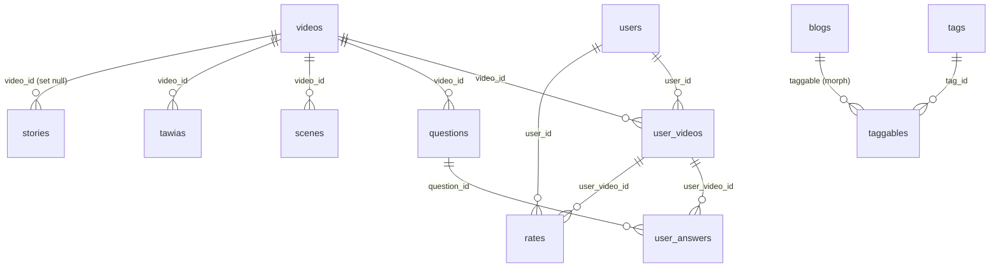
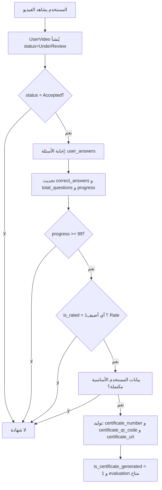
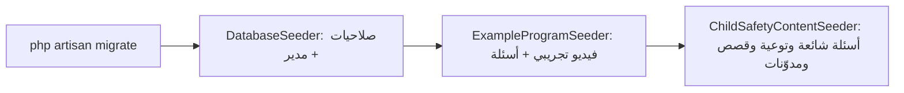

# الفصل الثاني: قاعدة البيانات والموديلات في منصة «أمان»

## ما ستتعلمه في هذا الفصل

- كيف يُبنى مخطط قاعدة البيانات في Laravel عبر ملفات الـ migrations، وكيف نقرأ «الحالة النهائية» للجدول من سلسلة تعديلات متراكمة.
- الجداول الفعلية في مشروع «أمان»: أعمدتها، أنواعها، الفهارس (indexes)، والمفاتيح الأجنبية (foreign keys) الحقيقية مقابل تلك التي لم تُنشأ فعليًا.
- الموديلات (Models) في `app/Models`: خصائص `$fillable` و`$casts` و`$appends`، والـ traits المشتركة، والعلاقات بينها.
- الحقول المترجمة (translatable columns) عبر حزمة `spatie/laravel-translatable`، وكيف تُخزَّن كـ JSON، ولماذا لا يمكن الترتيب عليها.
- الـ Enums في `app/Enums` وأين تُستخدم داخل المخطط.
- الـ Seeders والـ Factories: ما الذي يزرعه المشروع فعليًا، وما هو قديم/فارغ منها.
- تدفّق البيانات في أهم سيناريو تعليمي: من مشاهدة الفيديو إلى توليد الشهادة.
- الجداول والموديلات التي **حُذفت** (الدفع والكوبونات والأخبار) ولماذا يهمّ ذلك عند قراءة الكود القديم.

---

## 1. المفاهيم الأساسية أولًا

### 1.1 الـ Migration

الـ migration ملف PHP في `database/migrations` يوصف تغييرًا على المخطط. اسم الملف يبدأ بطابع زمني، وLaravel ينفّذها بالترتيب الزمني. لذلك **الحالة النهائية لأي جدول ليست في ملف واحد**، بل هي حصيلة ملف الإنشاء زائد كل ملفات التعديل اللاحقة. مثال: جدول `videos` أُنشئ في `2024_11_15_180159` ثم عُدّل في ستة ملفات لاحقة (إضافة `slug`، توسيع `logo`، تحويل `title` إلى `text`، حذف أعمدة الأسعار…).

### 1.2 الـ Model (Eloquent)

الموديل صنف PHP يمثّل جدولًا. مسؤولياته في هذا المشروع:

- تحديد الأعمدة المسموح تعبئتها جماعيًا: `$fillable`.
- تحويل الأنواع: `$casts` (مثل `password => 'hashed'`).
- الخصائص المحسوبة: accessors + `$appends`.
- العلاقات: `hasOne` / `hasMany` / `belongsTo` / `morphToMany`.
- سلوك دورة الحياة: `boot()` مع أحداث `created` / `saved`.

### 1.3 الحقل المترجم (Translatable)

في «أمان» لا يوجد جدول ترجمة منفصل. العمود نفسه من نوع `json` ويحتوي كائنًا بمفاتيح اللغات:

```json
{ "ar": "السلامة على الإنترنت", "en": "Online Safety" }
```

الموديل يعلن:

```php
public $translatable = ['video_url', 'title', 'description'];
```

فتُعيد حزمة `spatie/laravel-translatable` القيمة المطابقة للـ locale الحالي تلقائيًا. الـ locale يُحدَّد من ترويسة `Accept-language` عبر middleware الـ `ApiLocalization`.

> **قاعدة مهمة:** لأن القيمة JSON، **لا يمكن استخدام هذه الأعمدة في `ORDER BY` عبر endpoints القوائم**. وعندما يحتاج المشروع الترتيب فعلًا، يفعل ذلك بتعبير SQL صريح على مفتاح اللغة (سترى ذلك في علاقات `scenes()` و`questions()`).

### 1.4 الـ Soft Delete

معظم الجداول تحمل عمود `deleted_at`. الموديل الذي يستخدم trait الـ `SoftDeletes` يخفي السجلات المحذوفة تلقائيًا، ويحتاج `withTrashed()` لاستحضارها. المشروع يبني على ذلك مفهومًا إضافيًا: **«النشِط» = غير محذوف**، عبر trait مخصص سنشرحه في القسم 3.5.

---

## 2. مخطط قاعدة البيانات (الحالة النهائية)

### 2.1 نظرة عامة على العلاقات الجوهرية



المحور الحقيقي للمنصة هو المثلث: `videos` (المحتوى التدريبي) ← `user_videos` (تسجيل المستخدم في برنامج ومساره) ← `user_answers` (إجاباته على الأسئلة).

### 2.2 جدول `users`

الملف: `0001_01_01_000000_create_users_table.php`

| العمود | النوع | ملاحظات |
|---|---|---|
| `id` | bigIncrements | مفتاح أساسي |
| `mobile` | string(20) | مفهرس — وسيلة الدخول الأساسية |
| `otp` | string(4) nullable | مفهرس |
| `otp_created_at` | timestamp nullable | مفهرس — لحساب صلاحية الرمز |
| `first_name` / `last_name` | string nullable | |
| `full_name` | string **virtualAs** | `CONCAT(first_name, " ", last_name)` — عمود محسوب في قاعدة البيانات |
| `lang` | string(5) default `'en'` | لغة المستخدم المفضلة |
| `certificate_count` | integer default 0 | عدد الشهادات |
| `email` | string(60) nullable **unique** | |
| `deleted_at` | timestamp nullable | soft delete |
| `created_at` / `updated_at` | timestamps | كلاهما مفهرس |

لا توجد مفاتيح أجنبية على هذا الجدول. لاحظ أن `full_name` عمود **virtual**: لا يُكتب إليه، ولذلك هو معلَّق (commented out) داخل `$fillable` في الموديل `User`.

### 2.3 جدول `videos` — قلب المحتوى

الملف الأصلي `2024_11_15_180159` مع تعديلات `2026_04_08_140000`, `2026_04_10_160000`, `2026_04_21_140000`, `2026_05_13_120000`, `2026_07_16_100005`, `2026_07_21_120000`.

| العمود | النوع | ملاحظات |
|---|---|---|
| `id` | bigIncrements | |
| `slug` | string(191) nullable **unique** | أُضيف لاحقًا بعد `id` — يُستخدم في مسارات URL |
| `video_url` | json | **مترجم** |
| `logo` | string(500) | وُسِّع من طول أصغر |
| `title` | **text** | كان `json`؛ ما زال مُعلنًا مترجَمًا في الموديل |
| `description` | json | **مترجم** |
| `length` | string | مدة الفيديو |
| `color` | string default `'#fedcba'` | لون هوية البرنامج |
| `view_counter` | integer default 0 | عدّاد المشاهدات |
| `view_complete_counter` | integer default 0 | عدّاد الإكمال |
| `is_new` | unsignedTinyInteger default 0 | |
| `status` | string(32) nullable | يُحوَّل إلى `VideoStatus` |
| `certificate_url` | string nullable | مفهرس |
| `deleted_at` | timestamp nullable | |

**أعمدة حُذفت** في `2026_07_16_100005`: `price`, `total_price`, `total_paid`, `total_discount` (كان virtual). هذا جزء من إزالة منظومة الدفع بالكامل من المنصة.

### 2.4 جدول `questions`

الملف `2024_11_15_180250` مع `2026_07_22_120000`.

| العمود | النوع | ملاحظات |
|---|---|---|
| `video_id` | foreignId | **FK حقيقي** → `videos.id` بـ `cascadeOnDelete` و`cascadeOnUpdate` |
| `question` | json | مترجم |
| `answers_a` / `answers_b` | json | مترجم (إجابتان إلزاميتان) |
| `answers_c` / `answers_d` | json nullable | مترجم |
| `wrong_a` … `wrong_d` | json nullable | مترجم — نص التغذية الراجعة عند الخطأ |
| `correct_answer` | enum | `answer_a`,`answer_b`,`answer_c`,`answer_d` |
| `allowed_time` | string default `'04:00:00'` | الزمن المسموح للإجابة |
| `appears_at` | json nullable | مترجم — لحظة ظهور السؤال داخل الفيديو |

**عمود محذوف**: `wrong_answer_audio_urls` (json) في `2026_07_22_120000`.

### 2.5 جدول `scenes`

`2024_11_15_180344`: `video_id` (**FK حقيقي** إلى `videos.id`, cascade)، `logo` string، `title` json (مترجم)، `start_time`, `length`, `end_time` (كلها string)، مع فهارس على `created_at`/`updated_at`. المشاهد هي تقسيم الفيديو إلى فصول زمنية.

### 2.6 جدول `user_videos` — سجل مسار المتدرّب

الملف `2024_11_15_180647` مع `2026_04_23_090000`, `2026_07_16_100004`, `2026_07_17_100000`.

| العمود | النوع | الدور |
|---|---|---|
| `user_id` | foreignId | **FK** → `users.id` cascade |
| `video_id` | foreignId | **FK** → `videos.id` cascade |
| `answer_average` | string nullable | متوسط الإجابات |
| `hearts` | unsignedTinyInteger default 5 | «القلوب» — محاولات المتدرّب |
| `total_questions` | unsignedInteger default 0 | |
| `correct_answers` | unsignedInteger default 0 | |
| `progress` | unsignedInteger default 0 | نسبة التقدّم |
| `lang` | enum(`ar`,`en`) default `ar` | |
| `current_time` | string default `'00:00:00'` | موضع التوقف |
| `last_question_id` | foreignId nullable | **لا يوجد FK فعلي** (انظر التحذير أدناه) |
| `view_counter` / `view_complete_counter` | integer default 0 | |
| `is_rated` | boolean default 0 | مفهرس — شرط للشهادة |
| `status` | enum(`UnderReview`,`Accepted`,`Rejected`) default `UnderReview` | مفهرس |
| `certificate_url` | string nullable | مفهرس |
| `certificate_qr_code` | string nullable | |
| `certificate_number` | string nullable | |
| `is_certificate_generated` | boolean default 0 | |
| `deleted_at` | timestamp nullable | |

> **مصيدة تعليمية مهمة:** العمود `last_question_id` صُرِّح بـ `->on('questions')` دون `references()`. في Laravel هذا **لا يُنشئ قيد مفتاح أجنبي**، فالسلامة المرجعية هنا مسؤولية كود التطبيق لا قاعدة البيانات.

**أعمدة حُذفت** في `2026_07_16_100004` (إزالة الدفع): `final_price` (virtual), `outstanding_payment` (virtual), `transaction_id`, `price_original`, `price`, `tax_value`, `coupon_id`, `coupon_code`, `discount_value`, `paid` — ومعها فهرسا `user_videos_coupon_id_index` و`user_videos_coupon_code_index`. وفي `2026_07_17_100000` حُذف `has_form`.

### 2.7 جدول `user_answers`

`2024_11_15_190922` — الجدول الأغنى بالمفاتيح الأجنبية الحقيقية:

| العمود | FK |
|---|---|
| `user_video_id` | → `user_videos.id` cascade |
| `user_id` | → `users.id` cascade |
| `video_id` | → `videos.id` cascade |
| `question_id` | → `questions.id` |

بالإضافة إلى `user_answer` enum(`answer_a`..`answer_d`) nullable، و`status` boolean (صح/خطأ)، و`answer_time` string.

لاحظ التكرار المتعمّد (denormalization): `user_id` و`video_id` موجودان هنا مع أنهما مستنتجان من `user_video_id`. هذا خيار لتسريع الاستعلامات التحليلية على حساب التطبيع.

### 2.8 جدول `rates` — التقييم

`2024_11_18_165429` مع `2026_04_08_120000` (إضافة softDeletes): `code_number` string nullable، ثلاثة مفاتيح أجنبية حقيقية cascade إلى `users.id` و`videos.id` و`user_videos.id`، ثم `rate_1` … `rate_4` (tinyInteger — أربعة محاور تقييم)، و`comment` text nullable، و`deleted_at`.

### 2.9 جدول `contacts` — التواصل والشكاوى

`2024_11_18_212659` مع `2025_11_16_144423` و`2025_11_16_144424`:

| العمود | النوع |
|---|---|
| `type` | enum(`Inquiry`,`Complaint`,`Suggestion`) |
| `name` / `email` | string |
| `video_id` | bigInteger nullable — **بدون FK** |
| `mobile` | string(20) |
| `subject` | string |
| `message` | text |
| `images` | json nullable |
| `reply` | json nullable |
| `deleted_at` | timestamp nullable |

**لا يوجد عمود `status` فعلي** — الحالة محسوبة، إمّا في PHP عبر accessor أو في SQL عبر الثابت `Contact::STATUS_SQL`. هذا نمط مفيد: الحالة مشتقّة من `reply` و`created_at`، فلا داعي لتخزينها.

### 2.10 جدول `stories` — قصص النجاح

`2024_12_07_060000`: `first_name`(100), `last_name`(100), `full_name` **virtualAs** `CONCAT(first_name, ' ', last_name)`, `title`(255), `mobile`(20), `email`(255), `age` integer, `video_id` unsignedBigInteger nullable، `locale` string(10) default `'en'`, `content` text, `program_name` string nullable, `deleted_at`.

- **FK**: `video_id` → `videos.id` بـ `onDelete('set null')` — أي حذف الفيديو لا يحذف القصة بل يفكّ ارتباطها.
- فهارس واسعة: `first_name`, `last_name`, `full_name`, `email`, `mobile`, `video_id`, `locale`, `created_at`, `updated_at`.
- الـ migration نفسه يُدخل قصة عيّنة («John Doe / My Success Story»).

لاحظ الفرق التصميمي: القصص تستخدم عمود `locale` (سجل واحد لكل لغة) بدل الأعمدة المترجمة JSON.

### 2.11 جدول `blogs` والوسوم

`blogs` (`2026_04_07_120002` + `2026_04_16_110000` + `2026_04_19_120000`): `id`, `slug` string(191) nullable **unique**, `title` json, `short_description` json, `content` json, `publish_date` date, `logo` string(191) nullable, timestamps, `deleted_at`.

قصة تطوّر مفيدة: الجدول أُنشئ أصلًا بأعمدة منفصلة لكل لغة (`title_ar`, `title_en`, `short_description_ar`, `short_description_en`, `content_ar`, `content_en`)، ثم حوّلها `2026_04_16_110000` إلى أعمدة JSON مترجمة، وهي **هجرة غير قابلة للتراجع** (irreversible).

الوسوم عبر علاقة polymorphic:

- `tags` (`2026_04_07_120000`): `name` string، `slug` string **unique**، `color` string nullable.
- `taggables` (نفس الملف): `tag_id` foreignId **FK** → `tags.id` cascadeOnDelete، ثم `morphs('taggable')` أي `taggable_type` + `taggable_id` مفهرسان.

### 2.12 جدول `tawias` — التوعية

`2025_05_17_114906`: `video_id` **FK** → `videos.id` cascade، و`title`, `description`, `symptoms` (json مترجمة)، مع softDeletes.

### 2.13 `faqs` و`partners`

- `faqs` (`2024_11_18_210547`): `title` json, `description` json (كلاهما مترجم)، `deleted_at`.
- `partners` (`2024_12_07_070000`): `name` string, `logo` string nullable, `deleted_at` (مفهرس أيضًا).

### 2.14 `notifications` — الإشعارات polymorphic يدويًا

`2024_11_13_010001`:

| العمود | النوع |
|---|---|
| `title` | enum(`Payment`,`Inquiry`) — من `NotificationTitle` |
| `notificationable_id` | unsignedBigInteger |
| `notificationable_column` | string nullable |
| `notificationable_type` | enum(`UserVideo`,`Video`,`Contact`) — من `NotificationType` |
| `user_id` / `admin_id` | bigInteger nullable |
| `data` | json nullable |
| `deleted_at` | timestamp nullable |

> **مصيدة ثانية:** الـ migration يكتب `bigInteger('user_id')->constrained()->nullOnDelete()`. الدالة `constrained()` تعمل فقط مع `foreignId()`، لذلك **لم يُنشأ أي قيد FK هنا فعليًا**، مع أن الكود يبدو كأنه ينشئ واحدًا.

### 2.15 `admins` والصلاحيات

`admins` (`2024_09_22_135357`): `otp`(4) nullable، `otp_created_at`، `name`(50) nullable، `mobile`، `email`، `role_name` nullable، `password`(191)، `deleted_at`، و`last_read_notification_id` bigInteger default 0 (مفهرس — لتتبّع آخر إشعار قرأه المدير).

جداول `spatie/laravel-permission` (`2025_01_06_130141`، أسماؤها من `config/permission.php`):

| الجدول | ملاحظات |
|---|---|
| `permissions` | `name`, **`name_ar`**, **`name_en`** (إضافة مخصّصة للمشروع), `guard_name`; unique على `[name, guard_name]` |
| `roles` | `name`, `guard_name`; unique على `[name, guard_name]` |
| `model_has_permissions` | FK إلى `permissions.id` cascade + فهرس `[model_id, model_type]` |
| `model_has_roles` | FK إلى `roles.id` cascade + فهرس `[model_id, model_type]` |
| `role_has_permissions` | FK إلى `permissions.id` و`roles.id` cascade |

والـ migration `2026_07_16_100006` يحذف صفوف الصلاحيات المطابقة لـ `Coupon:%` و`Financial:%`.

### 2.16 جداول البنية التحتية

| الجدول | الملف | الدور |
|---|---|---|
| `cache` / `cache_locks` | `0001_01_01_000001` | تخزين مؤقت في قاعدة البيانات |
| `jobs` / `job_batches` / `failed_jobs` | `0001_01_01_000002` | طوابير المهام |
| `personal_access_tokens` | `2024_11_01_084556` | رموز Sanctum + عمود **غير قياسي** `device_token` |
| `downloads` | `2024_04_04_000000` | سجل ملفات التصدير: `type`, `path`, `status`, `size`, `count`, `exported` |
| `request_rates` | `2024_06_20_000100` (+`2026_05_22_053852`) | تتبّع الطلبات: `method`, `url`, `rate`, `ip`, `referrer`, `body` (وُسِّع إلى **longText**), `header` |
| `otps` | `2024_07_09_001020` | `key` default `'email'`, `otp`, `code`, `message` |
| `settings` | `2024_07_09_010010` | `set_key`(50) مفهرس, `set_value` longText, `type`, `description` |
| `telescope_entries` / `_tags` / `_monitoring` | `2025_05_12_223208` | أدوات التشخيص، على اتصال telescope منفصل |

الـ migration الخاص بـ `settings` يزرع صفّين ابتداءً: `timeout_audio` (كائن JSON بروابط mp3 لكل لغة، قُلِّص لاحقًا إلى `ar`/`en`)، و`tax` بقيمة `15`.

### 2.17 جداول حُذفت (موجودة في التاريخ فقط)

| الجدول | أُنشئ | حُذف |
|---|---|---|
| `transactions` | `2024_11_16_180647` (+ فهرس `order_id` في `2026_04_23_100000`) | `2026_07_16_100002` |
| `coupons` | `2024_12_07_055843` | `2026_07_16_100003` |
| `payment_callback_logs` | `2026_02_04_101808` (+`2026_02_04_113859`) | `2026_07_16_100001` |
| `user_infos` | `2025_05_24_141138` (`user_id` unique FK، `gender` enum Male/Female، `age`، `nationality`، `sector`، `workplace`) | `2026_07_17_100000` |
| `news` | `2026_04_07_120001` (+ تحويل للترجمة في `2026_04_16_100000`) | `2026_07_17_110000` |

**الدرس:** حين تقرأ خدمات أو كودًا قديمًا يذكر `Coupon` أو `Transaction` أو `UserInfo` أو `News`، فاعلم أن هذه الموديلات والجداول **لم تعد موجودة** بعد تنظيف تمّوز 2026 (إزالة الدفع والاشتراكات).

### 2.18 هجرات البيانات فقط (Data-only migrations)

بعض الهجرات لا تلمس المخطط بل المحتوى:

- `2026_07_16_100006_remove_payment_coupon_permissions.php` — حذف صلاحيات `Coupon:*` و`Financial:*`.
- `2026_07_17_151017_strip_non_ar_en_locales_from_translatable_columns.php` — يُبقي مفاتيح `ar` و`en` فقط داخل كل الأعمدة المترجمة: `videos`(`video_url`,`title`,`description`)، `questions`(`question`, `answers_a`–`answers_d`, `wrong_a`–`wrong_d`, `wrong_answer_audio_urls`, `appears_at`)، `scenes`(`title`)، `faqs`(`title`,`description`)، `blogs`(`title`,`short_description`,`content`)، `tawias`(`title`,`description`,`symptoms`)، وكذلك صف `settings` الذي مفتاحه `timeout_audio`.

---

## 3. الموديلات في `app/Models`

### 3.1 الخريطة الكاملة

| الموديل | الجدول | الـ traits |
|---|---|---|
| `AccessToken` | `personal_access_tokens` | — |
| `Admin` | `admins` | HasApiTokens, SoftDeletes, Notifiable, HasFactory, HasRoles |
| `Blog` | `blogs` | HasFactory, HasSlugTrait, HasTranslations, IsActiveTrait, SoftDeletes |
| `Contact` | `contacts` | HasFactory, SoftDeletes |
| `Downloads` | `downloads` | — (`$timestamps = false`) |
| `Faq` | `faqs` | HasFactory, HasTranslations, SoftDeletes |
| `Notification` | `notifications` | — |
| `OTP` | `otps` | — |
| `Partner` | `partners` | HasFactory, SoftDeletes, IsActiveTrait |
| `Question` | `questions` | HasFactory, HasTranslations |
| `Rate` | `rates` | IsActiveTrait, SoftDeletes |
| `RequestRate` | `request_rates` | — |
| `Scenes` | `scenes` | HasFactory, LogoTrait, HasTranslations |
| `Setting` | `settings` | HasFactory |
| `Story` | `stories` | HasFactory, SoftDeletes, IsActiveTrait |
| `Tag` | `tags` | HasFactory |
| `Tawia` | `tawias` | HasFactory, HasTranslations, SoftDeletes |
| `User` | `users` | HasFactory, Notifiable, HasApiTokens, SoftDeletes (يمتد `Authenticatable`) |
| `UserAnswer` | `user_answers` | HasFactory |
| `UserVideo` | `user_videos` | HasFactory, SoftDeletes |
| `Video` | `videos` | HasFactory, HasSlugTrait, HasTranslations, LogoTrait, SoftDeletes |

### 3.2 موديل `Video`

- `$fillable`: `slug, video_url, logo, title, description, color, length, view_counter, view_complete_counter, is_new, status, deleted_at`.
- `$casts`: `is_new => 'integer'`، `status => VideoStatus::class`.
- `$translatable`: `video_url, title, description`.
- يتجاوز `resolveSlugSource()` ليأخذ الترجمة الإنجليزية للعنوان: `getTranslation('title', 'en', false)` — أي أن الـ slug يُبنى دائمًا من النص الإنجليزي لا العربي.
- دالة ثابتة `resolveIdFromRouteParameter(mixed $raw): ?int` — تحاول أولًا مطابقة `slug` لسجل غير محذوف، وإلا تعتبر القيمة `id` رقميًا. هذا ما يجعل مسارات الـ API تقبل الـ slug والـ id معًا.
- العلاقات:

| العلاقة | النوع | الوجهة | ملاحظة |
|---|---|---|---|
| `scenes()` | HasMany | `Scenes` (`video_id`,`id`) | مرتبة زمنيًا بمفتاح اللغة من `start_time` |
| `questions()` | HasMany | `Question` (`video_id`,`id`) | مرتبة بمفتاح اللغة من `appears_at` |
| `userVideos()` | HasMany | `UserVideo` (`video_id`,`id`) | |

الترتيب هنا هو الحل العملي لمشكلة «لا يمكن الترتيب على أعمدة JSON»: يُستخرج مفتاح اللغة داخل تعبير SQL ثم يُحوَّل إلى وقت.

### 3.3 موديل `UserVideo` — أغنى موديل في المشروع

`$fillable`: `user_id, video_id, answer_average, hearts, total_questions, correct_answers, progress, lang, current_time, last_question_id, view_counter, view_complete_counter, is_rated, status, certificate_url, certificate_qr_code, certificate_number, is_certificate_generated`. لا `$casts` ولا `$appends`.

**سلوك دورة الحياة:** في `boot()` عند حدث `created` يُنشأ سجل `Notification` بعنوان `Payment` ونوع `UserVideo` — بقيّة تاريخية من زمن الدفع، ما زالت تُخبر لوحة التحكم بتسجيل جديد.

**خصائص محسوبة:**

```php
public function getEvaluationAttribute()
{
    // null إذا لم يوجد certificate_number
    // وإلا: evaluateMark($this->total_questions, $this->correct_answers)
}
```

تُقرأ بـ `$userVideo->evaluation`، وهي **ليست** في `$appends` أي لا تظهر تلقائيًا في الـ JSON.

**العلاقات:**

| العلاقة | النوع | ملاحظات |
|---|---|---|
| `video()` | HasOne → `Video`(`id`,`video_id`) | مع `withTrashed()` |
| `user()` | HasOne → `User`(`id`,`user_id`) | مع `withTrashed()` |
| `answers()` | HasMany → `UserAnswer`(`user_video_id`,`id`) | مقيَّدة بـ `where('user_id', Auth::id())` |
| `scenes()` | HasMany → `Scenes`(`video_id`,`video_id`) | ترتيب `STR_TO_DATE(JSON_EXTRACT(start_time,'$."{locale}"'),'%H:%i:%s')` |
| `questions()` | HasMany → `Question`(`video_id`,`video_id`) | ترتيب بمفتاح اللغة من `appears_at` |

> **ملاحظة نمطية:** المشروع يستخدم `hasOne` مع مفاتيح معكوسة (`id`, `video_id`) بدل `belongsTo` الاصطلاحي. النتيجة الاستعلامية مشابهة، لكنها مخالفة للعُرف؛ توقّع رؤية هذا النمط في `Rate` و`Notification` أيضًا. وربط `answers()` بـ `Auth::id()` داخل العلاقة يعني أن هذه العلاقة **غير صالحة للاستخدام في سياق بلا مستخدم مسجَّل** (مثل أمر artisan أو job).

**الـ scopes:**

| الـ scope | الشرط |
|---|---|
| `scopeRegistered` | `status = Accepted` و`is_certificate_generated = 0` |
| `scopeCanonicalFor($userId, $videoId)` | `Accepted`، مع تقديم `progress >= 99` ثم `latest()` |
| `scopeIsApplicableForCertificate` | `progress >= 99` و`is_rated = 1` |

**الدوال:** `isApplicableForCertificate(): bool`، و`certificateProgressPhases(): array` التي تُعيد `phase_1_completed` … `phase_5_completed` و`current_phase` و`can_revoke_certificate_generation`، و`userHasBasicProfileForCertificate(?User)` (محمية)، و`allCertificatePhasesCompleted(): bool`.

### 3.4 تدفّق أهلية الشهادة



المراحل الخمس في `certificateProgressPhases()` هي التمثيل البرمجي لهذا المخطط، وتُستخدم لعرض شريط تقدّم في الواجهة.

### 3.5 الـ traits المشتركة

**`app/Http/Traits/IsActiveTrait.php`** — يعرّف:

```php
public function getIsActiveAttribute()
{
    return $this->deleted_at === null;
}
// + scopeIsActive() و scopeIsNotActive()
```

أي أن «النشِط» في «أمان» يعني «غير محذوف soft». تستخدمه `Blog`, `Partner`, `Rate`, `Story`. لكن انتبه: `Blog` و`Rate` تضعان `is_active` في `$appends` فيظهر في الـ JSON، بينما `Partner` و`Story` **لا** تضعانه، فلا يظهر إلا إذا طُلب صريحًا.

**`app/Http/Traits/HasSlugTrait.php`** — عبر `bootHasSlugTrait()` يولّد الـ slug ويضمن تفرّده عند حدث `creating`. دواله المساعدة: `generateUniqueSlug`, `ensureSlugUnique`, `resolveSlugSource`, `slugTaken`. الأخيرة تستخدم `withTrashed()` عندما يكون الموديل soft-deletable — لتجنّب تعارض slug مع سجل محذوف.

**`app/Http/Traits/Model/LogoTrait.php`** — accessor و mutator للعمود `logo`: الـ accessor يُعيد القيمة كما هي إن كانت رابطًا كاملًا، وإلا يبنيها بـ `asset('storage/' . $value)`، ويُعيد `''` إذا كانت فارغة؛ والـ mutator يخزّن مسارًا نسبيًا عبر `getRelative($value)`.

### 3.6 بقيّة الموديلات باختصار

**`User`** — `$fillable`: `id, mobile, otp, otp_created_at, first_name, last_name, lang, email, certificate_count, deleted_at` (و`full_name` معلَّق لأنه virtual). بلا `$casts`، و`$hidden` معلَّق. mutator `setEmailAttribute` يقصّ المسافات ويصغّر الحروف ويضع `null` عند الفراغ. علاقة واحدة: `userVideos()` HasMany مقيّدة بـ `where('status','Accepted')` — أي لا تُعيد إلا التسجيلات المقبولة.

**`Admin`** — `$fillable` يشمل `role_name` و`last_read_notification_id`؛ `$hidden`: `password`؛ `$casts`: `password => 'hashed'` (فلا حاجة لـ `Hash::make` يدويًا)؛ mutator لتطبيع البريد؛ والأدوار عبر `HasRoles` (`roles` و`permissions` كعلاقات morphToMany).

**`Blog`** — `$fillable`: `slug, title, short_description, content, publish_date, logo, deleted_at`؛ `$casts`: `publish_date => 'date'`؛ مترجم: `title, short_description, content`؛ `$appends`: `is_active`؛ علاقة `tags()` **MorphToMany** إلى `Tag` باسم `taggable`.

**`Tag`** — `$fillable`: `name, slug, color`، وعلاقة `blogs()` عبر `morphedByMany(Blog::class, 'taggable')` — الطرف المقابل لعلاقة المدونة.

**`Contact`** — `$fillable`: `type, name, email, mobile, subject, message, images, reply, video_id`؛ `$casts`: `reply => 'json'`, `images => 'json'`؛ `$appends`: `status`. الـ accessor يُعيد `Responded` إذا كان `reply` غير فارغ، و`New` إذا كان `created_at` خلال 12 ساعة، وإلا `Pending`. والثابت `STATUS_SQL` يحتوي تعبير `CASE` المكافئ لاستخدامه في الاستعلامات والترتيب. وفي `boot()` عند `created` يُنشأ إشعار (`title=Inquiry`, `notificationable_type=Contact`, `notificationable_column='id'`). علاقة `video()` **BelongsTo** مع `withTrashed()`.

**`Notification`** — `$fillable`: `id, title, notificationable_id, notificationable_column, notificationable_type, user_id, admin_id, data`. mutator `setDataAttribute` يُرمِّز JSON بـ `JSON_UNESCAPED_UNICODE` (ضروري لسلامة العربية)، والـ accessor يفكّه إلى كائن. في `boot()`: عند `created` يُبنى العنوان والنص (إرسال البريد معلَّق)، وعند `saved` يُكتب سجل عبر `logToFile('00 Push.txt', ...)`. علاقاته كلها **HasOne** بشكل غير اصطلاحي، وأبرزها `notificationable()` التي تبني اسم الصنف ديناميكيًا: `App\Models\{notificationable_type}` مع المفتاح المخزّن في `notificationable_column`.

**`Question`** — يعرّف قيمة افتراضية على مستوى الموديل:

```php
protected $attributes = [
    'appears_at' => '{"ar": "00:00:00", "en": "00:00:00"}',
];
```

مترجم: `question, answers_a`–`answers_d, wrong_a`–`wrong_d, appears_at`. ولا يعرّف أي علاقة (الوصول يتم من `Video` أو `UserVideo`).

**`Rate`** — `$fillable`: `code_number, user_id, video_id, user_video_id, rate_1`–`rate_4, comment, deleted_at`؛ `$casts`: `deleted_at => 'datetime'`؛ `$appends`: `is_active`. علاقاته HasOne معكوسة، ولافتها `userVideo()` التي تضيف `->where('status','Accepted')`.

**`Scenes`** — `$fillable`: `video_id, logo, title, start_time, length, end_time`؛ مترجم: `title`؛ ويعتمد `LogoTrait`.

**`Story`** — `$fillable`: `first_name, last_name, title, mobile, email, age, video_id, locale, content, program_name, deleted_at`؛ `$casts`: `video_id => 'integer'`؛ علاقة `video()` **BelongsTo**.

**`Tawia`** — `$translatable = ['title','description','symptoms']`، لكن الموديل يعرّف أيضًا accessor `getSymptomsAttribute` بـ `json_decode(..., true)` و mutator `setSymptomsAttribute` بـ `json_encode(..., JSON_UNESCAPED_UNICODE)`.

> **تحذير تقني:** هذا **تعارض** مع `HasTranslations` على العمود نفسه: كلا الطرفين يريد التحكم في قراءة/كتابة `symptoms`. والـ cast `symptoms => 'array'` معلَّق أصلًا. عند تعديل هذا الموديل انتبه لأي سلوك مفاجئ في هذا العمود تحديدًا.

**`UserAnswer`** — `$fillable`: `user_video_id, user_id, video_id, question_id, user_answer, status, answer_time`؛ علاقة `question()` **BelongsTo**.

**`Faq`** — `$fillable`: `title, description, deleted_at`؛ مترجم: `title, description`؛ بلا علاقات.

**`Partner`** — `$fillable`: `name, logo, deleted_at`؛ `$casts` تحوّل `created_at`/`updated_at`/`deleted_at` إلى `datetime`.

**`Setting`** / **`OTP`** / **`RequestRate`** / **`AccessToken`** / **`Downloads`** — موديلات بسيطة بلا علاقات. لاحظ أن `Downloads` يضبط `$timestamps = false` لأن الجدول يدير `created_at`/`updated_at` بـ `useCurrent` على مستوى قاعدة البيانات، وأن `AccessToken` يشمل `device_token` في `$fillable` (العمود غير القياسي في جدول Sanctum).

---

## 4. الـ Enums (`app/Enums`)

كلّها enums مدعومة بنوع `string` (backed enums)، ما يجعلها قابلة للاستخدام مباشرة في `$casts` وفي أعمدة enum داخل المخطط.

| الـ Enum | القيم | أين تُستخدم |
|---|---|---|
| `AnswerOption` | `answer_a`, `answer_b`, `answer_c`, `answer_d` | `questions.correct_answer`, `user_answers.user_answer` |
| `ContactStatus` | `New`, `Pending`, `Responded` | حالة محسوبة لا مخزَّنة |
| `ContactType` | `Inquiry`, `Complaint`, `Suggestion` | `contacts.type` |
| `Lang` | `ar`, `en` | `user_videos.lang` واللغات المدعومة |
| `NotificationTitle` | `Payment`, `Inquiry` | `notifications.title` |
| `NotificationType` | `UserVideo`, `Video`, `Contact` | `notifications.notificationable_type` |
| `Sex` | `Male`, `Female` | كان لجدول `user_infos` المحذوف |
| `VideoPaymentStatus` | `UnderReview`, `Accepted`, `Rejected` | `user_videos.status` |
| `VideoStatus` | `Pending = 'New'`, `Approved = 'Updated'` | cast لـ `videos.status` |

> **انتبه إلى `VideoStatus`:** أسماء الحالات لا تطابق قيمها المخزّنة (`Pending` تُخزَّن كـ `'New'`، و`Approved` تُخزَّن كـ `'Updated'`). لذلك عند كتابة استعلام SQL خام قارن بالقيمة `'New'`/`'Updated'` لا بالاسم. ولاحظ أيضًا أن `VideoPaymentStatus` بقي اسمه مرتبطًا بالدفع مع أن دلالته الآن «حالة قبول التسجيل».

---

## 5. الـ Seeders والـ Factories

### 5.1 الـ Seeders (`database/seeders/`)

| الـ Seeder | الحجم | ما يفعله |
|---|---|---|
| `DatabaseSeeder.php` | 77 سطرًا | ينشئ صفوف `Permission` (بـ `name`, `name_ar`, `name_en`, و`guard_name = 'sanctum'`) ثم مديرًا `Admin`. نداء `User::factory(10)` **معلَّق**. |
| `ChildSafetyContentSeeder.php` | 454 سطرًا | `run()` يستدعي دوالّ خاصة: `seedFaqs()` (بـ `Faq::create`)، `seedAwareness()` (بـ `Tawia::create` مرتبطة بفيديوهات موجودة)، `seedStories()`، `seedBlogs()` (بـ `Blog::create`). |
| `ExampleProgramSeeder.php` | 72 سطرًا | **idempotent**: ينظّف `Video::withTrashed()->where('slug','test-program')` وتوابعه، ثم `Video::create` + `Question::create`. |
| `ProdAdminSeeder.php` | 59 سطرًا | upsert لمدير بحسب البريد (`password => '12345678'` يُهشَّم تلقائيًا عبر الـ cast) ويمنحه صلاحية كاملة. |

لاحظ درسين: أولًا، `guard_name = 'sanctum'` وليس `web` — لأن المصادقة كلها عبر رموز Sanctum. ثانيًا، فكرة الـ seeder «القابل لإعادة التنفيذ» في `ExampleProgramSeeder`: ينظّف قبل الإنشاء فلا يُكرِّر البيانات عند تشغيله مرتين.

### 5.2 الـ Factories (`database/factories/`)

الـ factories المكتملة:

| الـ Factory | المحتوى |
|---|---|
| `AdminFactory` | `name`, `email` (safeEmail فريد), `mobile`, `role_name='admin'`, `password=Hash::make('password')`, `otp_created_at=null`, `otp=null`, `last_read_notification_id=0` |
| `ContactFactory` | `type` عشوائي من الثلاثة, `name`, `email`, `subject`, `message` |
| `PartnerFactory` | `$model = Partner::class`؛ `name=company()`, `logo=imageUrl(200,200,'business',true)` |
| `StoryFactory` | `first_name`, `last_name`, `title`, `mobile`, `email`, `age` (18–120), `video_id => Video::factory()`, `locale` (`en` أو `ar`), `content`, `program_name` |
| `VideoFactory` | `video_url{en,ar}`, `logo`, `title{en,ar}`, `description{en,ar}`, `length`, `color`, `view_counter=0`, `view_complete_counter=0` |

مشاكل قائمة يجب أن تعرفها:

- **`UserFactory` قديم/غير صالح**: يُعيد `name`, `email`, `email_verified_at`, `password`, `remember_token` — وهي أعمدة **غير موجودة** في جدول `users` (الذي يستخدم `mobile` و`first_name`/`last_name` وOTP بلا كلمة مرور). ولديه أيضًا حالة `unverified()`. هذا يفسّر تعليق نداء `User::factory(10)` في `DatabaseSeeder`.
- **factories فارغة** (`definition()` تُعيد `[]`): `QuestionFactory`, `ScenesFactory`, `UserVideoFactory`, `UserAnswerFactory` — أي لا يمكن الاعتماد عليها في الاختبارات دون تمرير الحقول يدويًا.
- **لا توجد factories** لـ `Tag`, `Blog`, `Tawia`, `Faq`, `Rate`.
- الموديلات `Coupon`, `Transaction`, `UserInfo`, `News`, `PaymentCallbackLog` **لم تعد موجودة** بعد حذف جداولها في تمّوز 2026.

### 5.3 ترتيب التهيئة الموصى به للطالب



`ChildSafetyContentSeeder` يُنشئ محتوى التوعية «مطابقًا لفيديوهات موجودة»، فيجب أن تكون الفيديوهات قد زُرِعت قبله.

---

## 6. خلاصة عملية — قائمة تحقّق عند تعديل المخطط

1. **لا تعدّل ملف migration قديم** بعد تنفيذه على بيئة حقيقية؛ أضف ملفًا جديدًا كما فعل المشروع مرارًا مع `videos` و`user_videos`.
2. **عند إضافة مفتاح أجنبي** استخدم `foreignId('x')->constrained()` أو `foreign('x')->references('id')->on('table')` كاملة — وتذكّر الحالتين الفاشلتين في `notifications` و`user_videos.last_question_id`.
3. **عند إضافة عمود مترجم** أضِفه json، وأعلنه في `$translatable`، ولا تنسَ أنه غير قابل للترتيب مباشرة، وأن حزمة اللغات مقيّدة بـ `ar`/`en` بعد `2026_07_17_151017`.
4. **الحالات المحصورة** ضعها في `app/Enums` كـ backed string enum ثم استخدمها في `$casts` وفي `enum()` داخل الـ migration معًا، لتبقى مصدرًا واحدًا للحقيقة.
5. **الحالة المشتقّة** لا تُخزَّن — اتبع نمط `Contact::status` (accessor + `STATUS_SQL`).
6. **الأعمدة الافتراضية virtual** (`users.full_name`, `stories.full_name`) لا تُدرَج في `$fillable`.

---

### أسئلة للمراجعة

**1) لماذا لا يمكن ترتيب نتائج قائمة الفيديوهات حسب `title` مباشرة، وكيف حلّ المشروع مشكلة ترتيب المشاهد والأسئلة؟**
لأن هذه أعمدة JSON مترجمة، فقيمتها كائن لا نص. الحلّ في علاقات `Video::scenes()` و`questions()` (و`UserVideo` كذلك): استخراج مفتاح اللغة داخل SQL ثم تحويله إلى وقت، مثل `STR_TO_DATE(JSON_EXTRACT(start_time,'$."{locale}"'),'%H:%i:%s')`.

**2) في جدول `notifications` كُتب `bigInteger('user_id')->constrained()->nullOnDelete()`. ما نتيجة ذلك فعليًا؟**
لا يُنشأ قيد مفتاح أجنبي إطلاقًا، لأن `constrained()` تعمل مع `foreignId()` فقط. النتيجة: لا حماية مرجعية من قاعدة البيانات، ولا `SET NULL` تلقائي عند حذف المستخدم.

**3) ما الشروط الكاملة لأهلية `UserVideo` للحصول على شهادة؟**
`status = Accepted` (شرط علاقات المستخدم والـ scopes)، و`progress >= 99`، و`is_rated = 1` (وهذان شرطا `scopeIsApplicableForCertificate`)، بالإضافة إلى اكتمال بيانات المستخدم الأساسية عبر `userHasBasicProfileForCertificate()`. وبعد التوليد تُملأ `certificate_number` و`certificate_qr_code` و`certificate_url` ويُرفع `is_certificate_generated`.

**4) لماذا تُعيد `$userVideo->evaluation` القيمة `null` أحيانًا، ولماذا لا تظهر في استجابة الـ API افتراضيًا؟**
تُعيد `null` عندما لا يوجد `certificate_number` (أي لم تُولَّد شهادة بعد). ولا تظهر تلقائيًا لأن `UserVideo` لا يعرّف `$appends`، فالخاصية المحسوبة تُقرأ فقط عند طلبها صراحة.

**5) كيف يُحدَّد الـ slug في `Video` و`Blog`، وما دور `withTrashed()` في `HasSlugTrait`؟**
كلا الموديلين يتجاوز `resolveSlugSource()` ليأخذ `getTranslation('title','en',false)`، أي النص الإنجليزي للعنوان. و`slugTaken` تستخدم `withTrashed()` عندما يكون الموديل soft-deletable حتى لا يتعارض slug جديد مع سجل محذوف منطقيًا ولا يزال في الجدول مع قيد `unique`.

**6) ما الفرق بين طريقة `stories` وطريقة `blogs` في التعامل مع اللغات، وأيّهما أنسب لأي حالة؟**
`stories` تستخدم عمود `locale` string(10) فيكون لكل لغة **سجل منفصل**، وهو أنسب للمحتوى الذي يُنشئه المستخدم بلغة واحدة. أما `blogs` فتستخدم أعمدة JSON مترجمة (`title`, `short_description`, `content`) فيكون السجل واحدًا بعدّة ترجمات، وهو أنسب للمحتوى التحريري الذي يُترجم رسميًا.

**7) لماذا لا يوجد عمود `status` في جدول `contacts`، وكيف تُحسب الحالة؟**
لأنها حالة مشتقّة بالكامل: `Responded` إذا كان `reply` غير فارغ، و`New` إذا كان `created_at` خلال 12 ساعة، وإلا `Pending`. تُحسب في PHP عبر accessor مضاف إلى `$appends`، وفي SQL عبر الثابت `Contact::STATUS_SQL` عند الحاجة للتصفية أو الترتيب داخل الاستعلام.

**8) ما التعارض الموجود في موديل `Tawia`؟**
العمود `symptoms` مُعلَن ضمن `$translatable` (فتديره `HasTranslations`)، لكن الموديل يعرّف له أيضًا `getSymptomsAttribute` و`setSymptomsAttribute` يدويًا بـ `json_decode`/`json_encode`. تتنازع الجهتان على قراءة وكتابة العمود نفسه، والـ cast `symptoms => 'array'` معلَّق.

**9) لماذا فشل `User::factory(10)` ولذلك عُلِّق في `DatabaseSeeder`؟**
لأن `UserFactory` قديم ويُعيد `name, email, email_verified_at, password, remember_token`، وهي أعمدة لا وجود لها في جدول `users` الذي يعتمد `mobile` و`first_name`/`last_name` وOTP بلا كلمة مرور.

**10) عند مطاردة كود يشير إلى `Coupon` أو `Transaction` أو `UserInfo` أو `News`، ماذا تستنتج؟**
أنه كود قديم لم يُنظَّف: هذه الجداول والموديلات حُذفت في تمّوز 2026 (`2026_07_16_100001`–`100005` و`2026_07_17_100000` و`2026_07_17_110000`) مع أعمدة الأسعار في `videos` و`user_videos` وصلاحيات `Coupon:*`/`Financial:*`. المنصة اليوم بلا منظومة دفع.

**11) ما الغاية من `admins.last_read_notification_id` وفهرسه؟**
لتتبّع آخر إشعار قرأه المدير، فتُحسب الإشعارات غير المقروءة بمقارنة `notifications.id` بهذه القيمة؛ والفهرس يجعل هذه المقارنة سريعة في لوحة التحكم.
