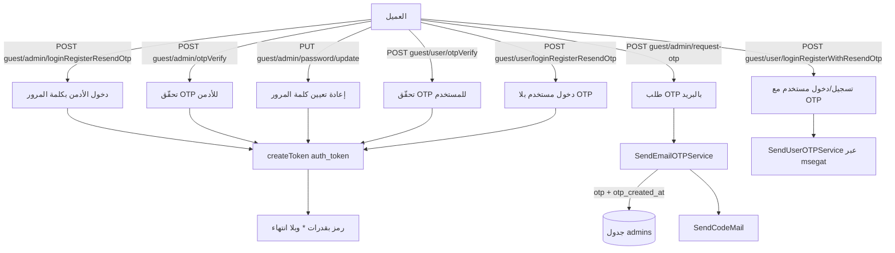
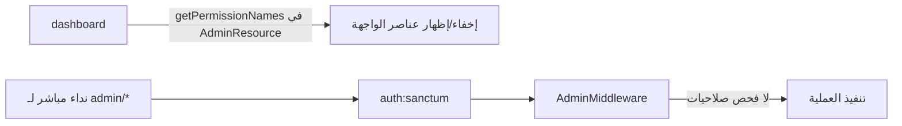

# الفصل الثالث: المصادقة والصلاحيات في منصة «أمان»

## ما ستتعلمه في هذا الفصل

- كيف تُبنى سلاسل الـ Middleware في `bootstrap/app.php` وكيف تختلف بين الجماهير الأربعة (`web`، `guest/*`، `admin/*`، `user/*`).
- مفهوم الـ Guard والـ Provider في Laravel، وكيف عُرِّفت الحُرّاس الثلاثة (`web`، `admin`، `user`) في `config/auth.php`.
- كيف يعمل Laravel Sanctum بنظام الـ Bearer Tokens، وكيف تُصدَر الرموز في هذا المشروع، وما هي القدرات (abilities) ومدة الصلاحية الممنوحة لها.
- كل تدفّقات المصادقة عمليًا: دخول الأدمن بكلمة المرور، طلب رمز OTP والتحقّق منه، إعادة تعيين كلمة المرور، تسجيل/دخول المستخدم بالجوال، تغيير رقم الجوال، وتسجيل الخروج.
- كيف يُولَّد رمز OTP ويُرسَل — بالبريد عبر `SendEmailOTPService` وبالرسائل القصيرة عبر `SendUserOTPService` — وأين تُخزَّن سجلاته.
- كيف رُكِّبت حزمة `spatie/laravel-permission`، ولماذا تبقى في هذا المشروع طبقة «تزيينية» لا تُنفَّذ على الخادم.
- طبقة الاستجابة الموحّدة (`BaseApiController::sendResponse`) وطبقة التحقّق (`CustomFormRequest` + `FailedValidation`).
- أهم الثغرات والعيوب الفعلية في هذه الطبقة، وهي جزء أساسي من قيمة الفصل التعليمية.

> ملاحظة منهجية: هذا الفصل يوثّق الكود كما هو موجود فعلًا، لا كما «يجب أن يكون». وفي عدة مواضع سنُشير صريحًا إلى خلل قائم، لأن قراءة الأخطاء في مشروع حقيقي أنفع للمتعلّم من قراءة مثال مثالي.

---

## 1. الصورة العامة: أربعة أبواب للـ API

خلافًا لمشروع Laravel الافتراضي، لا يوجد في هذا الباك-إند ملف `routes/api.php` إطلاقًا. التوجيه كلّه معرَّف يدويًا داخل `bootstrap/app.php` في الدالة `withRouting(then: ...)`، حيث يُحمَّل كل ملف مسارات ببادئة (prefix) وسلسلة Middleware خاصة به.

| البادئة | ملف المسارات | سلسلة الـ Middleware بالترتيب الدقيق | الجمهور |
|---|---|---|---|
| بلا بادئة | `routes/web.php` | `ApiLocalization` → مجموعة `web` → `RequestRateMiddleware` | Telescope وفحص الصحة `/up` |
| `guest/*` | `routes/guest.php` | `ApiLocalization` → `RequestRateMiddleware` | الموقع ولوحة التحكم قبل الدخول |
| `admin/*` | `routes/admin.php` | `ApiLocalization` → `auth:sanctum` → `AdminMiddleware` → `RequestRateMiddleware` | لوحة التحكم |
| `user/*` | `routes/user.php` | `ApiLocalization` → `auth:sanctum` → `UserMiddleware` → `RequestRateMiddleware` | الموقع العام بعد الدخول |

الترتيب هنا ليس تفصيلًا شكليًا: `ApiLocalization` يعمل **قبل** المصادقة، لذا يضبط اللغة لكل طلب حتى للزوّار؛ و`auth:sanctum` يعمل قبل `AdminMiddleware`، لذا حين يصل الطلب إلى `AdminMiddleware` يكون المستخدم قد تمّت مصادقته أصلًا ولم يبقَ إلا تمييز نوعه.

### 1.1 إعدادات الـ Middleware العامة

في `withMiddleware` نجد ثلاثة قرارات مهمّة:

```php
$middleware->trustProxies(at: '*');
$middleware->statefulApi();
$middleware->validateCsrfTokens(except: ['*']);
```

- `trustProxies(at: '*')` — الثقة بكل البروكسيات، وهو ما يجعل قراءة عنوان الـ IP والبروتوكول تعتمد على ترويسات قد يتحكّم بها العميل.
- `statefulApi()` — يُضيف `EnsureFrontendRequestsAreStateful` في مقدّمة مجموعة `api`، وهو نمط Sanctum المخصّص لجلسات SPA على نفس النطاق.
- `validateCsrfTokens(except: ['*'])` — **تعطيل حماية CSRF على كل المسارات دون استثناء**. الاجتماع بين هذا وبين `statefulApi()` متناقض في المبدأ: الأول يفتح باب مصادقة الجلسات، والثاني ينزع الحماية التي تجعل مصادقة الجلسات آمنة.

كذلك تُسجَّل مجموعة اسمها `telescope-auth` تحتوي `AuthenticateWithBasicAuth`، لكنها **غير مرفوعة** على مجموعة `web` — والتعليق في الكود يوضّح أن ربطها كان يُسبّب خطأ 403 على مسار الشهادة.

### 1.2 تحويل الاستثناءات إلى مظروف موحّد

في `withExceptions` يُعاد تشكيل استثناءين شائعين حتى لا يخرج HTML للعميل:

| الاستثناء | الرسالة | كود HTTP | الشرط |
|---|---|---|---|
| `AuthenticationException` | `Unauthorized` | 401 | للطلبات التي تتوقّع JSON فقط |
| `NotFoundHttpException` | `EndPoint Is Not Found` | 404 | دائمًا |

وهذا يفسّر سبب عدم وجود أي إعادة توجيه (redirect) عند انتهاء الرمز: الواجهات تتلقّى 401 داخل نفس المظروف وتتصرّف بنفسها.

---

## 2. أصناف الـ Middleware واحدًا واحدًا

جميع هذه الأصناف ترث `BaseApiController` — وهي حيلة عملية تمكّنها من استدعاء `sendResponse` وإرجاع نفس مظروف الاستجابة الذي تُرجعه المتحكّمات.

### 2.1 `app/Http/Middleware/API/ApiLocalization.php`

مسؤول عن تحديد اللغة، ويعمل بالخطوات التالية:

1. يقرأ ترويسة `Accept-Language`.
2. يأخذ النص قبل أول فاصلة `,` ثم قبل أول شرطة `-`، ويحوّله إلى حروف صغيرة. أي أن `ar-SA,en;q=0.9` تصبح `ar`.
3. إن كانت الترويسة غائبة أو اللغة غير موجودة في `config('app.supported_languages')` يرجع إلى `config('app.locale')`.
4. ينفّذ `app()->setLocale()`.
5. **إن كان هناك مستخدم مصادَق (`auth()->check()`) يكتب العمود `lang` على الموديل في كل طلب.** هذه كتابة على قاعدة البيانات مع كل نداء API، وهي تكلفة أداء ينبغي إدراكها.
6. يضبط ترويسة الاستجابة `Content-Language`.

### 2.2 `AdminMiddleware` و`UserMiddleware`

كلاهما بسيط جدًا:

```php
if (!auth('admin')->check()) {
    return $this->sendResponse(false, [], "You are not admin user", null, 400);
}
```

| الصنف | الفحص | الرسالة | كود HTTP |
|---|---|---|---|
| `AdminMiddleware` | `auth('admin')->check()` | `You are not admin user` | **400** |
| `UserMiddleware` | `auth('user')->check()` | `You are not user` | **400** |

الكود الصحيح دلاليًا هو `403 Forbidden` (مصادَق لكن غير مصرَّح له)، لكن المشروع يُرجع `400 Bad Request`. هذه ملاحظة مهمّة لمن يكتب عميلًا يستهلك الـ API: لا يمكنك التمييز بين «خطأ في المدخلات» و«حرّاس غير مطابقين» بالاعتماد على كود الحالة وحده.

### 2.3 `app/Http/Middleware/RequestRateMiddleware.php`

الاسم يوحي بتحديد المعدّل (rate limiting)، لكن ما يفعله فعليًا هو **التسجيل (logging)**: يُدخل صفًا في جدول `request_rates` مع **كل** طلب، يحتوي: الطريقة، الرابط، عنوان الـ IP، الـ referer، **كامل جسم الطلب بصيغة JSON**، و**كل الترويسات**.

النتيجة الأمنية المباشرة: كلمات المرور، ورموز OTP، وترويسة `Authorization: Bearer …` تُخزَّن كلها نصًّا صريحًا في قاعدة البيانات. أي وصول للقراءة على هذا الجدول يعني اختراقًا كاملًا للحسابات.

---

## 3. الحرّاس والمزوّدون (Guards & Providers)

### 3.1 مفهوم عام

في Laravel، الـ **guard** يجيب على سؤال «كيف نتعرّف على المستخدم في هذا الطلب؟» (جلسة؟ رمز؟)، و الـ **provider** يجيب على «من أي مصدر نجلب سجلّه؟» (أي موديل/جدول). فصل السؤالين يسمح بأن يشترك حارسان في نفس الطريقة (Sanctum) وهما يقرآن جدولين مختلفين.

### 3.2 التطبيق في `config/auth.php`

| الحارس | الطريقة (driver) | المزوّد | الموديل |
|---|---|---|---|
| `web` | `session` | `users` | `App\Models\User` |
| `admin` | `sanctum` | `admins` | `App\Models\Admin` |
| `user` | `sanctum` | `users` | `App\Models\User` |

- `defaults.guard = sanctum`.
- `defaults.passwords = admins` — وهذه **قيمة معطوبة**، لأن قسم `passwords` لا يعرّف إلا وسيطًا واحدًا اسمه `users`. أي أن تدفّق إعادة كلمة المرور المدمج في Laravel غير قابل للاستخدام هنا؛ وهو غير مستخدم أصلًا لأن المشروع بنى تدفّقه الخاص بالـ OTP.

### 3.3 `config/sanctum.php`

| الإعداد | القيمة | الأثر |
|---|---|---|
| `guard` | `['web']` | الحارس المستخدم داخليًا لفحص الجلسة قبل اللجوء للرمز |
| `expiration` | `null` | **الرموز لا تنتهي صلاحيتها أبدًا** |
| `token_prefix` | غير مضبوط | لا يمكن لأنظمة كشف التسريبات التعرّف على رموز المشروع |

آلية العمل مجتمعة: `auth:sanctum` يصادِق حاملَ الرمز، ثم يفرّق الحارسان `admin` و`user` بين نوعي الحاملين اعتمادًا على العمود `tokenable_type` في جدول الرموز.

---

## 4. إصدار الرموز والقدرات (Abilities)

كل موضع إصدار في المشروع يستخدم النمط ذاته:

```php
$token = $item->createToken("auth_token")->plainTextToken;
```

ثلاث ملاحظات دقيقة على هذا السطر:

1. اسم الرمز دائمًا `"auth_token"` — لا يمكن تمييز جهاز عن آخر من الاسم.
2. **لا يُمرَّر مصفوفة abilities**، وقيمتها الافتراضية في Sanctum هي `["*"]`، أي رمز بكامل الصلاحيات دائمًا.
3. لا يُمرَّر تاريخ انتهاء، ومع `expiration => null` يصبح الرمز أبديًا.

كلا الموديلين `User` و`Admin` يستخدمان `Laravel\Sanctum\HasApiTokens`.

### 4.1 مواضع الإصدار

| الصنف | الدالة | ملاحظة |
|---|---|---|
| `Admin/AdminAuthController` | `loginRegisterResendOtp` | دخول بكلمة المرور |
| `Admin/AdminAuthController` | `otpVerify` | تحقّق OTP |
| `Admin/AdminAuthController` | `updatePassword` | إعادة تعيين كلمة المرور تُسجّل الدخول تلقائيًا |
| `Admin/AdminAuthController` | `updateEmail` | **كود ميت**: لا مسار مسجَّل له، ويتحقّق من جدول `users` بدل `admins` (خطأ نسخ ولصق) |
| `User/UserAuthController` | `loginRegister` | دخول بلا OTP |
| `User/UserAuthController` | `otpVerify` | تحقّق OTP |
| `User/UserAuthController` | `updateMobile` | تغيير الجوال |

بعد كل إصدار يُنفَّذ `$item->is_login = true;` — وهي خاصية غير محفوظة وليست عمودًا في الجدول، ولا تظهر في الـ Resources، فهي عمليًا **لا تفعل شيئًا**.

هناك أيضًا `app/Models/AccessToken.php` الذي يُخاطب جدول `personal_access_tokens` ويضيف `device_token` إلى `$fillable` (العمود مضاف في المهاجرة `2024_11_01_084556_create_personal_access_tokens_table.php`)، لكن **تدفّقات المصادقة لا تستعمل هذا الموديل إطلاقًا**.

### 4.2 إبطال الرموز

| الموضع | ما يُبطَل |
|---|---|
| `HomeController::logout` (`POST admin/logout`, `POST user/logout`) | الرمز الحالي فقط |
| `AdminController::destroy` | كل رموز الأدمن المستهدف (ويرفض المساس بالمعرّف 1) |
| `AdminController::toggleActive` | كل رموز الأدمن المستهدف (ويرفض المساس بالمعرّف 1) |

سطر تسجيل الخروج:

```php
Auth::user()->tokens()->where('id', Auth::user()->currentAccessToken()->id)->delete();
```

لاحظ أن إعادة تعيين كلمة المرور **لا تُبطل الرموز القديمة**، فمن سرق رمزًا يبقى داخلًا حتى بعد تغيير الضحية لكلمة مرورها.

---

## 5. تدفّقات المصادقة بالتفصيل

### 5.1 نظرة تدفّقية عامة



### 5.2 دخول الأدمن بكلمة المرور — `POST guest/admin/loginRegisterResendOtp`

اسم المسار: `admin.sendotp` — والاسم مُضلِّل، فهذه الدالة **لا ترسل أي OTP**.

الدالة: `AdminAuthController::loginRegisterResendOtp`، والتحقّق فيها مكتوب داخليًا بـ `Validator`:

| الحقل | القاعدة |
|---|---|
| `email` | `required|exists:admins,email` |
| `password` | `required` |

الخطوات: `Admin::where('email', …)->first()` ثم `Hash::check`، وعند الفشل تُرجَع 401 مع `invalidCredentials`. ثم يُحدَّث العمود `lang` إلى **القيمة الخام** لترويسة `Accept-Language` (لا القيمة المنقّاة من `ApiLocalization`)، ويُصدَر الرمز، وتُرجَع `{token, item: AdminResource}`.

نقطة مهمّة: هذا هو المسار **الوحيد** للأدمن الذي لا يستخدم `withTrashed()` ولا يفحص الحساب المحظور/المحذوف منطقيًا. بقية المسارات تفحص `disabledAccount`، أما هذا فلا.

### 5.3 طلب OTP للأدمن — `POST guest/admin/request-otp`

الدالة: `AdminAuthController::requestOtp`. القاعدة: `email => required|exists:admins,email,deleted_at,NULL`.

منطق كبح المحاولات (throttle): إذا كان `otp_created_at` مضبوطًا وبيئة التشغيل ليست `testing`، يُقارَن `diffInSeconds` مع `config('constants.otpDelay')`، وعند المخالفة تُرجَع 403 مع `{delay_seconds}` ورسالة `trans('tryAgainAfter')`.

لكن `config/constants.php` يضبط `otpDelay => 0`، أي أن **الكبح معطّل فعليًا** ويمكن طلب رموز بلا حدّ.

والأخطر: فرع `else` معطوب. الأدمن الذي **لم يستلم رمزًا من قبل** (`otp_created_at = null`) يتلقّى خطأ 500 مع `emailNotFound`، فلا يستطيع أبدًا طلب أول رمز له.

كما أن الاستجابة تُرجع `ENV` و`ip` **والرمز نفسه** في كل بيئة غير `production`.

### 5.4 توليد الرمز وإرساله بالبريد — `app/Services/SendEmailOTPService.php`

يجري كل العمل في الـ `__construct`:

| الحالة | قيمة `otp` | إرسال البريد |
|---|---|---|
| البيئة `production` أو `local` | `rand(1000, 9999)` | نعم |
| أي بيئة أخرى | القيمة الحرفية `'0000'` | لا |

ثم يُبصَم `otp_created_at`، ويُرسل البريد عبر `App\Mail\SendCodeMail` (القالب `emails.send-verification-code`، الموضوع `Aman App: OTP`، المُرسِل من `config('mail.from.address')`)، وأخيرًا يُسجَّل صف في جدول `otps`:

```php
OTP::create(['key' => $email, 'otp' => $otp, 'code' => 200, 'message' => 'Success']);
```

### 5.5 تحقّق OTP للأدمن — `POST guest/admin/otpVerify`

الدالة `AdminAuthController::otpVerify(AdminVerifyOtpRequest)`، وتبحث بـ:

```php
Admin::withTrashed()->where('email', $request->email)->where('otp', $request->otp)->first();
```

ثم تُحدِّث `lang` وتُصدِر الرمز. و**لا تُصفِّر الرمز عند النجاح** — خلافًا لتدفّق المستخدم — فيبقى قابلًا للاستخدام المتكرّر إلى أن ينتهي زمنيًا أو يُستبدَل.

قواعد `app/Http/Requests/AdminVerifyOtpRequest.php`:

| الحقل | القاعدة |
|---|---|
| `email` | `required|exists:admins,email` |
| `otp` | `required` |

وفي `withValidator` → `after`:

| الشرط | الحقل | الرسالة |
|---|---|---|
| الحساب محذوف منطقيًا | `email` | `disabledAccount` |
| لا تطابق للرمز | `otp` | `invalidOtp` |
| `Carbon::now()->diffInSeconds(otp_created_at) > 600` | `otp` | `otpHasBeenExpired!` |

مدة الصلاحية 10 دقائق مكتوبة بشكل صريح (hard-coded) في كل صنف طلب على حدة. ولو كان `otp_created_at` فارغًا فالمقارنة تجري ضد «الآن» فتنجح.

### 5.6 إعادة تعيين كلمة مرور الأدمن — `PUT guest/admin/password/update`

الدالة `AdminAuthController::updatePassword(UpdatePasswordRequest)` تتبع نفس نمط البحث بالـ OTP، ثم تضبط `password` (يُهشَّم تلقائيًا بفضل الـ cast `'password' => 'hashed'` على `Admin`) مع `lang`، **ثم تُصدِر رمزًا وتُسجّل دخول الأدمن مباشرة**. والرمز لا يُصفَّر.

قواعد `app/Http/Requests/UpdatePasswordRequest.php`:

| الحقل | القاعدة |
|---|---|
| `email` | `required|exists:admins,email,deleted_at,NULL` |
| `password` | `required|min:6|max:12` |
| `otp` | `required` |

وتُطبَّق نفس فحوص `after()` (حساب معطّل / رمز خاطئ / انتهاء 600 ثانية). لا توجد خطوة «كلمة المرور الحالية»، ولا إبطال للرموز القديمة. ولاحظ الحدّ الأعلى `max:12` الذي يمنع كلمات المرور الطويلة القويّة.

### 5.7 تسجيل/دخول المستخدم مع OTP — `POST guest/user/loginRegisterWithResendOtp`

اسم المسار `user.registrationResendOtp`، والدالة `UserAuthController::loginRegisterResendOtp(UserRegisterRequest)`.

يبحث عن `User::withTrashed()->where('mobile', trimMobile(...))`، و**إن لم يجد ينشئ المستخدم تلقائيًا** بـ `User::create(['mobile' => …])`. أي أن التسجيل والدخول نقطة نهاية واحدة. ثم يُطبَّق كبح `otpDelay` نفسه (403 مع `delay_seconds`)، ويُنادى `new SendUserOTPService($item)`، وتُرجَع `sms_response_code` و`sms_response_message` و`ip` و`ENV` والرمز نفسه إن لم تكن البيئة `production`.

### 5.8 إرسال الرمز بالرسائل القصيرة — `app/Services/SendUserOTPService.php`

- `otp = rand(1000, 9999)` **دون أي استثناء للبيئات**، بخلاف خدمة البريد التي تُثبّت `'0000'` في الاختبارات — وهذا يعني أن اختبار تدفّق المستخدم آليًا أصعب.
- يُبصَم `otp_created_at`.
- يُرسَل طلب POST إلى `config('msegat.send_url')` بالحقول `userName`, `numbers`, `userSender`, `apiKey`, `msg` (قالب عربي)، مع `timeout(5)` و`connectTimeout(3)` و**`withoutVerifying()` أي تعطيل التحقّق من شهادة TLS** — ثغرة تسمح بهجوم وسيط.
- عند أي `throwable` يُنادى `saveResponse()` مع القيم الافتراضية `code = 401` و`message = 'API Connection Error'`.
- يكتب `OTP::create([... , 'mobile' => …])`، لكن `App\Models\OTP` لا يضمّ `mobile` في `$fillable`، وجدول `otps` (المهاجرة `2024_07_09_001020_create_otps_table.php`) لا يحتوي إلا `key, otp, code, message`. النتيجة: الإسناد الجماعي يُسقِط القيمة صامتًا، **فتفقد سجلات رسائل SMS هوية المستلِم تمامًا**.

قواعد `app/Http/Requests/UserRegisterRequest.php`: `mobile => required|min:8|max:20`، وفي `after()`: الحساب المحذوف منطقيًا → `mobile: disabledAccount`، ويضاف مفتاح خطأ `delay_seconds` عند الوقوع داخل فترة `otpDelay`.

### 5.9 دخول المستخدم بلا OTP — `POST guest/user/loginRegisterResendOtp`

هذه أخطر نقطة في المشروع كلّه، ولها سببان مجتمعان:

1. **المسار والاسم متبادلان** مقارنةً بالفقرة 5.8: المسار `loginRegisterResendOtp` (اسم `user.sendotp`) يُوجَّه إلى الدالة `loginRegister` التي لا علاقة لها بالـ OTP.
2. الدالة `UserAuthController::loginRegister(UserRegisterRequestWithOutOTP)` تجد المستخدم بالجوال أو تنشئه، **ثم تُعيد رمزًا كامل الصلاحيات فورًا**.

النتيجة: أي رقم جوال يحصل على جلسة مصادَقة بلا رمز تحقّق وبلا كلمة مرور وبلا أي سرّ. تُرجَع الدالة أيضًا `timeout_audio` من `settings('timeout_audio')`. وقواعدها: `mobile => required|min:8|max:20` مع فحص `disabledAccount` فقط.

### 5.10 تحقّق OTP للمستخدم — `POST guest/user/otpVerify`

الدالة `UserAuthController::otpVerify(UserVerifyOtpRequest)` تطابق على `mobile` + `otp` مع `withTrashed`، ثم:

```php
$item->update(['otp' => '', 'mobile_verified_at' => now(), 'lang' => $lang]);
```

هنا خسارة بيانات صامتة ثانية: `mobile_verified_at` ليس في `User::$fillable` وليس عمودًا في مهاجرة `0001_01_01_000000_create_users_table.php`، فيُسقَط. أي أن المشروع **لا يحتفظ بأي أثر لكون الجوال موثّقًا**. ثم يُصدَر الرمز مع `timeout_audio`.

قواعد `app/Http/Requests/UserVerifyOtpRequest.php`:

- `otp => required` فقط؛ قاعدة `mobile` **معلّقة كتعليق** في الكود.
- `prepareForValidation` تدمج `mobile => trimMobile($this->mobile)`.
- `after()`: `disabledAccount` / `invalidOtp` / انتهاء 600 ثانية.

ولأن `otp` يُصفَّر إلى `''` عند النجاح، فإن البحث `where('otp', '')` كان سيطابق كل الصفوف المصفَّرة — لكن قاعدة `required` تمنع إرسال `''` فتسدّ هذه الفجوة عرَضًا.

### 5.11 تغيير رقم الجوال — `PUT user/mobile/update` (يتطلّب مصادقة)

الدالة `UserAuthController::updateMobile` تطابق على `old_mobile` (**خامًا، دون `trimMobile`**) + `otp`، بالقواعد التالية المكتوبة داخليًا:

| الحقل | القاعدة | ملاحظة |
|---|---|---|
| `old_mobile` | `required|sa_mobile|exists:users,mobile` | — |
| `new_mobile` | `required|sa_mobile|unique:brands,mobile|unique:users,mobile,{id},id` | **جدول `brands` غير موجود في هذا المخطط** |
| `otp` | `required` | — |

وفي `after()` تُضاف فحوص `invalidOtp` و`otpHasBeenExpired!` (600 ثانية). ثم يُصفَّر الرمز، ويُضبَط الجوال الجديد، ويُصدَر رمز مصادقة جديد.

ملاحظة منطقية جوهرية: **لا يُرسَل أي OTP إلى الرقم الجديد**، فالتحقّق يجري على الرقم القديم فقط، وبذلك لا يُثبت المستخدم ملكيته للرقم الذي ينتقل إليه.

### 5.12 تسجيل الخروج — `POST admin/logout` و`POST user/logout`

`HomeController::logout` يحذف الرمز الحالي فقط ويُرجع الرسالة `Logout Success, Bye :)`. لا يوجد «تسجيل خروج من كل الأجهزة».

---

## 6. الأدوار والصلاحيات

### 6.1 المفهوم

توفّر حزمة `spatie/laravel-permission` نموذجًا من ثلاث طبقات: **صلاحية (permission)** وهي إذن ذرّي، و**دور (role)** وهو حزمة صلاحيات، و**نموذج (model)** يمكن ربطه بأي منهما. الفرض (enforcement) يجري عادةً عبر middleware مثل `permission:` و`role:`، أو عبر `$user->can(...)`، أو `authorize()` في المتحكّم.

### 6.2 الإعداد الفعلي

- `config/permission.php`: `teams => false`، `model_morph_key => model_id`.
- الجداول من المهاجرة `2025_01_06_130141_create_permission_tables.php`: `roles`, `permissions`, `model_has_permissions`, `model_has_roles`, `role_has_permissions` — مع إضافة عمودين اختياريين `name_ar` و`name_en` على `permissions`.
- `App\Models\Admin` يستخدم `HasRoles`. أما `App\Models\User` **فلا يستخدمها**، فالمستخدمون بلا أي نظام صلاحيات.

### 6.3 لا أدوار على الإطلاق

**لا يُنشَأ أي دور (role) في هذا المشروع.** والعمود `Admin.role_name` هو نصّ حرّ (`nullable|min:5|max:50` في `AdminStoreRequest`، ويُزرَع بالقيمة `'Admin'`) **ولا علاقة له بأدوار Spatie**. الصلاحيات تُربط **مباشرة بالأدمن**:

```php
$permissionIds = Permission::whereIn('name', $request->permissions)->pluck('id');
$admin->permissions()->sync($permissionIds);
```

### 6.4 مجموعة الصلاحيات المزروعة

هي نفسها في `database/seeders/DatabaseSeeder.php` وفي البذرة الاصطلاحية `database/seeders/ProdAdminSeeder.php`، بـ `guard_name => 'sanctum'`:

| المجموعة | الصلاحيات |
|---|---|
| عام | `Overview`, `Website_Management` |
| المستخدمون | `User:Add`, `User:Edit`, `User:Delete`, `User:Export` |
| التوعية | `Awareness:Add`, `Awareness:Edit`, `Awareness:Delete`, `Awareness:Export`, `Awareness:View` |
| البرامج | `Programs:Add`, `Programs:Edit`, `Programs:Delete`, `Programs:Export`, `Programs:View` |

والمهاجرة `2026_07_16_100006_remove_payment_coupon_permissions.php` حذفت كل صلاحيات `Coupon:%` و`Financial:%`.

الأدمن المزروعون: `sarah@aman.com` بكلمة مرور `12345678` (وجوال 966508570275) في `DatabaseSeeder`، و`sara@aman.com` بكلمة المرور نفسها في `ProdAdminSeeder`، وكلاهما مربوط بـ**كل** الصلاحيات. وهذه بيانات دخول مكشوفة ومحفوظة في المستودع.

### 6.5 الفرض: لا شيء على الخادم

البحث في `routes/` و`app/Http/Controllers/` عن `can:` و`permission:` و`role:` و`PermissionMiddleware` و`hasPermissionTo` و`authorize(` يُرجع **صفر نتائج**.

الخلاصة: **أي أدمن مصادَق يستطيع نداء كل مسار `admin/*` بغضّ النظر عن صلاحياته الممنوحة.** الصلاحيات في هذا المشروع تُقرأ فقط — تُعرَض للوحة التحكم عبر `AdminResource::toArray` باستخدام `$this->getPermissionNames()` لتخفي عناصر الواجهة — وتُكتَب في `Admin/AdminController::store` و`::update`. وهذا يعني أن إخفاء زرّ في اللوحة ليس حماية؛ يكفي نداء المسار مباشرة.

مشكلتان إضافيتان في الكتابة:

1. الحقل `permissions` **غير مُتحقَّق منه** في `AdminStoreRequest`.
2. الدالة `update` تنفّذ `sync([])` عند غياب المفتاح `permissions`، فتسحب صامتًا كل صلاحيات الأدمن.



---

## 7. طبقة الاستجابة والتحقّق المشتركة

### 7.1 `app/Http/Controllers/BaseApiController.php`

الدالة `sendResponse($status, $data, $message, $errors, $code, $request)` تُنتج مظروفًا موحّدًا بالحقول:

| الحقل | المعنى |
|---|---|
| `status` | نجاح/فشل منطقي |
| `local` / `local_language` | اللغة الحالية |
| `message` | رسالة مترجمة |
| `data` | الحمولة |
| `guard` | الحارس الحالي، من الدالة المساعدة `Authed()` |
| `errors` | خرائط الحقول ورسائلها |
| `response_code` | كود HTTP |
| `request_body` | **كامل الطلب معادًا إلى العميل** |

حين يكون `status === false` وعدد أوراق `errors` واحدًا أو أقل، تُستبدَل بـ `['message' => [$message]]`. والحقل `request_body` يعيد كلمات المرور ورموز OTP المُرسَلة إلى العميل، وهو تسريب واضح في السجلّات والوسائط.

توجد كذلك `sendServerError` و`checkValidator($validator)` التي تُرجع استجابة 422 أو `false`.

### 7.2 `app/Services/AuthService.php` والدالة `Authed()`

الدالة المساعدة `Authed()` في `app/Helpers/general.php:31` تُنشئ `AuthService`، وفي الـ constructor يُجرَّب `auth('admin')->check()` ثم `auth('user')->check()`، وبناءً على النتيجة تُضبَط الخصائص `table`, `primaryKey`, `model`, `resource`, `id`, `guard`:

| الحالة | `table` | `resource` | `guard` |
|---|---|---|---|
| أدمن | `admins` | `AdminResource` | `admin` |
| مستخدم | `users` | `UserResource` | `user` |
| زائر | `null` | `null` | `null` |

وتُنشأ نسخة جديدة من هذه الخدمة **مع كل نداء لـ `sendResponse`**.

### 7.3 `app/Helpers/CustomFormRequest.php`

هو الأساس لكل أصناف الطلبات في المشروع:

- `authorize()` تُرجع `true` دائمًا → **لا يوجد أي تصريح على مستوى الطلب في المشروع كلّه.**
- `failedValidation` ترمي `ValidationException` حاملةً استجابة `app/Services/FailedValidation.php`: كود 422 بالشكل `{status:false, message:<أول خطأ> [+ trans('and') + العدد + trans('moreValidation')], data:null, guard, errors:<حقل => [رسائل]>, response_code:422, request_data:<all>}`.

وهذا الشكل بالضبط هو ما تعتمد عليه الدالة `handleFormError` في الواجهتين لربط الأخطاء بحقول النماذج.

### 7.4 قاعدة `sa_mobile` والدالة `trimMobile`

القاعدة المخصّصة `sa_mobile` مسجَّلة في `app/Providers/AppServiceProvider.php:40` بالتعبير النمطي:

```php
/^(970|\+970|0)?5[0-9]{8}$/
```

أي أنها تقبل بادئات **فلسطينية (970)** رغم أن اسمها ورسالة خطئها `mobileIsNotAValidSaudiArabiaMobileNumber` يشيران إلى السعودية. والمفارقة أن تدفّقات OTP نفسها (`UserRegisterRequest`, `UserRegisterRequestWithOutOTP`, `UserVerifyOtpRequest`) **لا تستخدم هذه القاعدة** بل `min:8|max:20` فقط؛ ولا تستعملها إلا `updateMobile`.

والدالة `trimMobile()` في `app/Helpers/general.php:302` تحذف علامة `+` فقط ولا توحّد الصيغة فعليًا — لذلك قد يوجد نفس الرقم بصيغتين مختلفتين.

### 7.5 الثوابت

`config/constants.php` يضبط `otpDelay => 0`، أما مدة صلاحية OTP (600 ثانية) فمكرّرة يدويًا في كل صنف طلب بدل أن تكون إعدادًا مركزيًا.

---

## 8. ملخّص العيوب الأعلى خطورة

| # | العيب | الأثر |
|---|---|---|
| 1 | `guest/user/loginRegisterResendOtp` → `loginRegister` | رمز بقدرات `*` لأي رقم جوال بلا أي سرّ |
| 2 | `requestOtp` وفرع `else` | الأدمن ذو `otp_created_at = null` لا يمكنه طلب رمز أبدًا (500) |
| 3 | عدم تصفير OTP للأدمن | إعادة استخدام الرمز لعشر دقائق |
| 4 | `otpDelay = 0` + `RequestRateMiddleware` + `request_body` | لا كبح للمحاولات، وتخزين وإرجاع كلمات المرور والرموز والـ tokens |
| 5 | `expiration => null` + غياب abilities | رموز أبدية كاملة الصلاحية |
| 6 | لا فحص صلاحيات على `admin/*` | طبقة Spatie تزيينية بالكامل |
| 7 | `mobile_verified_at` و`mobile` غير fillable/غير أعمدة | فقدان بيانات صامت |
| 8 | `withoutVerifying()` في `SendUserOTPService` | تعطيل التحقّق من TLS مع مزوّد SMS |
| 9 | `12345678` في البذور | بيانات دخول مكشوفة في المستودع |
| 10 | `updateEmail` كود ميت يتحقّق من `users`؛ `updateMobile` يتحقّق من `brands` غير الموجود | أخطاء نسخ ولصق |
| 11 | دخول الأدمن بكلمة المرور بلا `withTrashed`/`disabledAccount` | تباين في فحوص الحساب المعطّل |
| 12 | `AdminMiddleware`/`UserMiddleware` يُرجعان 400 لا 403 | دلالة HTTP خاطئة |

---

### أسئلة للمراجعة

**1) ما الفرق بين `auth:sanctum` و`AdminMiddleware`، ولماذا نحتاج الاثنين؟**
`auth:sanctum` يتحقّق من صحّة الـ Bearer Token ويحدّد صاحبه، أما `AdminMiddleware` فيتحقّق أن `auth('admin')->check()` أي أن `tokenable_type` للرمز هو `App\Models\Admin`. بدون الثاني يمكن لرمز مستخدم عادي أن يمرّ إلى مسارات `admin/*`.

**2) ما القدرات (abilities) ومدّة صلاحية الرموز المُصدَرة في المشروع؟ ولماذا؟**
القدرات `["*"]` لأن `createToken("auth_token")` يُنادى بلا وسيط abilities فتُستخدم القيمة الافتراضية. والمدّة غير محدودة لأن `config/sanctum.php` يضبط `expiration => null` ولا يُمرَّر تاريخ انتهاء. النتيجة رموز أبدية كاملة الصلاحية.

**3) لماذا لا يستطيع أدمن جديد طلب رمز OTP؟**
لأن `requestOtp` تفحص أولًا `otp_created_at`؛ وإن كان `null` يذهب التنفيذ إلى فرع `else` الذي يُرجع خطأ 500 برسالة `emailNotFound` بدل إرسال أول رمز.

**4) ما الفرق الجوهري بين تحقّق OTP للأدمن وللمستخدم؟**
تدفّق المستخدم يصفّر العمود بـ `update(['otp' => ''])` بعد النجاح، أما تدفّق الأدمن (`otpVerify` و`updatePassword`) فلا يصفّره، فيبقى الرمز صالحًا للاستخدام مرارًا حتى انتهاء الـ 600 ثانية أو استبداله.

**5) هل إخفاء زرّ في لوحة التحكم بناءً على الصلاحيات يُعدّ حمايةً؟**
لا. الصلاحيات تُقرأ فقط وتُعرَض عبر `AdminResource::getPermissionNames()`، ولا يوجد أي `can:` أو `permission:` أو `authorize()` في المسارات أو المتحكّمات. أي أدمن مصادَق يمكنه نداء أي مسار `admin/*` مباشرة.

**6) لماذا يفقد جدول `otps` هوية مستلِم رسائل SMS؟**
لأن `SendUserOTPService` يمرّر مفتاح `mobile` إلى `OTP::create`، بينما `App\Models\OTP` لا يضمّه في `$fillable` وجدول `otps` لا يحتوي إلا `key, otp, code, message`. الإسناد الجماعي يُسقِط المفتاح صامتًا دون أي خطأ.

**7) ما الخطر في تسمية المسارات في تدفّق المستخدم؟**
المسار `guest/user/loginRegisterResendOtp` (اسم `user.sendotp`) يُوجَّه إلى `loginRegister` التي تصدر رمزًا بلا OTP، بينما المسار الذي يرسل OTP فعلًا هو `loginRegisterWithResendOtp`. هذا التبادل يجعل الأول بابًا خلفيًا يمنح جلسة مصادَقة لأي رقم جوال.

**8) ما الوظيفة الحقيقية لـ `RequestRateMiddleware` رغم اسمه؟**
لا يحدّد أي معدّل؛ بل يُدخل صفًا في `request_rates` مع كل طلب يحوي الطريقة والرابط والـ IP والـ referer وكامل جسم الطلب والترويسات — بما يعني تخزين كلمات المرور ورموز OTP وترويسة `Authorization` نصًّا صريحًا.

**9) لماذا يُعدّ الجمع بين `statefulApi()` و`validateCsrfTokens(except: ['*'])` مشكلة؟**
`statefulApi()` يتيح مصادقة قائمة على الجلسة (الكوكيز) للواجهات على نفس النطاق، وهذا النمط يعتمد على حماية CSRF ليكون آمنًا. وتعطيل CSRF على كل المسارات ينزع هذه الحماية.

**10) هل إعادة تعيين كلمة المرور تُبطل الجلسات القديمة؟ وما الأثر؟**
لا. `updatePassword` تحدّث كلمة المرور وتُصدر رمزًا جديدًا فقط، بلا حذف للرموز السابقة ولا مطالبة بكلمة المرور الحالية. لذا من استولى على رمز قديم يبقى داخلًا حتى بعد تغيير كلمة المرور.

**11) ما دور `Authed()` و`AuthService` في مظروف الاستجابة؟**
تُحدّد `AuthService` — عبر تجربة `auth('admin')` ثم `auth('user')` — الجدول والموديل والـ Resource والحارس الحالي، ويظهر الحارس في حقل `guard` من كل استجابة. وتُنشأ نسخة جديدة منها مع كل نداء لـ `sendResponse`.

**12) لماذا لا يمكن للمشروع معرفة ما إذا كان جوال المستخدم موثّقًا؟**
لأن `otpVerify` تحاول ضبط `mobile_verified_at`، لكنه ليس في `User::$fillable` وليس عمودًا في مهاجرة إنشاء `users`، فتُسقَط القيمة صامتًا ولا يُخزَّن أي أثر للتوثيق.
