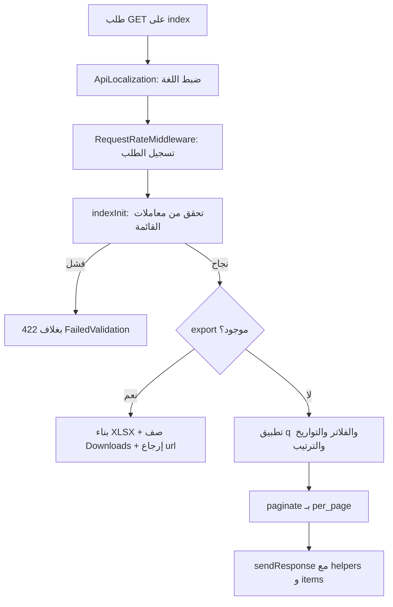
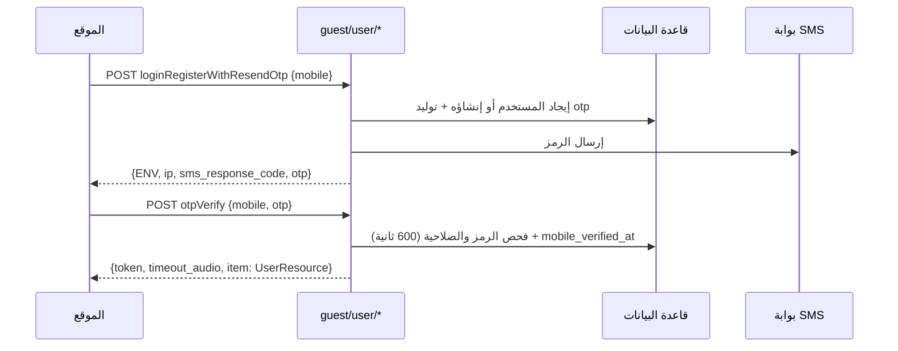
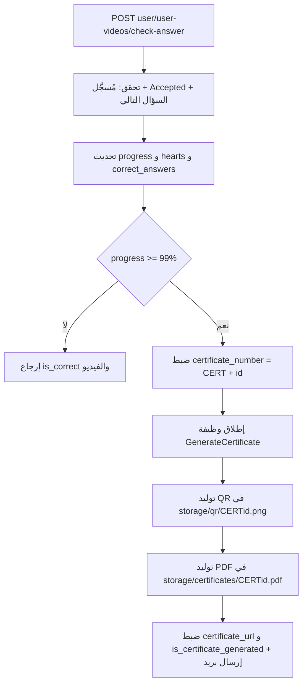

# الفصل الرابع: واجهات الـ API في منصة «أمان»

## ما ستتعلمه في هذا الفصل

- كيف يُقسّم الـ backend نقاط النهاية (endpoints) إلى ثلاثة جماهير: `guest` و`user` و`admin`، وكيف تُركّب هذه الأقسام في `bootstrap/app.php`.
- ما هي الوسائط (middleware) التي تمرّ عبرها كل مجموعة، وما الذي تفعله فعليًا (وما الذي لا تفعله رغم اسمها).
- شكل «الغلاف الموحد» (envelope) لكل استجابة ناجحة أو فاشلة، والفرق بينه وبين غلاف أخطاء التحقق (422).
- قواعد الترقيم (pagination) والفلترة والبحث والترتيب والتصدير (export) المشتركة بين جميع قوائم `index`.
- جداول مرجعية كاملة لكل نقطة نهاية: الطريقة (method)، المسار، الـ Controller، الصلاحية المطلوبة، حقول التحقق، وشكل `data` في الاستجابة.
- تدفّقات مهمة موضّحة بمخططات: المصادقة عبر OTP، وتوليد الشهادة (certificate).
- المخالفات والسلوكيات الغريبة في رموز الحالة (status codes) التي يجب أن تعرفها قبل استهلاك هذه الـ API.

---

## 1. المفهوم أولًا: ما معنى «تقسيم الـ API حسب الجمهور»؟

في التطبيقات النموذجية يوجد ملف واحد للمسارات (`routes/api.php`) وتُحمى بعض المسارات بوسيط مصادقة. أما هنا فقد اتُّخذ قرار معماري مختلف: **لا يوجد `routes/api.php` إطلاقًا**. بدلًا من ذلك يُسجَّل ثلاثة ملفات مسارات، كل ملف يخدم «جمهورًا» واحدًا، ولكل ملف بادئة (prefix) خاصة وسلسلة وسائط خاصة.

الفائدة التعليمية من هذا النمط: بمجرّد أن ترى مسارًا يبدأ بـ `admin/` تعرف يقينًا أنه يمرّ بحرس (guard) المدير، ولا تحتاج لقراءة تعريف المسار للتأكد.

### كيف طُبّق في هذا المشروع

الملف `backend/bootstrap/app.php` هو نقطة الربط:

| البادئة | ملف المسارات | سلسلة الوسائط |
|---|---|---|
| *(بلا بادئة)* | `routes/web.php` | `ApiLocalization`, `web`, `RequestRateMiddleware` |
| `guest/` | `routes/guest.php` | `ApiLocalization`, `RequestRateMiddleware` |
| `user/` | `routes/user.php` | `ApiLocalization`, `auth:sanctum`, `UserMiddleware`, `RequestRateMiddleware` |
| `admin/` | `routes/admin.php` | `ApiLocalization`, `auth:sanctum`, `AdminMiddleware`, `RequestRateMiddleware` |

إضافة إلى ذلك يُفعّل التطبيق `statefulApi()` و`trustProxies(at: '*')`، و**يُعطّل التحقق من CSRF لكل المسارات (`*`)** — وهو أمر مقبول في API خالصة تعتمد على رموز (tokens) لا على جلسات المتصفح.

### ماذا يفعل كل وسيط؟

**`ApiLocalization`** — يقرأ ترويسة `Accept-Language`، يأخذ الجزء الأساسي منها (subtag)، ويتحقق أنه ضمن `config('app.supported_languages')`، وإلا يرجع إلى `config('app.locale')`. ثم يضبط لغة التطبيق، **ويحفظ العمود `lang` على المستخدم المُصادق** إن وُجد، ويضيف ترويسة `Content-Language` على الاستجابة.

**`AdminMiddleware`** — يتحقق من `auth('admin')->check()`، وإلا يعيد:

```php
return $this->sendResponse(false, [], "You are not admin user", null, 400);
```

لاحظ: الرمز **400** لا 403 ولا 401. هذه مخالفة اصطلاحية يجب على العميل (frontend) التعامل معها.

**`UserMiddleware`** — نفس المنطق مع `auth('user')` والرسالة `"You are not user"` ورمز **400**.

**`RequestRateMiddleware`** — الاسم يوحي بتحديد المعدّل (rate limiting)، لكنه **لا يرفض أي طلب أبدًا**. وظيفته الفعلية هي إدراج سجل في جدول `RequestRate` لكل طلب، يحتوي على الطريقة، الرابط، عنوان IP، المُحيل (referrer)، الجسم (body)، والترويسات.

### مسألة الصلاحيات (permissions) — نقطة حرجة

الحزمة `spatie/laravel-permission` مُثبّتة ومستخدمة، **لكن لا يوجد أي وسيط صلاحيات ولا بوابة `can:` مطبّقة على أي مسار**. الصلاحيات موجودة كـ**بيانات فقط**: `AdminController@store/update` تُزامن أسماء `Permission`، و`AdminResource` تُرجع مصفوفة `permissions`. كما أن:

```php
public function authorize(): bool
{
    return true;
}
```

في `CustomFormRequest` تُعيد `true` دائمًا.

**النتيجة العملية:** التخويل (authorization) في هذا المشروع على مستوى الحرس فقط — أي مدير مُصادق يستطيع استدعاء أي نقطة نهاية إدارية. ولذلك في كل الجداول التالية عمود «الصلاحية المطلوبة» يعني حرفيًا: الحرس المطلوب، لا صلاحية دقيقة. الصلاحيات تُستخدم في لوحة التحكم لإخفاء عناصر الواجهة فقط، وهذا **ليس أمانًا** لأن الـ API لا تفرضه.

---

## 2. الغلاف الموحد للاستجابات

### المفهوم

«الغلاف» (envelope) هو أن تكون كل استجابة، ناجحة أو فاشلة، بنفس البنية الخارجية، بحيث يستطيع العميل كتابة معالج واحد لكل الحالات. البيانات الحقيقية تسكن دائمًا داخل مفتاح واحد (`data`).

### التطبيق: `BaseApiController::sendResponse`

التوقيع في `app/Http/Controllers/BaseApiController.php`:

```php
sendResponse($status = true, $data = null, $message = '', $errors = null, $code = 200, $request = null)
```

والناتج:

```json
{
  "status": true,
  "local": "ar",
  "message": "Listed",
  "data": { "...": "..." },
  "guard": "user",
  "errors": null,
  "response_code": 200,
  "local_language": "ar",
  "request_body": { "...": "صدى لـ request->all() إذا مُرِّر $request" }
}
```

ملاحظات دقيقة:

- `guard` يأتي من المساعد العام `Authed()->guard`.
- عند الفشل (`status === false`) تُطبّع `errors`: إذا مرّر المُنادي مصفوفة أخطاء تحتوي أكثر من عنصر (بالعدّ التعاودي) تُترك كما هي، وإلا تُستبدل بـ `{"message": ["<message>"]}`.
- `response_code` يكرّر رمز HTTP نفسه داخل الجسم.
- `sendServerError($msg, $data, $th, $request)` يُرجع رمز **500** ورسالة بالصيغة `"Server Technical Error: <msg> <exception message>"`.

### غلاف مختلف لأخطاء التحقق (422)

هذا مصدر التباس شائع للطلاب: أخطاء التحقق **لا تستخدم نفس الغلاف**. يُنتجها `app/Services/FailedValidation` عبر مسارين: `CustomFormRequest::failedValidation` (لكل أصناف FormRequest) و`BaseApiController::checkValidator($validator)` (للحالات التي تستخدم `Validator::make` مباشرة).

```json
{
  "status": false,
  "message": "<أول رسالة خطأ>[ and <n-1> moreValidation]",
  "data": null,
  "guard": "user",
  "errors": { "field": ["msg"] },
  "response_code": 422,
  "request_data": { "...": "..." }
}
```

الفروق عن الغلاف الأساسي: المفتاح هنا `request_data` لا `request_body`، ولا وجود لـ `local` ولا `local_language`.

### معالجات الاستثناءات العامة

| الشرط | الاستجابة |
|---|---|
| `AuthenticationException` مع `expectsJson` | غلاف، `message: "Unauthorized"`، `data: []`، **401** |
| `NotFoundHttpException` مع `expectsJson` | غلاف، `message: "EndPoint Is Not Found"`، **404** |

### استثناءات لا تتبع الغلاف

بعض نقاط النهاية الخاصة بالشهادات تُرجع **نصًّا خامًّا** لا JSON: `guest/user-videos/pdf/fix`، و`guest|user/user-videos/{certificate_number}/pdf`. هذا مذكور في مكانه في الجداول أدناه.

---

## 3. الترقيم والفلترة والترتيب والتصدير

### المفهوم

بدل تكرار منطق «اقرأ `per_page`، طبّق البحث، رتّب، صفّح» في كل Controller، يُجمع المنطق في سِمة (trait) واحدة يستدعيها كل `index`. هذا يضمن أن كل القوائم في النظام تتصرّف بنفس الطريقة وتقبل نفس معاملات الاستعلام.

### التطبيق: `app/Http/Traits/Controller/IndexTrait::indexInit`

القواعد مُعرَّفة في `config/constants.php` تحت `list_validations`. كل قائمة مبنية على السِمة تقبل المعاملات التالية:

| المعامل | القاعدة / السلوك |
|---|---|
| `per_page` | `nullable|numeric|min:1|max:100`؛ الافتراضي `config('constants.per_page')` = **20** |
| `page` | `nullable|numeric|min:1|max:1000` |
| `sort_column` | `nullable|in:` ويشمل `id` + أعمدة `$fillable` للموديل (ناقص الأعمدة المستثناة في الـ Controller) + مفاتيح `$sortAllowed` الإضافية. الافتراضي هو المفتاح الأساسي |
| `sort_direction` | `nullable|in:ASC,DESC`؛ الافتراضي `DESC` |
| `date_from` / `date_to` | `nullable|date_format:Y-m-d\TH:i:s.v\Z` (صيغة ISO مع أجزاء الثانية و`Z`). تُدمج إلى `dateFrom`/`dateTo` وتُطبَّق كـ `>=` و`<=` على العمود `$created_at` المعرَّف في الـ Controller (الافتراضي `created_at`، ومثال مخصّص: `AdminHomeController@userInformation` يستخدم `user_videos.created_at`) |
| `q` | بحث حر: `orLike(column, q)` على كل أعمدة `$fillable`؛ يمكن تعطيله لكل Controller عبر `$q = false` |
| `is_active` | مصفوفة من `1/0` أو `"true"/"false"`. إذا وُجدت القيمتان معًا فلا فلترة؛ وإذا وُجدت واحدة تُطبَّق `isActive()` أو `isNotActive()` — وهي نطاقات (scopes) مبنية على الحذف الناعم |
| أي عمود من `$fillable` | فلترة ضمنية لكل عمود: مطابقة تامة `where` إذا كان الاسم يحتوي `_id` أو كان `id`، وإلا `likeStart` (مطابقة بادئة) |
| `export` | إذا كانت قيمته صحيحة: يرفع حد الذاكرة إلى 2G، يبني `<Model>ResourceExport` (وإن لم يوجد يرجع إلى `<Model>Resource`) على مؤشّر (cursor)، يكتب ملف XLSX عبر `maatwebsite/excel` إلى `storage/app/public/downloads/export-Aman-<Ymd-His>.xlsx`، يسجّل صفًّا في `Downloads`، ويُرجع `data: { export: "<resource class>", url: "<public url>" }` **بدلًا من** القائمة المصفّحة |

تنبيه مهم: الأعمدة القابلة للترجمة (translatable) موجودة تقنيًا في `$fillable`، فيقبلها مُحقّق `sort_column`، لكنها مُخزَّنة كـ JSON، فالترتيب عليها يجري على النص الخام JSON ولا معنى دلالي له.

**الحذف الناعم:** كل Controller يقرّر قيمة `$deleted_at`، وعادةً تكون `auth('admin')->check()` — أي أن **المدير يرى الصفوف المحذوفة ناعمًا (`withTrashed`) بينما المستخدم والزائر لا يريانها**.

### شكل حمولة النجاح للقوائم

```json
{
  "data": {
    "helpers": { "...": "..." },
    "items": {
      "data": [],
      "links": {},
      "meta": { "current_page": 1, "per_page": 20, "total": 0, "last_page": 1 }
    }
  }
}
```

`items` هو ناتج `ResourceCollection::response()->getData(true)`. و`helpers` يحمل إضافات خاصة بكل Controller — مثل `averages` للتقييمات و`introduction` للفيديوهات، وقد يكون `null`.

### بقية السمات

`showInit` و`editInit` و`destroyInit` و`toggleActiveInit` تبدأ كلها بالتحقق `{primaryKey} => required|exists:<table>,<pk>` (فشلها ⇒ 422)، ثم تُرجع **403 مع الرسالة `"This Item is Inactive"`** إذا لم يُوجد الصف داخل النطاق المختار. الحمولات: `{item: Resource}` في show/destroy/toggle، و`{create: <بيانات create()>, item: Resource}` في edit. أما `toggleActive` فيكتب `deleted_at = null` عند `state=true` و`now()` عند `state=false`.



---

## 4. نقاط النهاية العامة — البادئة `/guest`

هذه المجموعة **بلا مصادقة**. الصلاحية المطلوبة في كل صفوفها: لا شيء.

### 4.1 مصادقة المدير

| الطريقة | المسار | الـ Controller@method | التحقق | `data` في الاستجابة |
|---|---|---|---|---|
| POST | `guest/admin/loginRegisterResendOtp` | `Admin\AdminAuthController@loginRegisterResendOtp` | مباشر: `email` مطلوب و`exists:admins,email`؛ `password` مطلوب | `{token, item: AdminResource}`. الرمز 400 مع `inActiveAccount` إذا لم يوجد صف، و**401 `invalidCredentials`** عند كلمة مرور خاطئة. عمليًا هو دخول بكلمة مرور — الاسم مضلّل |
| POST | `guest/admin/request-otp` | `AdminAuthController@requestOtp` | مباشر: `email` مطلوب `exists:admins,email,deleted_at,NULL` | `{ENV, ip, otp}` و`otp` يكون `null` في الإنتاج. الرمز 403 `tryAgainAfter` داخل مدة `otpDelay`، و**500 `emailNotFound` إذا كان `otp_created_at` فارغًا** |
| POST | `guest/admin/otpVerify` | `AdminAuthController@otpVerify` | `AdminVerifyOtpRequest`: `email` مطلوب `exists:admins,email`؛ `otp` مطلوب؛ وفحوص لاحقة: الحساب معطّل، `invalidOtp`، انتهاء الصلاحية بعد 600 ثانية | `{token, item: AdminResource}` |
| PUT | `guest/admin/password/update` | `AdminAuthController@updatePassword` | `UpdatePasswordRequest`: `email` مطلوب `exists:admins,email,deleted_at,NULL`؛ `password` مطلوب `min:6|max:12`؛ `otp` مطلوب مع نفس فحوص OTP | `{token, item: AdminResource}` |

### 4.2 مصادقة المستخدم

| الطريقة | المسار | الـ Controller@method | التحقق | `data` |
|---|---|---|---|---|
| POST | `guest/user/loginRegisterWithResendOtp` | `User\UserAuthController@loginRegisterResendOtp` | `UserRegisterRequest`: `mobile` مطلوب `min:8|max:20`؛ فحوص لاحقة: `disabledAccount`، `delay_seconds`/`tryAgainAfter` | يُنشئ المستخدم إن كان جديدًا ويرسل OTP عبر SMS؛ `{ENV, ip, sms_response_code, sms_response_message, otp}` |
| POST | `guest/user/loginRegisterResendOtp` | `UserAuthController@loginRegister` | `UserRegisterRequestWithOutOTP`: `mobile` مطلوب `min:8|max:20`؛ فحص `disabledAccount` | **دخول بلا OTP**: `{token, timeout_audio, item: UserResource}` |
| POST | `guest/user/otpVerify` | `UserAuthController@otpVerify` | `UserVerifyOtpRequest`: `otp` مطلوب (ورقم الجوال يُنظَّف عبر `trimMobile`)؛ فحوص: معطّل، `invalidOtp`، انتهاء بعد 600 ثانية | `{token, timeout_audio, item: UserResource}` ويُضبط `mobile_verified_at` |

انتبه إلى التشابه الشديد بين المسارين الأولين: `loginRegisterWithResendOtp` يرسل OTP، أما `loginRegisterResendOtp` (رغم اسمه) فيمنح رمز دخول فورًا بلا OTP.



### 4.3 المحتوى العام

| الطريقة | المسار | الـ Controller@method | التحقق | `data` |
|---|---|---|---|---|
| GET | `guest/videos` | `Admin\VideoController@index` | معاملات القائمة + `program_list_scope: nullable|in:all,new_programs,new_cases,most_viewed` | `VideoResource` مصفّح بلا `questions` ولا `scenes` للزوار؛ و`helpers.introduction.{title,description}` |
| GET | `guest/videos/{video}` | `VideoController@show` | `ShowVideoRequest` (بلا قواعد)؛ يُحلّ `{video}` بالـ **slug أو الـ id** عبر `Video::resolveIdFromRouteParameter`، و404 إن تعذّر | `{item: VideoResource}` |
| GET | `guest/certificates/{search}` | `User\UserVideoController@findCertificate` | لا شيء | `{items: UserVideoResource[]}` — حتى 10 نتائج، مطابقة بادئة على `certificate_number`، وللمولّدة أو القابلة للتوليد فقط |
| GET | `guest/user-videos/pdf/fix` | `UserVideoController@fixCertificatePdf` | لا شيء | **نص خام** `"Fixed Success"` — يعيد توليد كل الشهادات، بلا مصادقة وبلا تحديد معدّل |
| GET | `guest/user-videos/{certificate_number}/pdf` | `UserVideoController@downloadCertificateAsPdf` | لا شيء | **نص خام** (`"generated Success"` أو `"the certificate already generated"` أو جملة خطأ). آثار جانبية: توليد QR وPDF في `storage/public/{qr,certificates}`، وضبط `certificate_url` و`certificate_qr_code` و`is_certificate_generated`، وإرسال الشهادة بالبريد |
| GET | `guest/faqs` | `Admin\FaqController@index` | معاملات القائمة | `FaqResource` مصفّح `{id,title,description,deleted_at}` |
| GET | `guest/faqs/{faq}` | `FaqController@show` | وجود المفتاح | `{item: FaqResource}` |
| GET | `guest/awareness` | `Admin\TawiaController@index` | معاملات القائمة + `video_id` | `TawiaResource` مصفّح مع `VideoResource` متداخل |
| GET | `guest/awareness/{awareness}` | `TawiaController@show` | وجود المفتاح | `{item: TawiaResource}` |
| POST | `guest/uploadFile` | `FileController@uploadFile` | `file` مطلوب `file|mimes:jpeg,bmp,png,pdf,xlsx,docx,mp4,avi,flv|max:32024` (بالكيلوبايت)؛ `path` مطلوب `min:3|max:190`؛ `old_file` اختياري (يُحذف أولًا) | ناتج `uploadToStorage()` أي المسار/الرابط المخزَّن |
| POST | `guest/contacts` | `User\ContactController@store` | `ContactStoreRequest`: `name` مطلوب 1-50؛ `email` مطلوب بريد 1-100؛ `mobile` مطلوب نص (يُنظَّف، ويُشترط 10–13 رقمًا في فحص لاحق)؛ `subject` مطلوب ≤191؛ `message` مطلوب ≤1000؛ `video_id` اختياري موجود؛ `images` اختياري مصفوفة بحد 5 و`images.*` نص مطلوب ≤500؛ `type` مطلوب من `ContactType` | **201** `{item: ContactResource}` |
| GET | `guest/stories` | `Admin\StoryController@index` | معاملات القائمة + `video_id`، `email` (LIKE)، `mobile` (LIKE) | `StoryResource` مصفّح؛ الزوار يرون غير المحذوف ناعمًا فقط = **المنشور** |
| GET | `guest/stories/{story}` | `StoryController@show` | وجود المفتاح | `{item: StoryResource}` |
| POST | `guest/stories` | `StoryController@store` | `StoryRequest`: `first_name`/`last_name` مطلوب ≤100؛ `title` مطلوب ≤255؛ `mobile` مطلوب ≤20؛ `age` مطلوب صحيح 18–120؛ `email` مطلوب بريد ≤255؛ `video_id` اختياري موجود؛ `content` مطلوب؛ `program_name` اختياري ≤255 | **201** `{item: StoryResource}`؛ يُضبط `locale` باللغة الحالية و**`deleted_at = now()`** أي تُحفظ غير منشورة |
| GET | `guest/partners` | `Admin\PartnerController@index` | معاملات القائمة | `PartnerResource` مصفّح |
| GET | `guest/partners/{partner}` | `PartnerController@show` | وجود المفتاح | `{item: PartnerResource}` |
| GET | `guest/blogs` | `Admin\BlogController@index` | معاملات القائمة | `BlogResource` مصفّح (نصوص مترجَمة للزوار، وكائنات `{ar,en}` للمديرين) |
| GET | `guest/blogs/{blog}` | `BlogController@show` | يُحلّ بالـ **slug أو id رقمي**، و404 غير ذلك | `{item: BlogResource}` مع `tags` |
| GET | `guest/rates` | `User\RateController@index` | معاملات القائمة + `rate_1..4` (CSV)، `user_name`/`user_mobile`/`user_email`، `video_ids[]`، `langs[]`؛ ويدعم `sort_column=user_name` | `RateResource` مصفّح؛ `helpers.averages.{rate_1..4}` |
| GET | `guest/rates/{rate}` | `RateController@show` | وجود المفتاح | `{item: RateResource}` |
| GET | `guest/map/country-statistics` | `Admin\MapController@countryStatistics` | لا شيء | `data` = خريطة مفاتيحها معرّف ISO-3166 الرقمي ⇒ `{Name:{en,ar}, Id, Flag, Value, ValueRaw}`؛ مُخزَّنة مؤقتًا لشهر؛ وفلسطين مكرّرة تحت `376` |
| GET | `guest/test` | دالة مغلقة (closure) | لا شيء | صدى `request->all()` |

### 4.4 مسارات `web.php` (بلا بادئة)

| الطريقة | المسار | المعالج | الاستجابة |
|---|---|---|---|
| GET | `storage/certificates/{pdf}` | `UserVideoController@serveCertificate` | ملف PDF بترويسة `application/pdf`، أو **صفحة 404 بصيغة HTML** من `resources/views/certificate/notfound-display.php` تحمل `progress_phases` و`full_name`، أو HTML احتياطي برمز 500 |
| GET | `/` | دالة مغلقة | العرض `welcome` |
| GET | `/up` | فحص الصحة | — |
| — | `/telescope` | Telescope | محميّ بـ `config('telescope.middleware')` |

---

## 5. نقاط نهاية المستخدم — البادئة `/user`

الصلاحية المطلوبة لكل ما يلي: رمز Sanctum على حرس `user` (`auth:sanctum` + `UserMiddleware`).

| الطريقة | المسار | الـ Controller@method | التحقق | `data` |
|---|---|---|---|---|
| POST | `user/logout` | `HomeController@logout` | لا شيء | `[]` والرسالة `"Logout Success, Bye :)"`؛ يحذف الرمز الحالي فقط |
| POST | `user/uploadFile` | `FileController@uploadFile` | كما في الزائر | ناتج الرفع |
| DELETE | `user/deleteFile` | `FileController@deleteFile` | `files` مطلوب `array` | `null` مع `successfullDelete`؛ يحذف `storage/<file>` لكل عنصر **بلا فحص ملكية** |
| PATCH | `user/users/set-lang` | `User\UserController@set_lang` | `UserSetLangRequest`: `lang` مطلوب `in:ar,en` | `{item: UserResource}` |
| GET | `user/users/{user}` | `UserController@show` | وجود المفتاح | `{item: UserResource}` — **أي مستخدم مُصادق يستطيع قراءة أي معرّف مستخدم** |
| GET | `user/users/{user}/edit` | `UserController@edit` | وجود المفتاح | `{create: {}, item: UserResource}` |
| PUT/PATCH | `user/users/{user}` | `UserController@update` | `UserUpdateRequest`: `first_name`/`last_name` مطلوب 1-50؛ `email` اختياري بريد فريد باستثناء الصف نفسه؛ `mobile` **اختياري** على حرس المستخدم (ومطلوب على حرس المدير) بقاعدة `sa_mobile` وفريد باستثناء الصف | `{item: UserResource}`؛ ويُعاد الجوال قسرًا إلى قيمته الأصلية على حرس المستخدم |
| PUT | `user/mobile/update` | `UserAuthController@updateMobile` | مباشر: `old_mobile` مطلوب `sa_mobile` `exists:users,mobile`؛ `new_mobile` مطلوب `sa_mobile` `unique:brands,mobile` + فريد في `users`؛ `otp` مطلوب؛ فحوص `invalidOtp` والانتهاء | `{token, item: UserResource}` |
| GET | `user/videos` | `VideoController@index` | معاملات القائمة + `program_list_scope` | `VideoResource` مصفّح **مع `questions` و`scenes`** لأن الحُرس المصادقة تكشفهما |
| GET | `user/videos/{video}` | `VideoController@show` | slug أو id | `{item: VideoResource}` |
| GET | `user/rates` | `RateController@index` | كالزائر، لكن **مقيَّدة تلقائيًا بـ `user_id = Auth::id()`** | `RateResource` مصفّح + `helpers.averages` |
| GET | `user/rates/{rate}` | `RateController@show` | وجود المفتاح | `{item: RateResource}` (لا يُعاد فحص القيد في `show`) |
| POST | `user/rates` | `RateController@store` | `RateStoreRequest`: `video_id` مطلوب `exists:videos` وغير محذوف؛ `rate_1..4` مطلوب رقمي 1–3؛ `comment` اختياري ≤1000؛ فحص لاحق يشترط أن يكون للتسجيل القياسي (canonical enrollment) رقم شهادة، وإلا `youAreNotAllowToRateThisProgram` | **201** `{item: RateResource}`. آثار جانبية: upsert للتقييم (يُنشأ محذوفًا ناعمًا)، إسناد `code_number` بنوع `RATE`، ضبط `is_rated=1`، و`certificate_number='CERT'.id`، و`certificate_url`، وإطلاق `GenerateCertificate`. و404 `msg.notFound` إن لم يوجد تسجيل قياسي |
| GET | `user/scenes` | `Admin\ScenesController@index` | معاملات القائمة | `ScenesResource` مصفّح |
| GET | `user/scenes/{scene}` | `ScenesController@show` | وجود المفتاح | `{item: ScenesResource}` |
| GET | `user/questions` | `Admin\QuestionController@index` | معاملات القائمة | `QuestionResource` مصفّح — **ويشمل `correct_answer`** |
| GET | `user/questions/{question}` | `QuestionController@show` | وجود المفتاح | `{item: QuestionResource}` |
| GET | `user/awareness` | `TawiaController@index` | معاملات القائمة + `video_id` | `TawiaResource` مصفّح |
| GET | `user/awareness/{awareness}` | `TawiaController@show` | وجود المفتاح | `{item: TawiaResource}` |
| GET | `user/user-videos` | `UserVideoController@index` | معاملات القائمة؛ مقيَّدة بـ `user_id = Auth::id()` | `UserVideoResource` مصفّح (يُحمّل `video.questions` و`video.scenes` و`user`) |
| GET | `user/user-videos/{id}` | `UserVideoController@show` | `{id}` هو **معرّف فيديو** على حرس المستخدم | `{item: UserVideoResource}`؛ يحلّ `UserVideo::canonicalFor(user, video)`، و**يُنشئ تلقائيًا تسجيلًا مجانيًا بحالة `Accepted`** إن لم يوجد، وقد يطلق `GenerateCertificate` |
| GET | `user/user-videos/{id}/lastShow` | `UserVideoController@lastShow` | معرّف فيديو | `{item: UserVideoResource}` — نفس المحلّل القياسي بلا إنشاء تلقائي |
| POST | `user/user-videos` | `UserVideoController@store` | `UserVideoStoreRequest`: `video_id` مطلوب `exists:videos,deleted_at,NULL`؛ فحص لاحق يرفض تسجيلًا قائمًا `Accepted` ومُسجَّلًا برسالة `youAlreadyRegisteredInThisProgram` | **201** `{redirect_url: "<PLATFORM><locale>/payment/<video_id>?success=1", item: UserVideoResource}` |
| POST | `user/user-videos/check-answer` | `UserVideoController@checkQuestionAnswer` | `CheckAnswerRequest`: `video_id` مطلوب موجود وغير محذوف؛ `question_id` مطلوب `exists:questions`؛ `answer` اختياري من `answer_a..answer_d`؛ `answer_time` مطلوب `time_format`؛ فحوص لاحقة: يجب أن يكون مُسجَّلًا وبحالة `Accepted`، وأن يكون `question_id` هو **السؤال التالي** بحسب `appears_at` الخاص باللغة، وإلا رسالة تخطّي أسئلة | **201** `{video: UserVideoResource, is_correct: bool}`. يحدّث `answer_average`، و`hearts` (±1 محصورًا بين 0 و5)، و`correct_answers`، و`progress` كنسبة، و`current_time`، و`last_question_id`؛ وعند ‏99% أو أكثر يضبط `certificate_qr_code` و`certificate_number='CERT'.id` ويطلق `GenerateCertificate` |
| GET | `user/user-videos/{certificate_number}/pdf` | `UserVideoController@downloadCertificateAsPdf` | لا شيء | **نص خام** كما في مسار الزائر |
| GET | `user/stories` | `StoryController@index` | معاملات القائمة + الفلاتر | `StoryResource` مصفّح (غير المحذوف فقط) |
| GET | `user/stories/{story}` | `StoryController@show` | وجود المفتاح | `{item: StoryResource}` |

### ملاحظة على ترتيب المسارات

`user-videos/check-answer` مُسجَّل **بعد** `Route::resource('user-videos')`. ولأن `store` في الـ resource يستجيب لـ `POST user-videos` فقط، فإن `POST user-videos/check-answer` يُطابق مساره الصحيح. لكن **`GET user/user-videos/check-answer` سيصطدم بـ `show`** ويُعامل `check-answer` كمعرّف.

### تدفّق توليد الشهادة



---

## 6. نقاط نهاية المدير — البادئة `/admin`

الصلاحية المطلوبة لكل صف أدناه: رمز Sanctum على حرس `admin`. **ولا تُفرض أي صلاحية أدق من ذلك.**

### 6.1 الجلسة والملفات

| الطريقة | المسار | المعالج | التحقق | الاستجابة |
|---|---|---|---|---|
| POST | `admin/logout` | `HomeController@logout` | — | `[]` + رسالة |
| POST | `admin/uploadFile` | `FileController@uploadFile` | كما في الزائر | ناتج الرفع |
| DELETE | `admin/deleteFile` | `FileController@deleteFile` | `files` مطلوب `array` | `null` |

### 6.2 لوحة المعلومات والتقارير

| الطريقة | المسار | المعالج | التحقق | الاستجابة |
|---|---|---|---|---|
| GET | `admin/home/statistics` | `AdminHomeController@statistics` | `dates` و`date_from` و`date_to` بصيغة حرة عبر `getDateRangeByType` | **201** `{total_certificates, total_users, total_certificates_statistics:[{video_id,name,color,value,x,y}], date_range:{from,to}}` |
| GET | `admin/home/user-graph` | `AdminHomeController@userGraph` | — | `{graph: UserGraph}` |
| GET | `admin/home/user-information` | `AdminHomeController@userInformation` | معاملات القائمة؛ و`q` يبحث في `users.full_name`/`email`/`mobile` و`videos.title` و`user_videos.status`؛ والتواريخ على `user_videos.created_at`؛ ويدعم `export` | `UserInformationResource` مصفّح — `{id, video_id, program, color, lang, name, user{…}, transaction{payment_status, transaction_date}}` (وصيغة مسطّحة عند التصدير) |
| GET | `admin/map/country-statistics` | `MapController@countryStatistics` | — | كنسخة الزائر |
| GET | `admin/report/general-graph` | `ReportController@generalGraph` | `langs[]`، `video_ids[]`، `date_from`، `date_to` (بلا تحقق) | `{graph: GeneralGraph}` |
| GET | `admin/report/certificate-graph` | `ReportController@certificateGraph` | كما سبق | `{graph: ReportCertificateGraph}` |
| GET | `admin/report/user-graph` | `ReportController@userGraph` | كما سبق | `{graph: ReportUserGraph}` |

### 6.3 المديرون — `Route::resource('admins')` كاملًا

| الطريقة | المسار | الدالة | التحقق | الاستجابة |
|---|---|---|---|---|
| GET | `admin/admins` | `index` | معاملات القائمة على `$fillable` للموديل `Admin` (`name,email,mobile,role_name,password,otp*,last_read_notification_id,...`) | `AdminResource` مصفّح (`id,name,email,role_name,mobile,deleted_at,permissions[]`) |
| GET | `admin/admins/create` | `create` | — | `{}` |
| POST | `admin/admins` | `store` | `AdminStoreRequest`: `name` مطلوب `min:3|max:60` فريد؛ `email` مطلوب بريد 5-60 فريد؛ `mobile` اختياري 5-50؛ `role_name` اختياري 5-50؛ `password` مطلوب `min:6` و**`max:8`**؛ بالإضافة إلى `permissions[]` غير المُتحقَّق منها (تُزامن كأسماء `Permission`) | **201** `{item: AdminResource}` |
| GET | `admin/admins/{admin}` | `show` | وجود المفتاح | `{item: AdminResource}` |
| GET | `admin/admins/{admin}/edit` | `edit` | وجود المفتاح | `{create:{}, item: AdminResource}` |
| PUT/PATCH | `admin/admins/{admin}` | `update` | نفس الطلب؛ ومع PUT تُضاف قاعدة `id` موجود، وقواعد التفرّد تستثني الصف نفسه، و**لا قاعدة لكلمة المرور**؛ و`permissions` تُزامن (مصفوفة فارغة تمسحها) | `{item: AdminResource}` |
| DELETE | `admin/admins/{admin}` | `destroy` | وجود المفتاح | `{item: AdminResource}`؛ يُبطل الرموز؛ و**422 للمعرّف 1** برسالة "Can not delete first admin account"؛ حذف نهائي |
| PUT | `admin/admins/{admin}/toggleActive/{state}` | `toggleActive` | `state` من `true|false` | `{item: AdminResource}`؛ يُبطل الرموز؛ و**422 للمعرّف 1** |

### 6.4 المستخدمون — `Route::resource('users')` كاملًا

| الطريقة | المسار | الدالة | التحقق | الاستجابة |
|---|---|---|---|---|
| GET | `admin/users` | `index` | معاملات القائمة + `video_ids[]` (القيمة 0 تعني «بلا برنامج») و`langs[]`؛ ويدعم `sort_column=certificate_count` بترتيب عبر استعلام فرعي؛ و`export` ⇒ `UserResourceExport` | `UserResource` مصفّح مع `certificate_count` محتسبًا و`userVideos` متداخلة كـ `UserInformationVideoResource` مفلترة بـ `video_ids` إن وُجدت |
| GET | `admin/users/create` | `create` | — | `{}` |
| POST | `admin/users` | `store` | `UserStoreRequest`: `first_name`/`last_name` مطلوب 1-50؛ `email` اختياري بريد ≤60 فريد؛ `mobile` **مطلوب** على حرس المدير بقاعدة `sa_mobile` وفريد | **200** `{item: UserResource}` |
| GET | `admin/users/{user}` | `show` | وجود المفتاح (مع `withTrashed`) | `{item: UserResource}` |
| GET | `admin/users/{user}/edit` | `edit` | وجود المفتاح | `{create, item}` |
| PUT/PATCH | `admin/users/{user}` | `update` | `UserUpdateRequest` (الجوال مطلوب على حرس المدير، ويُطبَّق `trimMobile`) | `{item: UserResource}` |
| DELETE | `admin/users/{user}` | `destroy` | وجود المفتاح | حذف نهائي وإبطال الرموز؛ `{item: UserResource}` |
| PUT | `admin/users/{user}/toggleActive/{state}` | `toggleActive` | `state` من true/false | `{item: UserResource}`؛ يُبطل الرموز |

الدالة `UserController@destroyme` موجودة في الكود لكنها **غير مربوطة بأي مسار**.

### 6.5 الفيديوهات

| الطريقة | المسار | الدالة | التحقق | الاستجابة |
|---|---|---|---|---|
| GET | `admin/videos/colors` | `colors` | — | `{items:{id:{id:color}, en:{title:color}, ar:{title:color}}}` |
| GET | `admin/videos` | `index` | معاملات القائمة + `program_list_scope` (وفلاتر النطاق تُطبَّق فقط عندما **لا** يكون المستدعي مديرًا) | `VideoResource` مصفّح مع `questions` و`scenes`؛ و`helpers.introduction` |
| GET | `admin/videos/create` | `create` | — | `{}` |
| POST | `admin/videos` | `store` | `VideoStoreRequest`: `video_url.{ar,en}` مطلوب رابط ≤500؛ `logo` مطلوب ≤500؛ `title.{ar,en}` مطلوب ≤500؛ `description.{ar,en}` مطلوب ≤1000؛ `length` مطلوب `time_format` ≤191؛ `color` مطلوب ≤10؛ `is_new` اختياري `in:0,1` (ويُطبَّع من true/false و"true"/"false")؛ `status` اختياري من قيم `VideoStatus` | **201** `{item: VideoResource}` |
| GET | `admin/videos/{video}` | `show` | `ShowVideoRequest`؛ slug أو id | `{item: VideoResource}` |
| GET | `admin/videos/{video}/edit` | `edit` | وجود المفتاح | `{create, item: VideoEditResource}` — الترجمات كخرائط `{ar,en}` والأبناء بـ `QuestionEditResource`/`ScenesEditResource` |
| PUT/PATCH | `admin/videos/{video}` | `update` | `VideoStoreRequest` + `id` `exists:videos` | `{item: VideoResource}` |
| DELETE | `admin/videos/{video}` | `destroy` | وجود المفتاح | **429** مع `msg.can-not-delete-video-having-{scenes,questions,certificates}` إذا وُجدت تبعيات؛ وإلا حذف نهائي `{item}` |
| PUT | `admin/videos/{video}/toggleActive/{state}` | `toggleActive` | state | `{item: VideoResource}` |
| PUT | `admin/videos/{video}/toggleIsNew/{state}` | `toggleIsNew` | `state` مطلوب `in:true,false` | `{item: VideoResource}`؛ و404 إن لم يُوجد (مع `withTrashed`) |
| PUT | `admin/videos/{video}/status` | `updateStatus` | `UpdateVideoStatusRequest`: `status` **present** واختياري القيمة، من `VideoStatus` (والنص الفارغ `""` يصبح `null`) | `{item: VideoResource}`؛ و404 إن لم يُوجد |

### 6.6 قالب الشهادة (إعداد عام)

| الطريقة | المسار | الدالة | التحقق | الاستجابة |
|---|---|---|---|---|
| GET | `admin/certificate/image` | `CertificateController@show` | — | `{item: "<url>"}` من `settings('certificate_image')` أو `asset('certificate.jpeg')` |
| PUT | `admin/certificate/image` | `CertificateController@update` | `CertificateImageUpdateRequest`: `image` مطلوب نص 1-191 مطابق لـ `/\.(png|jpe?g)$/i` | `{item: "<storage url>"}`؛ ويُحدَّث/يُنشأ `Setting{set_key:'certificate_image'}` |

### 6.7 التقييمات — resource بـ `only(index, show, create, edit, update, destroy)`

| الطريقة | المسار | الدالة | التحقق | الاستجابة |
|---|---|---|---|---|
| GET | `admin/rates` | `index` | كل فلاتر الزائر، مع `withTrashed`، و`export` ⇒ `RateResourceExport` (يضيف `certificate_number`/`certificate_url`) | `RateResource` مصفّح + `helpers.averages` |
| GET | `admin/rates/create` | `create` | — | `{}` |
| GET | `admin/rates/{rate}` | `show` | وجود المفتاح | `{item: RateResource}` |
| GET | `admin/rates/{rate}/edit` | `edit` | وجود المفتاح | `{create, item}` |
| PUT/PATCH | `admin/rates/{rate}` | `update` | `RateUpdateRequest`: `rate_1..4` مطلوب رقمي 1–3؛ `comment` اختياري ≤1000 | `{item: RateResource}` |
| DELETE | `admin/rates/{rate}` | `destroy` | وجود المفتاح | حذف نهائي `{item}` |
| PUT | `admin/rates/{rate}/toggleActive/{state}` | `toggleActive` | state | `{item}` |

لا يوجد `POST admin/rates` — إنشاء التقييم متاح للمستخدم فقط.

### 6.8 المشاهد — `Route::resource('scenes')` كاملًا

هنا `$deleted_at = false` في كل المواضع، أي أن الموديل يُعامَل كموديل صارم و`destroy` يستخدم `delete()` لا الحذف النهائي.

- `index` بمعاملات القائمة، و`create` يُرجع `{}`.
- `store`/`update` عبر **`ScenesStoreRequest`**: `video_id` مطلوب `exists:videos`؛ `title.{ar,en}` مطلوب 1-191؛ `logo` مطلوب 1-191؛ `start_time` مطلوب `time_format`؛ `length` مطلوب `time_format`؛ `end_time` مطلوب `time_format` و`after:start_time`؛ وفحص لاحق: الزوج `(video_id, start_time)` يجب أن يكون فريدًا.
- `show` ⇒ `ScenesResource`، و`edit` ⇒ `ScenesEditResource`، و`destroy` حذف ناعم.

### 6.9 الأسئلة — `Route::resource('questions')` كاملًا

| الطريقة | المسار | الدالة | التحقق | الاستجابة |
|---|---|---|---|---|
| GET | `admin/questions` | `index` | معاملات القائمة | `QuestionResource` مصفّح |
| GET | `admin/questions/create` | `create` | — | `{}` |
| POST | `admin/questions` | `store` | `QuestionStoreRequest` (أدناه) | **201** `{item: QuestionResource}`؛ و**يُعيد تصفير كل `UserVideos` لذلك الفيديو** (حذف `UserAnswer`، تصفير `progress` و`correct_answers`، `hearts=5`، تحديث `total_questions`) للصفوف التي `certificate_number = null`، داخل معاملة (transaction) |
| GET | `admin/questions/{question}` | `show` | وجود المفتاح | `{item: QuestionResource}` |
| GET | `admin/questions/{question}/edit` | `edit` | وجود المفتاح | `{create, item: QuestionEditResource}` بخرائط `{ar,en}` |
| PUT/PATCH | `admin/questions/{question}` | `update` | نفس الطلب + `id` مطلوب | `{item}`؛ ونفس الأثر الجانبي بالتصفير |
| DELETE | `admin/questions/{question}` | `destroy` | وجود المفتاح | `{item}` |

حقول `QuestionStoreRequest`: `video_id` مطلوب (ويُفحص وجوده مع `withTrashed` في فحص لاحق)؛ `question.{ar,en}` مطلوب 1-1000؛ `answers_a.{ar,en}` و`answers_b.{ar,en}` مطلوبة؛ `answers_c/d.{ar,en}` اختيارية؛ `wrong_a/b/c/d.{ar,en}` اختيارية؛ `correct_answer` مطلوب من `answer_a..answer_d`؛ `allowed_time` مطلوب `time_format`؛ `appears_at.{ar,en}` مطلوب `time_format`. والفحوص اللاحقة: `appears_at` لا يجوز أن يكون `00:00:00` (`validation.appears_at_not_zero`)، ويجب أن يكون فريدًا **لكل لغة على مستوى الثانية** بين بقية أسئلة الفيديو.

### 6.10 تسجيلات المستخدم في الفيديو — resource بـ `only(index, show)` + أفعال مخصّصة

| الطريقة | المسار | الدالة | التحقق | الاستجابة |
|---|---|---|---|---|
| GET | `admin/user-videos` | `index` | معاملات القائمة على `$fillable` (`user_id,video_id,progress,lang,status,certificate_number,is_certificate_generated,…`) مع `withTrashed` | `UserVideoResource` مصفّح (فيديو متداخل مع أسئلته ومشاهده، والمستخدم) |
| GET | `admin/user-videos/{user_video}` | `show` | وجود المفتاح | `{item: UserVideoResource}` — وعلى حرس المدير يكون المعرّف هو معرّف **UserVideo** نفسه لا الفيديو |
| PUT | `admin/user-videos/update-certificate-user-name` | `updateCertificateUserName` | `UpdateCertificateUserName`: `user_video_id` مطلوب `exists:user_videos`؛ `first_name`/`last_name` مطلوب نص ≤191 | `data: null` والرسالة `Updated`؛ يُعيد تسمية المستخدم، يحذف الـ PDF القديم، ويعيد التوليد بعد الاستجابة |
| POST | `admin/user-videos/{certificate_number}/regenerate-certificate` | `regenerateCertificate` | المسار مقيَّد بـ `[A-Za-z0-9_-]+` | يحذف الـ PDF والـ QR ثم يعيد التوليد: `{item: UserVideoResource}` عند النجاح؛ 404 `msg.notFound`؛ و**422** بـ `{message: "<نص المولّد>"}` عند فشل المولّد |
| POST | `admin/user-videos/{user_video}/revoke-certificate` | `revokeCertificate` | معرّف رقمي | `{item: UserVideoResource}`؛ 403 إن لم يكن مديرًا، 404 إن لم يوجد، **422** `certificate.revoke_not_generated -1` إن لم تكن مولّدة، **422** `certificate.revoke_pipeline_complete -2` إن كانت كل المراحل مكتملة؛ ويحذف PDF وQR ويضبط `is_certificate_generated=0` |
| POST | `admin/user-videos/{user_video}/reset` | `resetUserVideo` | معرّف رقمي | `{item: UserVideoResource}`؛ **422** إذا كان `certificate_number !== null`؛ 404 إذا غاب الصف أو الفيديو؛ ويحذف `UserAnswer` ويصفّر التقدّم |
| PUT | `admin/user-videos/{user_video}/toggleActive/{state}` | `toggleActive` | state | `{item}` |

### 6.11 الأسئلة الشائعة — `Route::resource('faqs')` كاملًا + toggleActive

`FaqStoreRequest`: `title` مصفوفة مع `title.ar` و`title.en` مطلوبين 1-191؛ `description` مصفوفة مع `.ar` و`.en` مطلوبين 1-1000 (ومع PUT تُضاف `id` `exists:faqs,deleted_at,NULL`). الاستجابات `{item: FaqResource}`، و`store` يُرجع 201، ورسالة `update` **خطأً** هي `Created`.

### 6.12 جهات الاتصال — `Route::resource('contacts')` كاملًا + إضافات

| الطريقة | المسار | الدالة | التحقق | الاستجابة |
|---|---|---|---|---|
| GET | `admin/contacts` | `index` | معاملات القائمة + `types[]` و`statuses[]` (تُفلتر على التعبير المحتسب `Contact::STATUS_SQL` من نوع CASE) | `ContactResource` مصفّح (`type,name,email,mobile,subject,message,images,reply,status,video_title,…`) |
| GET | `admin/contacts/create` | `create` | — | `{}` |
| POST | `admin/contacts` | `store` | `ContactStoreRequest` | **201** `{item}` |
| GET | `admin/contacts/{contact}` | `show` | وجود المفتاح | `{item}` |
| GET | `admin/contacts/{contact}/edit` | `edit` | وجود المفتاح | `{create,item}` |
| PUT/PATCH | `admin/contacts/{contact}` | `update` | `ContactStoreRequest` + `id` موجود | `{item}` |
| POST | `admin/contacts/{contact}/reply` | `reply` | `ContactReplyRequest`: `reply` مطلوب 1-1000 | `{item}`؛ يحفظ الرد ويُرسل `SendReplyMail` إلى `contact.email` |
| DELETE | `admin/contacts/{contact}` | `destroy` | وجود المفتاح | `{item}` |
| PUT | `admin/contacts/{contact}/toggleActive/{state}` | `toggleActive` | state | `{item}` |

### 6.13 القصص — `Route::resource('stories')` كاملًا + toggleActive

- `index`: معاملات القائمة + `video_id`/`email`/`mobile`؛ و`withTrashed` للمديرين؛ والعمود `full_name` مستثنى من أعمدة الفلترة.
- `create` ⇒ `{videos:[{id,title}]}`.
- `store`/`update` عبر `StoryRequest`، و`show`، و`edit`.
- `destroy`: **`$deleted_at = false` ⇒ حذف ناعم فقط**.
- `toggleActive` يعمل عمليًا كـ«نشر / إلغاء نشر»، لأن الزوار يرون غير المحذوف فقط.

### 6.14 الإشعارات

| الطريقة | المسار | المعالج | التحقق | الاستجابة |
|---|---|---|---|---|
| GET | `admin/notifications` | `NotificationController@indexAdmin` | معاملات القائمة + `is_not_update_last_read_notification_id` | موديلات `Notification` مصفّحة (بتحميل مسبق للعلاقات `user` و`Contact` و`UserVideo.video`؛ و`NotificationResource` مُعرَّف لكن السِمة تُسلسل عبر `$this->resource`)، والعناصر مقصورة على الإشعارات التي لها `contact` أو `userVideo`. أثر جانبي: يقدّم `last_read_notification_id` للمدير إلا إذا رُفعت الراية |
| GET | `admin/is-new-notifications` | `isNewNotifications` | — | `{is_new_notification: bool}` |
| POST | `admin/set-last-notification-id` | `setLastNotificationId` | `notification_id` (بلا تحقق) | `{is_new_notification: bool}` |

### 6.15 التوعية (Tawia) — `Route::resource('awareness')` كاملًا بأسماء `admin.tawias` + toggleActive

`TawiaRequest`: `video_id` مطلوب `exists:videos`؛ `title.{ar,en}` مطلوب 1-255؛ `description.{ar,en}` مطلوب 1-1000؛ `symptoms.ar[]` و`symptoms.en[]` مصفوفتان مطلوبتان وعناصرهما 1-1000 (ومع PUT تُضاف `id` `exists:tawias`).

انتبه: `store`/`update` تُرجع **الموديل الخام** (`{item: <model>}`) لا Resource؛ أما `show`/`index` فترجع `TawiaResource`، و`edit` يرجع `TawiaEditResource` بخرائط `{ar,en}` و`symptoms` مفكوكة من JSON لكل لغة.

### 6.16 الشركاء — `Route::resource('partners')` كاملًا + toggleActive

`PartnerStoreRequest`: `name` مطلوب نص 1-191؛ `logo` اختياري نص ≤500 (ومع PUT تُضاف `id` `exists:partners,deleted_at,NULL`). الاستجابة `{item: PartnerResource}` بالحقول `id,name,logo,createdAt,updatedAt,created_at,updated_at,deleted_at,isActive`.

### 6.17 المدونة — `Route::resource('blogs')` كاملًا + toggleActive

`BlogRequest`: `slug` اختياري نص ≤191 بقاعدة `regex:/^[a-z0-9]+(?:-[a-z0-9]+)*$/` وفريد باستثناء `{blog}` في المسار؛ `publish_date` مطلوب تاريخ؛ `logo` اختياري نص ≤191؛ `tags` اختياري مصفوفة نصوص ≤191؛ `title.{ar,en}` مطلوب ≤191؛ `short_description.{ar,en}` مطلوب ≤500؛ `content.{ar,en}` مطلوب. و`store`/`update` تُزامن الوسوم عبر `SyncsArticleTags` وتُرجع `{item: BlogResource}` مع `tags[{id,name,slug,color}]` (و`store` يُرجع 201). و`show` يقبل **slug أو id** (و404 غير ذلك).

---

## 7. سلوكيات عابرة للأقسام يجب حفظها

- **الحُرس**: `admin` و`user` حرسان منفصلان في Sanctum، والرموز تُسمّى `auth_token`. و`logout` يحذف الرمز الحالي فقط لا كل الرموز.
- **المساعد `toString($data)`** يحوّل معظم القيم القياسية في الـ Resources إلى نصوص، ولذلك تُعاد القيم المنطقية إلى نوعها صراحةً حيث يلزم (`is_new`، `is_rated`، `is_certificate_generated`، `is_active`).
- **الأعمدة القابلة للترجمة** (`spatie/laravel-translatable`) تُرجع نص اللغة الحالية للحُرس غير الإدارية، وخرائط `{ar,en}` في مسار المدير و`*EditResource`. وهي مخزَّنة JSON، فالترتيب عليها بلا معنى ولو قبله المُحقّق.
- **`is_active` والحذف الناعم يُستخدمان كراية نشر**: `toggleActive` يكتب في `deleted_at`. ولذلك قصص الزوار تُنشأ «محذوفة» أساسًا.
- **هوية الشهادة** هي `'CERT' . user_video.id`؛ الـ PDF في `storage/certificates/CERT{id}.pdf` والـ QR في `storage/qr/CERT{id}.png`.
- **نقاط نهاية بلا مصادقة ولها آثار جانبية**: `guest/user-videos/pdf/fix` (يعيد توليد كل الشهادات) و`guest/user-videos/{certificate_number}/pdf` (يولّد ويرسل بريدًا). وكلتاهما تُرجع نصًّا خامًّا لا الغلاف.
- **ملفات غير مربوطة أو معطوبة**: `app/Http/Controllers/User/UserAnswerController.php` و`CronJobController.php` غير مربوطين ومعطوبان (استيرادات ناقصة، ومرجع لصنف غير موجود `App\Http\Controllers\API\BaseApiController`، واستخدام `Admin::class` كموديل لـ `UserAnswer`). و`Admin\DownloadsController` بدواله `index`/`download`/`destroy` مكتمل لكنه **غير مربوط**، وكذلك `AdminAuthController@updateEmail`.
- **مخالفات رموز الحالة**: رفض الحرس ⇒ 400؛ «الصف خارج النطاق» ⇒ 403؛ تعارض التبعيات ⇒ 429؛ نجاح `AdminHomeController@statistics` ⇒ 201؛ و«البريد غير موجود» في `requestOtp` ⇒ 500.

---

### أسئلة للمراجعة

**1. لماذا لا يوجد `routes/api.php` في هذا المشروع، وأين تُعرَّف المسارات بدلًا منه؟**
لأن التوجيه أُعيد تنظيمه حسب الجمهور في `bootstrap/app.php`، الذي يسجّل `routes/guest.php` و`routes/user.php` و`routes/admin.php` و`routes/web.php`، كل واحد ببادئته وسلسلة وسائطه.

**2. هل تحمي الحزمة `spatie/laravel-permission` نقاط النهاية الإدارية؟**
لا. لا يوجد وسيط صلاحيات ولا بوابة `can:` على أي مسار، و`CustomFormRequest::authorize()` تُعيد `true` دائمًا. الصلاحيات بيانات تُزامن وتُعاد في `AdminResource` وتُستخدم لإخفاء عناصر واجهة لوحة التحكم فقط. أي مدير مُصادق يمكنه استدعاء أي نقطة نهاية إدارية.

**3. ما وظيفة `RequestRateMiddleware` الحقيقية؟**
لا يحدّ المعدّل ولا يرفض أي طلب. يُدرج صفًّا في `RequestRate` لكل طلب يحتوي الطريقة والرابط وIP والمُحيل والجسم والترويسات.

**4. ما الفرق بين غلاف `sendResponse` وغلاف أخطاء التحقق؟**
غلاف `sendResponse` يحتوي `status, local, message, data, guard, errors, response_code, local_language, request_body`. أما غلاف التحقق (422) الصادر من `app/Services/FailedValidation` فيحتوي `request_data` بدل `request_body`، ولا يحتوي `local` ولا `local_language`، ورسالته هي أول خطأ مع لاحقة `and <n-1> moreValidation`.

**5. كيف يرى المدير الصفوف المحذوفة ناعمًا بينما لا يراها المستخدم؟**
كل Controller يحدّد `$deleted_at`، وقيمتها عادةً `auth('admin')->check()`. فإذا كان المستدعي مديرًا يُطبَّق `withTrashed`، وإلا فتُخفى الصفوف المحذوفة. ولهذا صار `toggleActive` — الذي يكتب في `deleted_at` — بمثابة نشر/إلغاء نشر.

**6. ماذا يحدث عند إرسال `export=1` إلى أي قائمة؟**
تتغيّر بنية الاستجابة كليًا: يُرفع حدّ الذاكرة إلى 2G، ويُبنى `<Model>ResourceExport` (أو `<Model>Resource` احتياطًا) على مؤشّر، ويُكتب XLSX في `storage/app/public/downloads/export-Aman-<Ymd-His>.xlsx`، ويُسجَّل صف في `Downloads`، ويُرجع `data: {export, url}` بدلًا من القائمة المصفّحة.

**7. متى تُولَّد الشهادة تلقائيًا؟**
عند وصول `progress` إلى 99% أو أكثر في `checkQuestionAnswer`: يُضبط `certificate_qr_code` و`certificate_number = 'CERT'.id` وتُطلَق الوظيفة `GenerateCertificate`. كما تُطلَق عند إنشاء تقييم في `RateController@store`، وقد تُطلَق أيضًا من `UserVideoController@show`.

**8. لماذا لا يُعتبر رقم الجوال قابلًا للتعديل عبر `PUT user/users/{user}`؟**
لأن `UserUpdateRequest` يجعل `mobile` اختياريًا على حرس المستخدم، و`update` يُعيد قسرًا قيمة الجوال الأصلية للصف. تغيير الجوال يجري فقط عبر `PUT user/mobile/update` الذي يشترط `old_mobile` و`new_mobile` و`otp`.

**9. ما دلالة الرمز 429 في حذف فيديو؟**
هو استخدام غير اصطلاحي: `admin/videos/{video}` DELETE يُرجع 429 مع `msg.can-not-delete-video-having-{scenes,questions,certificates}` عندما توجد تبعيات، بدلًا من 409 المتوقّعة للتعارض.

**10. لماذا يعمل `POST user/user-videos/check-answer` بينما `GET` على المسار نفسه لا يعمل؟**
لأن المسار سُجِّل بعد `Route::resource('user-videos')`. الـ resource لا يملك مسار POST بهذه الصيغة فيصل الطلب صحيحًا، لكن `GET user/user-videos/check-answer` يُطابق `show` الذي يعتبر `check-answer` معرّفًا.
