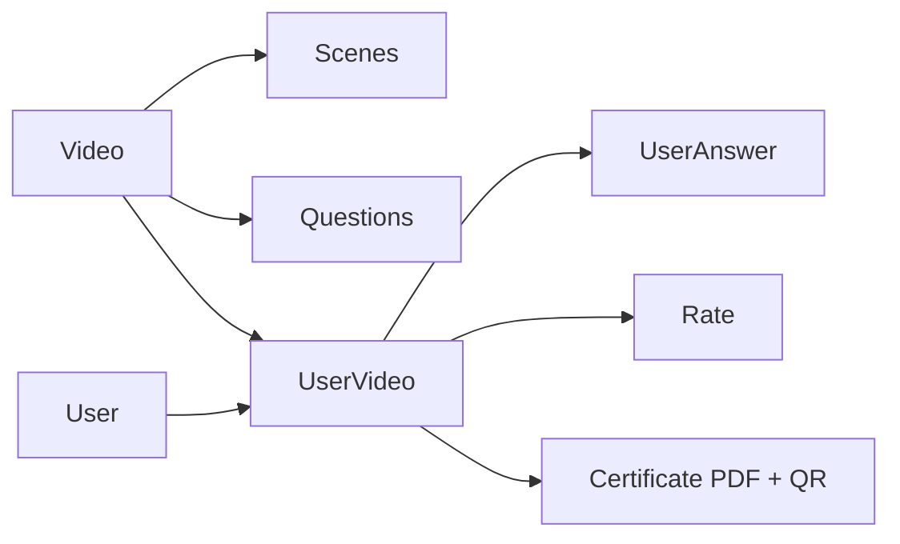
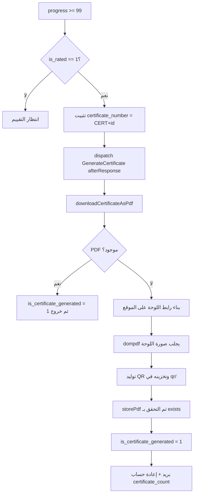

# منطق العمل وميزات النظام في منصة «أمان»

هذا الفصل يشرح **قلب التطبيق**: كيف يسير المستخدم في مسار التدريب، وكيف تُولَّد الشهادة كملف PDF مع رمز QR ونص عربي سليم، وكيف تُبنى خدمات الإحصاء والرسوم البيانية، وكيف يُصدَّر Excel، وكيف تعمل المهام المؤجّلة والبريد، وما هي الدوال المساعدة العامة التي يعتمد عليها كل ما سبق.

---

## ما ستتعلمه في هذا الفصل

- المفهوم المحوري في النظام: كائن الالتحاق `UserVideo` وكيف يجمع التقدّم والتقييم وهوية الشهادة في مكان واحد.
- كيف تُرتَّب المشاهد (`Scenes`) والأسئلة (`Question`) بحسب اللغة الحالية باستخدام تعبير SQL خام على أعمدة JSON.
- خوارزمية «الالتحاق الأصلي» `scopeCanonicalFor` وسبب وجودها (وأي علّة أصلحتها).
- ما يحدث بالتفصيل عند الإجابة على سؤال: القلوب (`hearts`)، الدرجة، `progress`، متوسط زمن الإجابة، ونقطة الاستئناف.
- مسار توليد الشهادة كاملًا: من الإعدادات البيئية (`PLATFORM`, `PLATFORM_CERT`) إلى `dompdf` إلى `BaconQrCode` إلى التخزين والبريد.
- كيف حُلّت مشكلة **النص العربي** في الشهادة (ولماذا لا يوجد «تشكيل مسبق» للحروف).
- «نموذج المراحل» (`certificateProgressPhases`) الذي يُخبر المستخدم أين توقّف مساره.
- بنية خدمات الرسوم البيانية الأربع، والفروق الدلالية بينها.
- المُصدِّر العام إلى Excel، وصف «المتوسطات»، وحدود دالة `columnFormats()`.
- حقيقة أن المهام «المؤجّلة» في المشروع تعمل داخل عملية PHP نفسها عبر `afterResponse()` ولا تحتاج عاملًا (worker).
- الرسائل البريدية الأربع، والدوال المساعدة في `app/Helpers/general.php`، وأوامر الـ Console.
- قائمة بالتعارضات والعلل الكامنة المرصودة في الكود — مهمّة جدًا لمن يريد تطوير المشروع.

---

## 1. المفهوم المحوري: `UserVideo`

في هذا المشروع لا يوجد «كورس» و«تسجيل» و«شهادة» ككيانات منفصلة؛ كلّها مجموعة في كائن واحد هو **التحاق المستخدم ببرنامج**:

| الكيان | الملف | دوره |
|---|---|---|
| `Video` | `app/Models/Video.php` | البرنامج التدريبي نفسه (الفيديو) |
| `Scene` | علاقة `Video::scenes()` | علامات فصول داخل الفيديو |
| `Question` | `app/Models/Question.php` | سؤال يظهر في لحظة معيّنة من الفيديو |
| `UserVideo` | `app/Models/UserVideo.php` | التحاق مستخدم ببرنامج + التقدّم + هوية الشهادة |
| `UserAnswer` | جدول الأجوبة | كل إجابة يسجّلها المستخدم |
| `Rate` | `app/Models/Rate.php` | تقييم المستخدم للبرنامج (شرط للشهادة) |
| `Tawia` | `app/Models/Tawia.php` | محتوى الكتيّب التوعوي المرافق |

كل الأرقام التي تظهر للمستخدم (النسبة، الدرجة، التقدير، رقم الشهادة) مقروءة من صفّ `UserVideo` واحد.



---

## 2. مسار التدريب

### 2.1 البرنامج والأسئلة والمشاهد

`Video` يستخدم `spatie/laravel-translatable` على أعمدة `video_url` و`title` و`description` (`app/Models/Video.php:43`). لاحظ أنّ **رابط الفيديو نفسه مُترجَم**، أي أنّ لكل لغة ملف فيديو مستقل. الـ slug مُشتقّ من العنوان الإنجليزي (`Video.php:18`)، والاستدعاء يمكن أن يكون بالـ slug أو بالـ id (`Video.php:52`).

الترتيب هو الجزء اللافت. الأعمدة `start_time` (للمشاهد) و`appears_at` (للأسئلة) مخزّنة **JSON مُترجَم**، فلا يمكن الترتيب عليها مباشرة. لذلك تُستخرَج قيمة اللغة الحالية من الـ JSON وقت الاستعلام ثم تُحوَّل إلى وقت:

```php
// app/Models/Video.php:81  (وكذلك :91 للأسئلة)
->orderByRaw(
    "STR_TO_DATE(JSON_UNQUOTE(JSON_EXTRACT(start_time, '$.\"" . app()->getLocale() . "\"')), '%H:%i:%s')"
)
```

> تنبيه مهم للطلاب: هذا التعبير **خاصّ بـ MySQL** ويفشل على sqlite. أي بيئة تطوير محلية تعمل على sqlite ستُعطِّل ترتيب المشاهد والأسئلة.

في `app/Models/Question.php:17` نجد حلًّا لقيد آخر: MySQL 8 لا يسمح بقيمة افتراضية لعمود JSON، لذا وُضعت القيمة الاحتياطية في `$attributes` على مستوى الـ Model:

```php
protected $attributes = [
    'appears_at' => '{"ar":"00:00:00","en":"00:00:00"}',
];
```

بنية السؤال: أربعة خيارات مُترجَمة `answers_a..answers_d`، وأربع رسائل تفسير للخطأ `wrong_a..wrong_d`، إضافة إلى `correct_answer` و`allowed_time`.

### 2.2 الالتحاق (Enrollment)

الالتحاق في «أمان» **مجاني دائمًا**؛ لا توجد بوابة دفع فعلية، وتُثبَّت الحالة مباشرة على `VideoPaymentStatus::Accepted`:

```php
// app/Http/Controllers/User/UserVideoController.php:117 — enrollmentInputs()
'status'          => VideoPaymentStatus::Accepted,
'hearts'          => 5,
'total_questions' => $video->questions->count(),
'lang'            => $request->header('Accept-Language'),
```

- `show()` (`UserVideoController.php:58`) يحلّ الالتحاق عبر `UserVideo::canonicalFor()`، وإن لم يوجد **يُنشئه تلقائيًا** عند أول فتح للبرنامج (`:70`).
- `store()` (`:137`) يعيد استخدام صفّ `registered()` (أي `Accepted` ولم تُصدر له شهادة بعد) إن وُجد، وإلا يُنشئ صفًّا جديدًا.
- `UserVideo::boot()` (`:43`) يُنشئ صفّ `Notification` عند كل عملية التحاق جديدة.

### 2.3 خوارزمية «الالتحاق الأصلي» `scopeCanonicalFor`

قد يملك المستخدم أكثمن صفّ `UserVideo` لنفس البرنامج (إعادة التحاق، تجارب سابقة). فأي صفّ هو «الصحيح»؟ الجواب في `app/Models/UserVideo.php:125`:

```php
->where('status', VideoPaymentStatus::Accepted)
->orderByRaw('CASE WHEN progress >= 99 THEN 0 ELSE 1 END')
->latest();
```

أي: **فضّل الالتحاق المُنجَز، ثم الأحدث**. ويوثّق تعليق الدالة العلّة التي أُصلحت بها: كان `show()` و`lastShow()` يحلّان صفّين مختلفين، فكان المستخدم بعد إنهاء البرنامج يُعاد به إلى بدايته.

### 2.4 الإجابة على سؤال — `checkQuestionAnswer()`

الدالة في `app/Http/Controllers/User/UserVideoController.php:167`، وخطواتها بالترتيب:

1. تحميل `Question`، وحلّ الالتحاق باستخدام `registered()->latest()` — لاحظ أنّه **ليس** `canonicalFor()` (تعارض مذكور في القسم 9)، ثم تحميل كل `UserAnswer` السابقة.
2. تحديد الصحّة: `$is_correct = $question->correct_answer == $request->answer;`
3. إدراج صفّ `UserAnswer` يحمل الحالة (صحيح/خطأ) و`answer_time` و`user_answer`.
4. **القلوب** (`:188`):

   | الحالة | الشرط | الأثر |
   |---|---|---|
   | إجابة صحيحة | `0 <= hearts < 5` | `hearts + 1` |
   | إجابة خاطئة | `0 < hearts <= 5` | `hearts - 1` |

   القيمة محصورة في المجال `[0,5]`، ولا تمنع الخادم شيئًا فعليًا — أثرها في واجهة المستخدم فقط.
5. **الدرجة والتقدّم** (`:199`):

   ```php
   $correct_answers = $prior_correct + ($is_correct ? 1 : 0);
   $progress = (int) ((count($priorAnswers) + 1) / $question->video->questions->count() * 100);
   ```

   بما أنّ الحساب على **عدد الأجوبة** لا على عدد الأسئلة المميّزة، فإعادة الإجابة على السؤال نفسه تُقدّم النسبة أيضًا.
6. **`answer_average`**: متوسط أزمنة الإجابة عبر `calculateAverageTime()` في `app/Helpers/general.php:276` — تحويل `hh:mm:ss` إلى ثوانٍ، ثم المتوسط، ثم `floor`، ثم إعادة التنسيق.
7. **نقطة الاستئناف**: `current_time` و`last_question_id`، وتُصفَّر إلى `00:00:00` و`null` بمجرّد تجاوز `progress` قيمة 99.
8. **عند `progress >= 99`** (`:217`) تُثبَّت هوية الشهادة:

   ```php
   $user_video->certificate_number = 'CERT' . $user_video->id;
   ```

   والتعليق في (`:221`) يشرح أنّ هذه القيمة يجب أن تكون **ثابتة ومطابقة** لما يضعه `RateController`، لأن أسماء ملفات PDF/QR ومسار الزائر `/certificates/{n}` كلّها مبنيّة عليها؛ النظام القديم `base_convert(id*2)` كان يُنتج ملفات «يتيمة» لا يجدها أحد.
9. إن تحقّق `isApplicableForCertificate()` — أي `progress >= 99` **و** `is_rated == 1` (`UserVideo.php:143`) — تُطلَق `GenerateCertificate` عبر `dispatch(...)->afterResponse()`.

### 2.5 التقييم — شرط الشهادة الثاني

`app/Http/Controllers/User/RateController.php:222`:

1. حلّ الالتحاق بـ `canonicalFor()`.
2. `updateOrCreate` لصفّ `Rate` بمفتاح (البرنامج، المستخدم، الالتحاق) يحمل `rate_1..rate_4` وتعليقًا.
3. توليد كود بشري: `set_code_number($item, 'RATE')` (`general.php:24`) الذي يعطي `'RATE' . base_convert($id*2, 10, 36)`.
4. ضبط `is_rated = 1` و`certificate_number = 'CERT'.$id` و`certificate_url`.
5. إطلاق `GenerateCertificate`.

نقطة تصميمية غريبة تستحق الانتباه: صفوف `Rate` تُنشأ **وقيمة `deleted_at = now()`** (`RateController.php:251`)، أي محذوفة منطقيًا بالتصميم؛ لأنّ `IsActiveTrait` يعيد استخدام `deleted_at` كعلَم «مُفعَّل»، ولذلك تستعمل قوائم الإدارة `withTrashed()` (`:35`).

### 2.6 إعادة تصفير مسار مستخدم (إداريًّا)

`resetUserVideo()` (`RateController.php:602`) يحذف صفوف `UserAnswer` ويُعيد `hearts=5, progress=0, correct_answers=0, current_time=00:00:00` — **لكن فقط** إذا كان `certificate_number` لا يزال `null`، حماية للشهادات الصادرة.

---

## 3. توليد الشهادة

### 3.1 عقد الروابط والبيئة — `CertificateService`

الملف `app/Services/CertificateService.php` هو الحاجز الذي يمنع تكرار علّة قديمة موثّقة في تعليق (`:12`): إذا كان `PLATFORM=` موجودًا لكن **فارغًا**، فإنّ `env()` تُرجع `''` بدلًا من القيمة الافتراضية، فتصير الروابط نسبية، فلا يجلب `dompdf` شيئًا، فتخرج شهادات PDF بيضاء ورموز QR ميتة.

| الدالة | السطر | الوظيفة |
|---|---|---|
| `platformUrl()` | `:18` | `config('app.platform')` مع التأكّد أنه مطلق وبشرطة مائلة واحدة في نهايته |
| `assertAbsoluteUrl()` | `:59` | يرمي `RuntimeException` يذكر `PLATFORM` صراحةً إذا كان فارغًا أو لا يبدأ بـ `http(s)://` |
| `canvasBaseUrl()` | `:32` | `PLATFORM_CERT` إن وُجد، وإلّا `PLATFORM` |
| `canvasImageUrl()` | `:48` | يبني `{base}/api/certificate/{videoId}?{query}` مع تجاهل الوسائط الفارغة |
| `storePdf()` / `pdfPath()` | `:81`, `:91` | كتابة `certificates/{cert}.pdf` عبر `Storage::disk('public')` والتحقّق بـ `exists()` |

- سبب وجود `PLATFORM_CERT`: بعض الخوادم لا تستطيع حلّ اسم نطاقها العامّ، فيُسمح للخادم بجلب «اللوحة» (canvas) من `http://127.0.0.1:3000/` محليًّا، بينما تبقى روابط QR والبريد مبنيّة دائمًا على `platformUrl()` العامّ.
- سبب استخدام `Storage::disk('public')` بدل `file_put_contents`: النشر الجديد لا يحتوي مجلد `storage/app/public/certificates` أصلًا، والقرص مضبوط على `throw => false` فلا يُخبرك بالفشل — لذا يجري تحقّق صريح بـ `exists()`.

### 3.2 المولِّد — `downloadCertificateAsPdf()`

الدالة في `app/Http/Controllers/User/UserVideoController.php:309`:

1. `ini_set('memory_limit','1024M')` ثم البحث عن `UserVideo` بواسطة `certificate_number`.
2. **حراسات تُرجع نصوصًا عادية** (لا استجابات HTTP) لأنّ الدالة تُستدعى كمسار وأيضًا داخليًّا من الـ Job: غياب المستخدم أو `full_name`، أو `progress < 99`، أو `is_rated == 0`.
3. إن كان ملف PDF موجودًا مسبقًا: يُضبط `is_certificate_generated=1`، وتُحدَّث الروابط، ويُرجع `'the certificate already generated'` — فالعملية **مُتماثلة (idempotent)**.
4. القالب: صفّ `Setting` عامّ واحد باسم `certificate_image` (`:334`)، وإن كان فارغًا يُستخدم ملف الموقع المرفق `certificate.jpeg`.
5. `app()->setLocale($userVideo->lang)` (`:340`) حتى يُطبَع عنوان البرنامج باللغة التي درس بها المستخدم فعلًا.
6. بناء رابط اللوحة مع الوسائط: `name`, `date` (من `updated_at`), `certificate_no` (بحروف صغيرة), `certificate_code`, `program_name`, `template_url`.
7. `dompdf` بإعداد `enable_remote => true` (لا بدّ منه لجلب صورة اللوحة البعيدة)، ومحرّك `CPDF`، وذاكرة 1 غيغابايت، والعرض `resources/views/pdf/sample-with-image.blade.php` وهو مجرّد ``، وحجم ورق `[0,0,4400,3450]`.
   > الفكرة الجوهرية: **كل النصوص تُرسَم كصورة من قِبل الموقع (Next.js)، ولا يطبعها `dompdf` أبدًا.** الـ PDF ليس إلا صورة واحدة.
8. **رمز QR** عبر `BaconQrCode` بإعداد `ImageRenderer(new RendererStyle(350), new ImagickImageBackEnd())` يشفّر `{PLATFORM}ar/information-center/{cert}` ويُخزَّن في `qr/{cert}.png`، ثم `unset()` لتحرير الذاكرة (`:369`–`:379`).
9. تُكتَب الروابط أولًا، ولا يُرفع `is_certificate_generated` إلا بعد أن يؤكّد `storePdf()` نجاح الكتابة (`:381`–`:404`) — فشل الكتابة لا يجوز أن يدّعي وجود شهادة.
10. إرسال البريد وإعادة حساب `certificate_count` يُطلقان عبر `afterResponse()` (`:407`).
11. أي استثناء يُسجَّل بـ `CustomLogger::logInfo('downloadCertificateAsPdf', …)` ويُرجَع **نصّ** خطأ.



### 3.3 معالجة النص العربي

هذه نقطة يتعثّر فيها كثيرون، والحلّ في هذا المشروع أنّ **الخادم لا يتعامل مع العربية إطلاقًا**؛ الرسم كلّه على مسار اللوحة في الموقع:

`website/src/app/api/certificate/[id]/route.ts`

- تسجيل خطوط IBM Plex Sans Arabic (Bold / SemiBold / Regular) من `public/fonts` (`:13`).
- الاسم بلون تركوازي عريض على ارتفاع `H*0.41`.
- عنوان البرنامج يُلَفّ إلى سطرين كحدّ أقصى عبر `wrapLines()` (`:36`) ويُثبَّت من الأسفل.
- ثم التاريخ، ثم رمز QR مقصوص داخل مستطيل بحواف دائرية.

وفي `website/src/app/api/certificate/[id]/utils/index.ts:35` يُوثَّق القرار الأهمّ: **لا يوجد أي تشكيل مسبق للحروف (no pre-shaping)**، لأن `node-canvas` يرسم عبر Pango/HarfBuzz وهما يتوليان الاتّصال السياقي للحروف والاتجاه الثنائي (bidi) تلقائيًّا. الدالة المساعدة `shapeText` التي كانت موجودة كانت **تعالج النص مرّتين فتقلب كل اسم عربي**، وحذفها هو مضمون الـ commit رقم `f8db02f`.

### 3.4 تقديم الشهادة للزائر

`serveCertificate()` (`UserVideoController.php:453`) مُعرَّف علنًا في `routes/web.php:7` على المسار `/storage/certificates/{pdf}`:

- إذا وُجد الملف: `response()->file()`.
- وإلّا يُعرَض `resources/views/certificate/notfound-display.php` وهو ملف **PHP خالص لا Blade** بشكل متعمَّد (`:495`)، حتى لا يحتاج PHP-FPM الكتابة في `storage/framework/views`. يسرد الملف أسباب التعذّر بحسب المرحلة وبلغتين.
- لنفس السبب، `certificateProcessingFallbackResponse()` (`:505`) تبني HTML يدويًّا.

### 3.5 نموذج المراحل — أين توقّف المستخدم؟

`UserVideo::certificateProgressPhases()` (`:166`):

| المرحلة | الشرط |
|---|---|
| 1 | `progress >= 99` |
| 2 | `is_rated` |
| 3 | للمستخدم `full_name` غير فارغ |
| 4 | صحيحة دائمًا (أُبقيت للحفاظ على شكل البيانات بعد إزالة نموذج معلومات المستخدم) |
| 5 | `is_certificate_generated` |

- `current_phase` = أول مرحلة غير مكتملة.
- `can_revoke_certificate_generation` = الشهادة مُولَّدة لكن الشروط ناقصة.

### 3.6 عمليات الإدارة على الشهادات

| العملية | الموقع | الوصف |
|---|---|---|
| `regenerateCertificate()` | `:275` | حذف PDF و QR ثم إعادة تشغيل المولِّد |
| `revokeCertificate()` | `:553` | فقط إذا كانت مُولَّدة والمراحل غير مكتملة؛ يحذف الملفات ويصفّر العَلم داخل transaction |
| `updateCertificateUserName()` | `:517` | تغيير اسم المستخدم، حذف PDF، ثم إعادة التوليد لاحقًا |
| `fixCertificatePdf()` | `:437` | يمرّ على كل صفّ له `certificate_url` — على مسار **زائر** `user-videos/pdf/fix` بلا مصادقة |
| `findCertificate()` | `:249` | بحث بالبادئة على `certificate_number` للصفوف المُولَّدة أو المؤهّلة |

وإدارة القالب في `app/Http/Controllers/Admin/CertificateController.php:20/:33`: قراءة وكتابة إعداد `certificate_image` مع تخزين المسار النسبي عبر `getRelative()` (`general.php:39`).

---

## 4. خدمات الإحصاء والرسوم البيانية

الخدمات الأربع مبنيّة على نمط واحد: **الـ constructor ينفّذ كل العمل، والمصفوفات العامّة هي حِمل JSON الجاهز**، وتُرجعها `app/Http/Controllers/Admin/ReportController.php` كما هي في (`:25`, `:35`, `:45`).

### 4.1 `UserGraph` — تسجيلات المستخدمين (بلا فلاتر)

`app/Services/UserGraph.php`. لكل دلو (bucket) تُهيّأ سلسلة مصفَّرة أولًا، ثم يُنفَّذ استعلام مجمَّع **لكل لغة** من `Lang::cases()`، فتُكتب `y_ar` و`y_en`، ثم يُعاد حساب `y` كمجموعهما عبر `findTotal()` (`:163`).

| الدلو | التعبير | النطاق | السطر |
|---|---|---|---|
| ساعي | `HOUR(created_at)` — 24 خانة | اليوم | `:42` |
| يومي | `DAY()` | الشهر الحالي | `:67` |
| أسبوعي | `WEEKDAY()` | الأسبوع الحالي | `:90` |
| شهري | `MONTH()` | السنة الحالية | `:114` |
| سنوي | `YEAR()` — 3 خانات، الفهرس `now.year - item.year + 2` | من الآن−سنتين إلى الآن | `:137` |

### 4.2 `GeneralGraph` — نفس الشكل مع فلاتر

`app/Services/GeneralGraph.php`، يضيف الفلاتر `langs` و`video_ids` و`date_from/date_to`.

- `itemsInit()` (`:97`) يُعيد بناء `User::query()` جديدًا **قبل كل دلو** (`:51`–`:60`)، لأنّ دوال الدلاء تُعدِّل الـ builder نفسه.
- عند تمرير `date_from/date_to` تُبنى سلسلة `custom` (`:62`–`:94`): تُختار الحبيبيّة من طول المدى — يوم واحد أو أقل ⇒ قطعة ساعية، شهر/31 يومًا أو أقل ⇒ يومية، 12 شهرًا أو أقل ⇒ شهرية، وإلّا سنوية — ثم تُحسب تلك السلسلة بالنسبة لبداية المدى ويُقتطع منها بـ `array_slice`، ثم تُستعاد السلسلة الأصلية.
- ملاحظتان تبدوان خطأً: فهرس السنوي يختلف عن `UserGraph` بمقدار `-1` (`GeneralGraph.php:232` مقابل `UserGraph.php:156`)، ووسائط طول `array_slice` هي تواريخ نهاية لا أطوال.

### 4.3 `ReportCertificateGraph` — الشهادات الصادرة لكل برنامج

`app/Services/ReportCertificateGraph.php`:

- `references[videoId] = {label: title, color}` مأخوذة من `Video::withTrashed()` (`:38`) حتى تظهر البرامج المحذوفة أيضًا.
- دلو مصفَّر لكل برنامج، ثم استعلام `count(user_id) GROUP BY video_id` لكل فترة، بالفلتر:

  ```
  status = 'Accepted' AND certificate_number IS NOT NULL AND is_certificate_generated = 1
  ```
- `['total']` = مجموع القيم. الفترات: اليوم / هذا الشهر / هذا الأسبوع / هذه السنة / آخر 3 سنوات / مدى مخصّص.

### 4.4 `ReportUserGraph` — الالتحاقات لكل برنامج

`app/Services/ReportUserGraph.php`:

- الدلو `0` مخصَّص لـ `msg.hasNotCertificate` (`:43`) وقيمته `users->whereDoesntHave('userVideos')->count()`.
- `['total']` = عدد **المستخدمين المميَّزين** في النافذة، لا مجموع الالتحاقات.
- لا يُطبَّق فلتر `is_certificate_generated` — **إلّا** في `findCustom()` (`:230`) التي تُطبّقه، فيصبح المدى المخصّص مختلفًا دلاليًّا عن بقية الفترات.

إضافة إلى ذلك، `app/Http/Controllers/Admin/MapController.php` يقدّم إحصاءات الشهادات موزّعة على الدول بترميز ISO (`routes/admin.php:40`، و`routes/guest.php:77`).

---

## 5. تصدير Excel

المشروع يملك **مُصدِّرًا عامًّا واحدًا** يخدم كل القوائم.

1. `IndexTrait::indexInit()` (`app/Http/Traits/Controller/IndexTrait.php:106`) يعترض المعامل `?export=true`: يرفع الذاكرة إلى 2 غيغابايت، ويأخذ الصفّ الأول عبر `$this->resourceExport` لاستنباط `heading()`، ثم يمرّر المجموعة المفلترة كاملة بـ `->cursor()` عبر `resourceExport::collection()`.
2. `BaseApiController::export()` (`app/Http/Controllers/BaseApiController.php` ≈`:93`) يُنشئ صفّ `Downloads` بحالة `status=0`، ثم `Excel::store(new CollectionExport(...), 'public/downloads/export-Aman-Ymd-His.xlsx')`، ثم يُحدّث الصفّ بالحجم و`exported=1` ويُرجع رابط الملف.
   > مع أنّ جدول `Downloads` فيه حقل حالة يوحي بمعالجة غير متزامنة، فالتصدير **متزامن تمامًا**.
3. `app/Exports/CollectionExport.php` يطبّق `FromCollection`, `WithHeadings`, `WithColumnFormatting`, `WithEvents`.

الجزء المميّز فيه هو خُطّاف `AfterSheet` (`:37`): إن مُرّرت `$averages` فإنه يبني صفّ «Average» مصفوفًا على ترتيب العناوين، ثم `insertNewRowBefore(2,1)`، ويجعله عريضًا ومتوسّطًا، ويعيد كتابة خلايا التقييم بـ `setCellValueExplicit(..., TYPE_STRING)` مع `FORMAT_TEXT` حتى لا يحوّل Excel القيمة `4.50` إلى `4.5`.

نقطة الضعف هي `columnFormats()` (`:105`): مخطّط `$i > 22 ? 'A' : ''` مع `$i % 22` لا يُنتج أسماء أعمدة صحيحة إلا حتى `AV` تقريبًا، ويُخطئ التسمية بعد `Z`.

المصدر الوحيد للمتوسطات هو `RateController::index()` (`app/Http/Controllers/User/RateController.php:40`): يُعيد بناء **نفس سلسلة الفلاتر مرّة ثانية** (`:42`–`:91`) لمجرّد حساب متوسّطات `rate_1..rate_4`، ثم يمرّرها كـ `helpers['averages']` (`:170`) لتنقلها `indexInit` إلى المُصدِّر.

---

## 6. المهام المؤجَّلة (Jobs)

### 6.1 صنف واحد فقط: `GenerateCertificate`

`app/Jobs/GenerateCertificate.php`. الملاحظة الأهمّ: الصنف **لا يطبّق `ShouldQueue`**. ومع استخدام `dispatch(...)->afterResponse()` في مواضع الاستدعاء الثلاثة (`UserVideoController.php:80`، `:229`، `RateController.php:268`) فإنّه ينفّذ داخل عملية PHP-FPM نفسها بعد إرسال الاستجابة للمستخدم، **ولا يعمل على عامل (worker) أبدًا**.

`handle()` (`:30`) يسجّل في `000.log`، ويتوقّف إن كان رقم الشهادة فارغًا، ثم ينادي:

```php
app(UserVideoController::class)->downloadCertificateAsPdf($certificate_number);
```

أي **داخل نفس العملية**. ويشرح تعليق الصنف (`:11`) أنّ هذا استبدل نداءً سابقًا بـ `Http::get()` إلى الـ API العامّ كان يفشل بأخطاء DNS و cURL-28 عندما يعجز الخادم عن حلّ اسم نفسه. أي `Throwable` يُبتلَع ويُسجَّل.

### 6.2 مغلَّفان آخران يعملان بنفس الأسلوب

- بريد الشهادة + إعادة حساب `certificate_count` (`UserVideoController.php:407`).
- إعادة التوليد بعد تغيير الاسم (`:533`) — وتستخدم صراحةً `app(Controller::class)` لتجنّب سَلسَلة `$this` داخل المغلَّف.

### 6.3 حلّ الاستضافة المشتركة

`app/Http/Controllers/CronJobController.php:10` يُعرِّض:

```php
Artisan::call('queue:work', ['--timeout' => 180, '--tries' => 1]);
```

وهو حلّ بديل لعدم توفّر خدمة دائمة (daemon). لكنه لا يزال يمدّد صنفًا **غير موجود** هو `App\Http\Controllers\API\BaseApiController` (`:5`)، فلو رُبط بمسار لانفجر بخطأ قاتل. ولا يوجد `app/Console/Kernel.php` (بأسلوب Laravel 11) ولا مهامّ مجدولة.

**علّة كامنة**: `sendNotification()` في `app/Helpers/general.php:170` تُطلق `App\Jobs\SendFcmNotification`، وهذا الصنف غير موجود في `app/Jobs/`.

---

## 7. البريد الإلكتروني

أربعة أصناف `Mailable`، كلّها `Queueable` لكنها كلّها تُرسَل بـ `Mail::send()` / `Mail::to()` **بشكل متزامن** داخل مغلَّفات `afterResponse()`.

| الصنف | العرض | ملاحظات |
|---|---|---|
| `app/Mail/SendCertMail.php` | `emails/send-cert.blade.php` | مغلّفها (`:36`) يُرسل إلى المستخدم **وإلى** `mail.from.address` (نسخة للنفس) |
| `SendCodeMail` | `emails.send-verification-code` | الموضوع `Aman App: OTP`، يستخدمها `SendEmailOTPService` و`SendUserOTPService` |
| `SendNotificationMail` | `emails.send-notification` | الموضوع `Aman: {title}` |
| `SendReplyMail` | `emails.send-reply` | ردود الإدارة على `Contact` |

قالب بريد الشهادة عربي مكتوب بالنصّ مباشرة بـ `dir="rtl"`، ويحتوي:

- رابط الشهادة: `{PLATFORM}ar/information-center/{cert}`
- الكتيّب التوعوي: `{AMAN_API}pdf/{video_id}.pdf`
- صورة QR مضمَّنة من: `{AMAN_API}storage/qr/{cert}.png`

> لأن QR **يُستَجلَب من تخزين الخادم** ولا يُرفَق بالرسالة، فإنّ خطوة كتابة QR (الخطوة 8 في القسم 3.2) **يجب** أن تسبق إرسال البريد.

---

## 8. الدوال المساعدة والأوامر

### 8.1 `app/Helpers/general.php` (محمَّل عالميًّا)

| الدالة | السطر | الوظيفة |
|---|---|---|
| `evaluateMark($fullMark, $mark)` | `:306` | نسبة ⇒ تقدير مُترجَم: <60 `Fail`، <65 `Ok`، <75 `Good`، <85 `VeryGood`، ≤100 `Excellent` |
| `calculateAverageTime()` | `:276` | متوسّط سلاسل `hh:mm:ss` |
| `getDateRangeByType()` | `:343` | المدى الصريح يفوز، وإلّا: `hourly`⇒اليوم، `daily`⇒الشهر، `weekly`⇒الأسبوع، `monthly`⇒السنة، `yearly`⇒آخر 3 سنوات |
| `set_code_number($item, $prefix)` | `:24` | كود بشري مُتماثل `PREFIX . base_convert(id*2,10,36)` — **نوع الإرجاع غير متّسق**: نصّ إن وُجد الكود، وإلّا الـ Model |
| `settings($key)` | `:35` | جلب صفّ `Setting` (يُستخدم لـ `certificate_image`) |
| `getRelative($path)` | `:39` | يحذف `https://{host}/storage/` للحصول على مسار نسبي للقرص — يثبّت `https` ويستخدم مضيف **الطلب الحالي** |

التقدير معروض للمستخدم عبر `UserVideo::getEvaluationAttribute()` (`UserVideo.php:65`)، وهو يُرجع `null` حتى يوجد `certificate_number`.

الرفع: `upload` / `upload64` (إلى `public_path`)، و`uploadToStorage` (`:229` — يُنشئ المجلد، `chmod 0755`، ويُرجع المسار النسبي والمطلق)، و`uploadStorage`.

متنوّعات: `toString()` (تحويل تعاقبي إلى نصّ، وCarbon إلى ISO UTC)، `formatSizeUnits`، `executionTime`، `logToFile`، `generateRandomPassword`، `generateRandomStringId`، `delete_img` (يحذف الملفات الشقيقة بـ glob)، `trimMobile`، `isValidUrl`، `getFirstNWords`، `FileBaseURl`، و`Authed()` التي تُحيل إلى `AuthService`.

### 8.2 السجلّات المخصّصة

`app/Helpers/CustomLogger.php:9` — سجلّات مُقسَّمة بالتاريخ في `storage/logs/Y/m/d/{file}` عبر `Log::build(['driver' => 'single'])` مؤقّت، مع `mkdir 0777`. تُستخدم في كل مسارات فشل الشهادات والتصدير.

### 8.3 مغلّف أخطاء التحقّق 422

`app/Helpers/CustomFormRequest.php:25` مع `app/Services/FailedValidation.php:19`. الدالة `prepareResponse()` تأخذ **أول** رسالة خطأ وتُلحق بها `trans('and') . (n-1) . trans('moreValidation')` إن أخفقت عدّة حقول، ثم تُرجع:

```php
[
  'status' => false, 'message' => $message, 'data' => null,
  'guard' => ..., 'errors' => ['field' => [$msg]],
  'response_code' => ..., 'request_data' => ...,
]
```

- الحقل `errors` هو الشكل الذي تُسقطه دالة `handleFormError` في كلا الواجهتين على حقول النموذج.
- **تحذير أمني**: `request_data` يُعيد الطلب كاملًا، أي أنه قد يُسرِّب كلمات المرور المُرسَلة داخل جسم الرد 422.
- `BaseApiController::checkValidator()` يعيد استخدام نفس الصنف للمُحقِّقات المكتوبة داخل الدوال.

### 8.4 أوامر Console

| الأمر | الملف | الوظيفة |
|---|---|---|
| `lang:cmj` | `app/Console/Commands/ConvertMsgJson.php` | لكل مجلد لغة تحت `lang/`: `json_decode` لـ `msg.json` ثم `var_export` إلى `msg.php` — المترجمون يعدّلون JSON والتشغيل يقرأ PHP |
| `project:compress` | `app/Console/Commands/CompressProjectFolders.php` | يضغط `app, config, database, lang, resources, routes, tests` إلى `project_backup.zip` ويطبع جدول أحجام |

---

## 9. تعارضات وعلل مرصودة (مهمّ للمطوّرين الجدد)

1. `checkQuestionAnswer()` (`UserVideoController.php:170`) يستخدم `registered()->latest()` بينما `show()` و`lastShow()` و`RateController::store()` تستخدم `canonicalFor()` — وهو بالضبط التباعد الذي أُنشئ `scopeCanonicalFor` لإزالته.
2. `app/Http/Controllers/User/UserAnswerController.php` كود ميّت/مكسور: لا `use` لـ `Admin` ولا `Validator` ولا `AdminResource` ولا `BaseApiController` (`:19`, `:46`, `:63`)، وهو يُدير `Admin` لا `UserAnswer`، وغير مربوط بأي مسار.
3. `ReportUserGraph::findCustom()` (`:230`) يطبّق فلاتر شهادة لا تطبّقها الفترات الأخرى.
4. `GeneralGraph::findYearly()` يفهرس بـ `+$years-1` بينما `UserGraph` يستخدم `+$years` (`GeneralGraph.php:232` مقابل `UserGraph.php:156`).
5. `CollectionExport::columnFormats()` (`:110`) يتعطّل بعد العمود `Z`.
6. مسار الزائر `user-videos/pdf/fix` (`routes/guest.php:44`) يسمح لأي شخص بإطلاق إعادة توليد **كل** شهادات الموقع.
7. `CronJobController` يمدّد صنفًا غير موجود، و`sendNotification()` تُطلق مهمّة `SendFcmNotification` غير موجودة.
8. `resources/views/certificate/notfound.blade.php` نسخة Blade مكرّرة وغير مستخدمة من `notfound-display.php`.

---

### أسئلة للمراجعة

**1) لماذا لا يمكن ترتيب المشاهد والأسئلة بـ `orderBy('start_time')` عاديًّا؟**
لأن `start_time` و`appears_at` أعمدة JSON مُترجَمة (spatie)، فالترتيب عليها يرتّب نصّ JSON. لذلك يُستخرَج وقت اللغة الحالية بـ `JSON_EXTRACT` ثم يُحوَّل بـ `STR_TO_DATE` داخل `orderByRaw` — وهذا يعمل على MySQL فقط.

**2) ما المشكلة التي يحلّها `scopeCanonicalFor` وكيف؟**
تعدّد صفوف `UserVideo` لنفس (المستخدم، البرنامج). يحلّها بترتيب `CASE WHEN progress >= 99 THEN 0 ELSE 1 END` ثم `latest()`، أي تفضيل الالتحاق المُنجَز ثم الأحدث. سبب وجودها أنّ `show()` و`lastShow()` كانا يحلّان صفّين مختلفين فيُعاد المستخدم إلى بداية البرنامج بعد إنهائه.

**3) ما شرطا استحقاق الشهادة؟ وأين يُفحصان؟**
`progress >= 99` **و** `is_rated == 1`، في `UserVideo::isApplicableForCertificate()` (`UserVideo.php:143`)، ويُعاد فحصهما كحراسات داخل `downloadCertificateAsPdf()`.

**4) لماذا يجب أن يكون `certificate_number` هو `'CERT'.$id` بالضبط في مكانين؟**
لأنّ اسم ملف PDF واسم ملف QR ورابط الزائر `/certificates/{n}` كلّها مبنيّة على هذه القيمة. لو أنتج `UserVideoController` قيمة و`RateController` قيمة أخرى (كما كان مع `base_convert(id*2)`) لأصبحت الملفات «يتيمة» لا يجدها أي مسار.

**5) من الذي يرسم النص العربي في الشهادة، ولماذا لا يوجد تشكيل مسبق للحروف؟**
يرسمه مسار الموقع `website/src/app/api/certificate/[id]/route.ts` عبر `node-canvas`. لا تشكيل مسبق لأنّ Pango/HarfBuzz يتوليان الاتّصال السياقي والاتجاه الثنائي؛ ودالة `shapeText` القديمة كانت تعالج النص مرّتين فتقلب الأسماء العربية (أُزيلت في `f8db02f`). أمّا `dompdf` فلا يطبع نصًّا أصلًا — يضع صورة واحدة فقط.

**6) لماذا `PLATFORM_CERT` موجود بجانب `PLATFORM`؟ وماذا يمنع `assertAbsoluteUrl()`؟**
`PLATFORM_CERT` يسمح للخادم بجلب اللوحة من `127.0.0.1:3000` عندما لا يستطيع حلّ اسم نطاقه العامّ، بينما تبقى روابط QR والبريد على `PLATFORM` العامّ. و`assertAbsoluteUrl()` يرمي `RuntimeException` إن كان `PLATFORM` فارغًا أو نسبيًّا، لأنّ `PLATFORM=` الفارغ يُعيد `''` من `env()` فينتج PDF أبيض و QR ميت.

**7) هل تعمل `GenerateCertificate` على عامل (queue worker)؟**
لا. الصنف لا يطبّق `ShouldQueue`، ويُستدعى بـ `dispatch(...)->afterResponse()`، فينفّذ داخل عملية PHP-FPM بعد إرسال الاستجابة، وينادي `downloadCertificateAsPdf()` داخليًّا بـ `app(UserVideoController::class)` — بديلًا عن `Http::get()` السابق الذي كان يفشل بأخطاء DNS/cURL-28.

**8) لماذا تُعرَض صفحة «الشهادة غير موجودة» من ملف PHP خالص لا من Blade؟**
حتى لا يحتاج PHP-FPM صلاحية الكتابة في `storage/framework/views` (حيث يُخزِّن Blade قوالبه المُصرَّفة). لنفس السبب تبني `certificateProcessingFallbackResponse()` الـ HTML يدويًّا.

**9) ما الفرق الدلالي بين `ReportCertificateGraph` و`ReportUserGraph`؟**
الأول يعدّ الشهادات الصادرة فعلًا (`status='Accepted' AND certificate_number IS NOT NULL AND is_certificate_generated=1`). والثاني يعدّ الالتحاقات دون فلتر التوليد، ويضيف دلوًا رقم `0` لمن ليس لديه شهادة، ويجعل `total` عدد المستخدمين المميَّزين لا مجموع الالتحاقات — إلّا في `findCustom()` التي تُطبّق فلتر التوليد فتصبح مختلفة عن باقي الفترات.

**10) ماذا يفعل خُطّاف `AfterSheet` في `CollectionExport`، وما حدوده؟**
يُدخل صفّ «Average» فوق البيانات (`insertNewRowBefore(2,1)`) مصفوفًا على ترتيب العناوين، ويجعله عريضًا ومتوسّطًا، ويكتب قيم التقييم كنصّ صريح (`TYPE_STRING` + `FORMAT_TEXT`) حتى لا يُختصر `4.50` إلى `4.5`. حدوده في `columnFormats()` التي تُخطئ أسماء الأعمدة بعد `Z`.

**11) لماذا `Rate` تُنشأ وهي محذوفة منطقيًّا (`deleted_at = now()`)؟**
لأن `IsActiveTrait` يعيد استخدام العمود `deleted_at` كعلَم «مُفعَّل/غير مُفعَّل» بدلًا من معناه المعتاد، ولذلك تستخدم قوائم الإدارة `withTrashed()` لعرضها.
