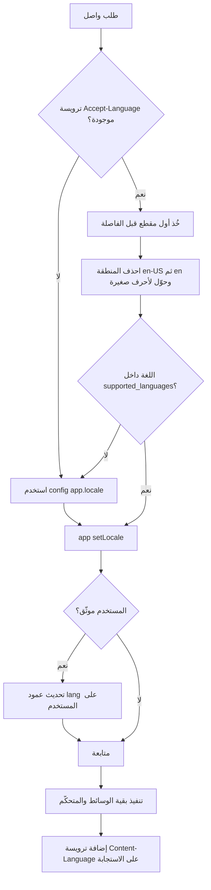
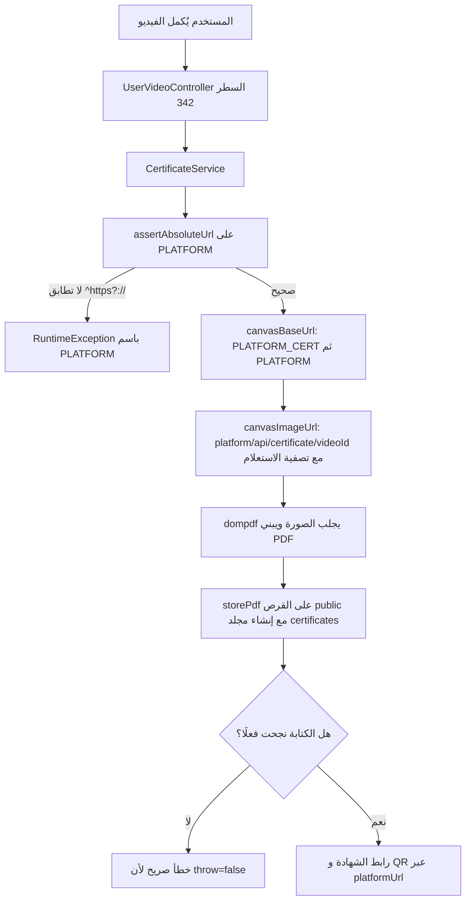

# الفصل السادس: التعريب وتعدد اللغات، الملفات والتخزين، وملاحظات تقنية مهمة

## ما ستتعلمه في هذا الفصل

- كيف يحدّد الـ backend لغة كل طلب عبر ترويسة `Accept-Language`، وما الأثر الجانبي الخفي لذلك على جدول المستخدمين.
- الفرق بين قواميس الترجمة الثلاثة الموجودة في المشروع: `lang/en.json` و `lang/ar/*.php` و الأعمدة المترجَمة في قاعدة البيانات.
- كيف تعمل حزمة `spatie/laravel-translatable` هنا، وأي الموديلات والأعمدة تستخدمها.
- لماذا لا يمكن الترتيب (`sort_column`) على الأعمدة المترجَمة، وما الرمز الذي يعيده الـ API في هذه الحالة.
- منظومة رفع الملفات والتخزين (`filesystems`)، وأربع دوال مساعدة غير متسقة يجب الحذر منها.
- الحقيقة الصادمة حول تحديد معدل الطلبات (rate limiting) في هذا المشروع: لا وجود له فعليًا.
- إعداد `Telescope`، ومسارُه المُبهم، والفخّ الذي جعل زوّار الشهادات يحصلون على 403.
- ملفات الاختبارات الموجودة وما يغطّيه كل منها.
- الأخطاء الشائعة: متغيّر `PLATFORM` الفارغ، رموز الأخطاء غير المتوقعة (400 بدل 403)، وتسجيل الطلبات في قاعدة البيانات.

---

## 1. التعريب وتعدد اللغات (Localization)

### 1.1 المفهوم أولًا

في أي واجهة برمجية (API) تخدم أكثر من لغة، يجب أن يكون تحديد اللغة **جزءًا من الطلب لا من حالة الخادم**. الأسلوب المعياري هو أن يرسل العميل ترويسة `Accept-Language` مع كل طلب، ويقوم الخادم بضبط لغته الحالية (locale) في بداية دورة الطلب، ثم تعود جميع الرسائل والبيانات المترجَمة بتلك اللغة.

في هذا المشروع يوجد **ثلاث طبقات** من الترجمة:

| الطبقة | المكان | ما تُترجمه |
|---|---|---|
| رسائل النظام القصيرة | `lang/en.json`، `lang/ar.json` | رسائل النجاح والخطأ التي يعيدها الـ API |
| قواميس PHP لكل لغة | `lang/ar/*.php`، `lang/en/*.php` | التحقق، كلمات المرور، الترقيم، نصوص الشهادة، أسماء الدول |
| محتوى قاعدة البيانات | أعمدة JSON عبر `spatie/laravel-translatable` | المقالات، الأسئلة الشائعة، الفيديوهات… |

### 1.2 الوسيط `ApiLocalization`

الملف: `app/Http/Middleware/API/ApiLocalization.php`

منطقه بالترتيب:

1. يقرأ ترويسة `Accept-Language`.
2. يأخذ **أول مقطع** قبل الفاصلة (فمثلًا `ar,en-US;q=0.9` تصبح `ar`).
3. يحذف جزء المنطقة: `en-US` تصبح `en`.
4. يحوّل النتيجة إلى أحرف صغيرة.
5. إن كانت الترويسة غائبة، **أو** كانت اللغة غير مدرجة في `config('app.supported_languages')`، يعود إلى `config('app.locale')`.
6. ينفّذ `app()->setLocale($locale)`.
7. **أثر جانبي مهم:** إن كان الطلب موثّقًا (مستخدم مسجَّل)، يكتب اللغة على صف المستخدم:

```php
auth()->user()->update(['lang' => $locale]);
```

8. يضيف ترويسة `Content-Language` على الاستجابة.

هذا الوسيط مُسجَّل في `bootstrap/app.php` وهو **الوسيط الأول في كل مجموعات المسارات الأربع** (`guest`, `admin`, `user`, `web`).

> ⚠️ لاحظ الخطوة 7: هذه عملية **كتابة على قاعدة البيانات في كل طلب موثّق**، حتى لو لم تتغيّر اللغة. طالب مدقّق يجب أن يلاحظ أن هذا يزيد الحمل ويُعطّل بعض أنواع التخزين المؤقت، وأن الأنظف هو التحقق `if ($user->lang !== $locale)` قبل التحديث.

### 1.3 مخطط تدفّق تحديد اللغة



### 1.4 الإعدادات في `config/app.php`

| المفتاح | القيمة / متغير البيئة | ملاحظة |
|---|---|---|
| `supported_languages` | `['en','ar']` (السطر 81) | **مفتاح مخصّص** غير موجود في Laravel الافتراضي، يستهلكه `ApiLocalization` |
| `locale` | `APP_LOCALE`، الافتراضي `en` | اللغة الاحتياطية عند فشل التفاوض |
| `fallback_locale` | الافتراضي `en` | |
| `faker_locale` | الافتراضي `en` | لبيانات الاختبار |
| `timezone` | `APP_TIMEZONE`، الافتراضي `UTC` | |
| `platform` | `PLATFORM`، الافتراضي `http://localhost:3000/` (السطر 130) | يُستخدم في الشهادات والروابط |
| `platform_cert` | `PLATFORM_CERT` (السطر 131) | خاص بصفحة الشهادة |

### 1.5 قواميس الرسائل: اصطلاحان في المشروع نفسه

**الاصطلاح الأول:** ملفات JSON في جذر `lang/`، تُستدعى بلا مساحة أسماء:

```php
return $this->sendResponse(true, $data, trans('Listed'));
```

أمثلة على المفاتيح: `technicalError`, `disabledAccount`, `tryAgainAfter`, `otpHasBeenSentToYourMobile`, `otpHasBeenExpired`, `invalidOtp`, `successfullLogin`, `successfullUpload`, `successfullDelete`, `successfullUpdate`, `Listed`, `youAreNotAllowedToDoThisAction`, `UnderReview`, `Rejected`.

> ⚠️ **مشكلة قائمة فعلًا:** `lang/en.json` يحتوي **121 مفتاحًا** بينما `lang/ar.json` يحتوي **109 مفاتيح** — أي أن **12 مفتاحًا مفقود في العربية**. سلوك Laravel عند غياب المفتاح هو إعادة **المفتاح نفسه كنص**، فيرى المستخدم العربي نصًا إنجليزيًا مثل `technicalError` بدلًا من رسالة مفهومة. مزامنة القاموسين مهمة صيانة حقيقية في هذا المشروع.

**الاصطلاح الثاني:** قواميس PHP لكل لغة داخل `lang/ar/` و `lang/en/`:

| الملف | الغرض |
|---|---|
| `auth.php` | رسائل المصادقة القياسية |
| `certificate.php` | نصوص صفحة الشهادة وملف الـ PDF |
| `map_countries.php` | أسماء الدول |
| `msg.php` و `msg.json` | رسائل عامة |
| `pagination.php` | نصوص الترقيم |
| `passwords.php` | رسائل إعادة كلمة المرور |
| `validation.php` | رسائل التحقق |

وتُستدعى بمساحة أسماء: `trans('msg.technicalError')`.

> 📌 نقطة تعليمية: وجود اصطلاحين (`trans('key')` و `trans('msg.key')`) لنفس النوع من الرسائل هو **دَين تقني**. عند إضافة رسالة جديدة، ابحث أولًا أين توجد نظيراتها بدلًا من اختيار الاصطلاح عشوائيًا.

### 1.6 الأعمدة المترجَمة عبر `spatie/laravel-translatable`

المفهوم: بدلًا من جدول منفصل للترجمات، تُخزَّن قيم كل اللغات في **عمود JSON واحد** بالشكل `{"en": "...", "ar": "..."}`. وعند القراءة يعيد الموديل تلقائيًا القيمة الموافقة للـ locale الحالي — وهذا بالضبط سبب أهمية الوسيط `ApiLocalization`.

ستة موديلات تستخدم `HasTranslations`:

| الموديل | الملف | الأعمدة المترجَمة |
|---|---|---|
| `Blog` | `app/Models/Blog.php` | `title`, `short_description`, `content` |
| `Faq` | `app/Models/Faq.php` | `title`, `description` |
| `Question` | `app/Models/Question.php` | `question`, `answers_a`, `answers_b`, `answers_c` (وغيرها) |
| `Scenes` | `app/Models/Scenes.php` | `title` |
| `Tawia` | `app/Models/Tawia.php` | `title`, `description`, `symptoms` |
| `Video` | `app/Models/Video.php` | `video_url`, `title`, `description` |

ملاحظتان دقيقتان:

- في `Tawia` أُعلن `public $translatable` بينما تستخدم بقية الموديلات `protected` — عدم اتساق شكلي لا يغيّر السلوك لكنه يلفت النظر.
- في `Video` العمود `video_url` **مترجَم أيضًا**، أي أن لكل لغة رابط فيديو مختلف (نسخة عربية ونسخة إنجليزية من المقطع). هذا قرار تصميمي مقصود ومهم لفهم منصة تدريبية.

### 1.7 الفخّ الشهير: لا يمكن الترتيب على الأعمدة المترجَمة

المكان: `app/Http/Traits/Controller/IndexTrait.php` في الدالة `indexInit()` — وهي نقطة القوائم المشتركة لكل الموارد.

الترتيب مبني على **قائمة بيضاء** (whitelist):

```php
$allowedSortColumns = array_unique(array_merge(['id'], $this->columns, array_keys($sortAllowed)));
// ثم يُتحقق منها:
'sort_column' => 'in:'.implode(',', $allowedSortColumns),
```

النتيجة العملية: إذا أرسل العميل عمودًا غير مدرج — مثل عمود JSON مترجَم — فسيحصل على **422 Unprocessable Entity** من طبقة التحقق، **وليس** خطأ SQL. هذا سلوك جيد (فشل مُبكر ونظيف) لكنه يفاجئ مطوّر الواجهة الذي يتوقع أن كل عمود قابل للترتيب.

بقية سلوك `indexInit()` المهم:

| السلوك | التفصيل |
|---|---|
| `$sortAllowed` | قيمته إمّا `true` (ترتيب مباشر `orderBy`، للأعمدة الافتراضية/المحسوبة) أو `callable(fn($query, $direction))` لترتيب يحتاج `join` |
| التصفية | `likeStart` للأعمدة التي لا تنتهي بـ `_id` |
| البحث الحر `q` | `orLike` على كل أعمدة `$this->columns` مجمّعة بـ OR |
| المحذوفات | `withTrashed()` افتراضيًا |
| التصدير | عند `export=true` يرفع `memory_limit` إلى 2G ويبثّ عبر `$this->resourceExport::collection($items->cursor())` |
| الترتيب الافتراضي | `primaryKey DESC` |

وقيود القوائم من `config/constants.php`:

| المفتاح | القيمة |
|---|---|
| `per_page` | افتراضي 20، الحد الأقصى 100 (عبر `list_validations`) |
| `page` | الحد الأقصى 1000 |
| `date_from` / `date_to` | صيغة صارمة `Y-m-d\TH:i:s.v\Z` |

---

## 2. رفع الملفات والتخزين

### 2.1 المفهوم

Laravel يجرّد التخزين عبر `Storage` و"الأقراص" (disks): تكتب الشيفرة إلى قرص منطقي، والإعداد يقرّر أين يقع فعليًا (نظام ملفات محلي، مجلد عام، أو S3). فائدة هذا التجريد أن الانتقال إلى سحابة لا يستلزم تغيير شيفرة الرفع.

### 2.2 الإعداد في `config/filesystems.php`

| القرص | الجذر | الرابط العام |
|---|---|---|
| `local` | `storage/app` | لا يوجد (غير عام) |
| `public` | `storage/app/public` | `APP_URL . '/storage'`، الظهور `public` |
| `s3` | خدمة أمازون | حسب الإعداد |

القرص الافتراضي يأتي من `FILESYSTEM_DISK` وقيمته `local` (وهي كذلك في `.env.example`).

> تذكير عملي: القرص `public` لا يُخدَم للمتصفح إلا بعد تنفيذ `php artisan storage:link` الذي يُنشئ الوصلة الرمزية `public/storage → storage/app/public`.

### 2.3 أربع دوال مساعدة غير متسقة في `app/Helpers/general.php`

هذه من أهم الملاحظات في المشروع كلّه — أربع طرق مختلفة لرفع ملف:

| الدالة | السطر | إلى أين تكتب | ملاحظات |
|---|---|---|---|
| `upload()` | 196 | `public_path('uploads/'.$path)` عبر `move()` | **تتجاوز `Storage` تمامًا** |
| `upload64()` | 213 | نفس المكان | جسم الدالة **مطابق حرفيًا** لـ `upload()` — تكرار صريح |
| `uploadToStorage()` | 230 | القرص `public` | ينفّذ `mkdir` ثم `chmod 0755`، ويعيد `['relativePath', 'absolutePath' => asset('storage/…')]` |
| `uploadStorage()` | 264 | القرص `local` تحت `public/<path>` | مسار مربك: مجلد باسم `public` داخل قرص غير عام |

اسم الملف في كل الحالات يُبنى بالصيغة:

```php
sha1(time() . $file->getClientOriginalName()) . '.' . $extension;
```

وهناك `FileBaseURl()` التي تُلحق `config('app.file_url')` كبادئة للروابط.

> ⚠️ **عيب تصميمي صريح:** `uploadToStorage()` عند الفشل **تُعيد كائن `response()->json(...)` من داخل دالة مساعدة** بدلًا من رمي استثناء. هذا يخلط بين طبقة الأدوات وطبقة HTTP، ويعني أن المُستدعي قد يظنّ أنه استلم مسار ملف وهو في الحقيقة يحمل استجابة HTTP. الصحيح: رمي استثناء وترك تحويله إلى استجابة لطبقة معالجة الأخطاء.

كذلك في `app/Http/Controllers/BaseApiController.php` الدالة `export()` (السطر 93) تكتب ملفات التصدير وتبني رابطها في السطر 121 بالشكل `asset(Storage::url($path))`.

**الدرس للطالب:** عند إضافة ميزة رفع جديدة، لا تختر دالة عشوائيًا. تعرّف أولًا: هل الملف يجب أن يكون عامًا؟ إن نعم فاستخدم القرص `public` (`uploadToStorage`) والتزم به، ولا تُنشئ طريقًا خامسًا.

---

## 3. تحديد معدل الطلبات (Rate Limiting)

### 3.1 المفهوم

تحديد المعدل يمنع إسراف الاستخدام وهجمات التخمين (brute force) بحدّ عدد الطلبات المسموحة لكل عميل في نافذة زمنية. في Laravel يتحقّق ذلك بالوسيط `throttle:`، ويُخصَّص عبر `RateLimiter::for(...)` في أحد الـ providers.

### 3.2 الواقع في هذا المشروع

**لا يوجد تحديد معدل على الإطلاق.** لا وسيط `throttle:` في أي من ملفات المسارات، ولا استدعاء واحد لـ `RateLimiter::for()` في الـ providers.

وهنا الالتباس الأكبر: الملف `app/Http/Middleware/RequestRateMiddleware.php` **اسمه مُضلِّل**. هو لا يحدّ شيئًا، بل **يسجّل** كل طلب في جدول `request_rates` ثم يُنادي `$next($request)` دائمًا. الأعمدة التي يسجّلها:

| العمود | المحتوى |
|---|---|
| `method` | فعل HTTP |
| `url` | العنوان المطلوب |
| `rate` | القيمة الثابتة `1` |
| `ip` | عنوان العميل |
| `referrer` | المُحيل |
| body | **كامل جسم الطلب بصيغة JSON** |
| headers | **كل الترويسات** |

> 🔴 **مخاطر يجب أن يفهمها الطالب:**
> 1. **خطر أمني/خصوصية:** تسجيل الجسم والترويسات يعني أن كلمات المرور ورموز `Authorization: Bearer` تُخزَّن نصًا في قاعدة البيانات. أي وصول لقاعدة البيانات يصبح وصولًا للحسابات.
> 2. **خطر أداء:** كتابة صف على القاعدة في **كل** طلب، بما فيها طلبات الزوّار، أي أن حركة عامة كبيرة تتحول إلى ضغط كتابة.
> 3. **خطر إدراكي:** الاسم يجعل القارئ يفترض وجود حماية غير موجودة.
>
> الإصلاح المنطقي: تعمية أو استبعاد الحقول الحسّاسة، وإضافة `throttle:` حقيقي على المسارات الحسّاسة (تسجيل الدخول، إرسال OTP)، وإعادة تسمية الوسيط ليعبّر عن وظيفته (تسجيل لا تحديد).

---

## 4. Telescope

### 4.1 المفهوم

`laravel/telescope` لوحة تشخيص تعرض الطلبات والاستعلامات والوظائف والاستثناءات والبريد… إلخ. هي أداة تطوير قوية، ولذلك **كشفها في بيئة الإنتاج بلا حماية يعدّ ثغرة**، لأنها تعرض بيانات الطلبات الفعلية.

### 4.2 الإعداد في `config/telescope.php`

| المفتاح | القيمة |
|---|---|
| `enabled` | `TELESCOPE_ENABLED`، الافتراضي **`true`** |
| `path` | `TELESCOPE_PATH`، الافتراضي **`tel513462`** (مسار مُبهم بدل `telescope`) |
| `driver` | `database` |
| المراقبات (watchers) | كلها مُفعّلة افتراضيًا |

إبهام المسار (`tel513462`) هو "أمان بالإخفاء" (security through obscurity): يقلّل الاكتشاف العابر لكنه **ليس** بديلًا عن المصادقة. ولذلك يوجد أيضًا في `bootstrap/app.php` مجموعة وسائط باسم `telescope-auth` تستعمل `AuthenticateWithBasicAuth`، ومسارات Telescope نفسها تبقى محميّة عبر `config('telescope.middleware')`.

### 4.3 الفخّ الموثّق: 403 على مسار الشهادة العام

في `bootstrap/app.php` تعليق صريح يحفظ درسًا مكلّفًا:

> يجب **عدم** إلحاق `Telescope\Authorize` بمجموعة `web` كاملة.

السبب: عندما أُلحق بها، أصبح المسار العام للشهادة `storage/certificates/{pdf}` يعيد **403 للزوّار**، لأن دالة `viewTelescope` تستقبل `$user` بلا نوع محدّد، وتمنع من ليس مستخدمًا موثّقًا. النتيجة: بوابة أداة تطوير خنقت ميزة عامة تخصّ المستخدم النهائي.

**الدرس:** الوسائط تُلحق بأضيق نطاق ممكن. وسيط تخويل خاص بأداة واحدة يجب أن يبقى على مسارات تلك الأداة.

ملاحظة إضافية: التحقق من `CSRF` مستبعَد لـ `*` و `telescope/*`، وهناك `$middleware->trustProxies(at: '*')` مع `statefulApi()`.

---

## 5. الاختبارات

### 5.1 كيف تُشغّل

```bash
cd backend
php artisan test
# أو
vendor/bin/phpunit
```

الإعداد في `phpunit.xml`.

### 5.2 ما هو موجود فعلًا

| الملف | ما يغطّيه |
|---|---|
| `tests/Feature/AppTest.php` | مُشغِّل عام `test_crud($resource, $token, ...)` يضرب `index`, `edit`, `show`, `create`, `store`, `update`, `destroy`, `toggleActive` — ويرسل `Accept-Language: en` |
| `tests/Feature/SortingTest.php` | الترتيب برمز إداري على `Partner` و `Story` و `Video`، ويشمل `test_partners_invalid_sort_direction_returns_422` المستند إلى `constants.list_validations`. يستخدم `RefreshDatabase` |
| `tests/Feature/StoriesTest.php` | سلوك القصص |
| `tests/Feature/CertificateStorageTest.php` | يستخدم `Storage::fake('public')` ويتأكد أن `CertificateService::storePdf` **يُنشئ** مجلد `certificates/` |
| `tests/Unit/CertificateServiceTest.php` | منطق خدمة الشهادة بمعزل |
| `tests/Unit/ExampleTest.php` | مثال Laravel الافتراضي |

> 📌 لماذا اختبار إنشاء مجلد `certificates/` مهم؟ لأن النشر الجديد ينفّذ `storage:link` فقط ولا يُنشئ المجلدات الفرعية، و `file_put_contents` **لا يُنشئ** المجلدات الناقصة. فبدون إنشاء صريح للمجلد، توليد الشهادة يفشل على أول خادم جديد فقط — وهو أسوأ أنواع الأخطاء: يعمل عندك ويفشل في الإنتاج.

---

## 6. الأخطاء الشائعة والملاحظات المهمة للطالب

### 6.1 `PLATFORM` الفارغ: أخطر مصيدة في المشروع

الملف: `app/Services/CertificateService.php` — وهو يوثّق الفخّ بنفسه.

القاعدة التي يجب حفظها:

```php
// env('PLATFORM', 'http://localhost:3000/')
// إذا كان السطر في .env هو:  PLATFORM=
// فالنتيجة '' وليست القيمة الافتراضية!
```

السبب: `env()` تعيد القيمة الافتراضية **فقط عندما يكون المفتاح غائبًا تمامًا**، لا عندما يكون موجودًا بقيمة فارغة.

الأثر الذي وقع فعلًا: منصّة فارغة ⇒ روابط نسبية ⇒ `dompdf` لم يستطع جلب صورة الـ canvas ⇒ **ملف PDF فارغ**، وأكواد QR تشير إلى لا شيء.

العلاج المطبَّق: الدالة `assertAbsoluteUrl()` (نحو السطر 58) ترمي `RuntimeException` تذكر اسم `PLATFORM` صراحةً إن لم تُطابق القيمة النمط `^https?://`. أي **الفشل الصريح المبكر** بدل الفشل الصامت.

الدوال ذات الصلة:

| الدالة | الدور |
|---|---|
| `platformUrl()` | روابط QR والبريد |
| `canvasBaseUrl()` | تُفضّل `PLATFORM_CERT` ثم تعود إلى `PLATFORM` — لأن بعض المضيفين لا يستطيعون تحليل اسم مضيفهم العام |
| `canvasImageUrl()` | تبني `<platform>/api/certificate/<videoId>?<query>` مع تصفية قيم الاستعلام الفارغة/`null` |
| `storePdf()` | تكتب عبر القرص `public` الذي أُعدّ بـ `throw => false`، لذا **تُتحقَّق** الكتابة ولا تُفترض |

المستهلك: `app/Http/Controllers/User/UserVideoController.php:342`.

> ⚠️ المتغيّران `PLATFORM` و `PLATFORM_CERT` **موجودان بقيمة فارغة** في `.env.example` (السطران 74–75) — أي أن النسخة الافتراضية للمشروع هي بالضبط حالة الفشل. أول ما تفعله بعد نسخ `.env.example`: املأهما بروابط مطلقة.

### 6.2 مخطط تدفّق توليد الشهادة



### 6.3 رموز حالة غير متوقعة

| الوسيط | الملف | السلوك |
|---|---|---|
| `AdminMiddleware` | `app/Http/Middleware/API/` | يتحقق من حارس `auth('admin')`، ويعيد **HTTP 400** (لا 403) مع `"You are not admin user"` |
| `UserMiddleware` | `app/Http/Middleware/API/` | يتحقق من حارس `auth('user')`، ويعيد **HTTP 400** مع `"You are not user"` |

هذا انحراف عن الدلالة المعيارية (403 Forbidden للتخويل). لكنه **سلوك قائم يعتمد عليه العميلان**، فتغييره تغيير في العقد بين الخادم والواجهات ولا يُفعل منفردًا.

ومعالجات الاستثناءات في `bootstrap/app.php` تعيد المُغلَّف القياسي:

| الاستثناء | الرمز | الرسالة |
|---|---|---|
| `AuthenticationException` | 401 | `Unauthorized` |
| `NotFoundHttpException` | 404 | `EndPoint Is Not Found` |

بشرط واحد مهم: **فقط عندما يكون `expectsJson()` صحيحًا**. أي أن طلبًا بلا ترويسة `Accept: application/json` قد يحصل على صفحة خطأ HTML بدل المُغلَّف — سبب شائع لارتباك مطوّري الواجهة وأدوات مثل curl.

### 6.4 قائمة تحقّق سريعة للطالب

1. أرسل `Accept-Language` مع كل طلب؛ وإلا حصلت على `en` صامتًا.
2. أرسل `Accept: application/json`؛ وإلا فقدت مُغلَّف الأخطاء.
3. لا تحاول الترتيب على عمود مترجَم — النتيجة 422.
4. عند إضافة رسالة جديدة: أضِفها إلى **كلا** `en.json` و `ar.json`.
5. عند إضافة عمود مترجَم جديد: أضِفه إلى `$translatable`، واجعل نوعه JSON، ولا تضعه في قائمة الترتيب.
6. بعد `composer install`: أنشئ `.env`، ثم `key:generate`، ثم `migrate`، ثم `storage:link`، ثم **املأ `PLATFORM`**.
7. لا تعتمد على وجود حماية معدل طلبات — لا وجود لها.
8. أوقف `TELESCOPE_ENABLED` في أي بيئة عامة، ولا تُلحق `Telescope\Authorize` بمجموعة `web`.

---

### أسئلة للمراجعة

**1) كيف يحدّد الخادم لغة الطلب، وماذا يحدث إذا أرسل العميل `Accept-Language: fr`؟**
`ApiLocalization` يأخذ أول مقطع ويحذف المنطقة ويصغّر الأحرف، ثم يتحقق من وجود اللغة في `config('app.supported_languages')` = `['en','ar']`. لأن `fr` غير مدرجة، يعود إلى `config('app.locale')` أي `en` — بصمت ودون خطأ.

**2) ما الأثر الجانبي غير المتوقع في وسيط التعريب؟**
إن كان الطلب موثّقًا فهو ينفّذ `auth()->user()->update(['lang' => $locale])` في **كل** طلب، أي كتابة على قاعدة البيانات لكل نداء API موثّق حتى بلا تغيير فعلي للغة.

**3) لماذا يُرجع طلب الترتيب على عمود `title` المترجَم رمز 422 وليس خطأ SQL؟**
لأن `IndexTrait::indexInit()` يبني قائمة بيضاء `$allowedSortColumns` من `['id']` و `$this->columns` و مفاتيح `$sortAllowed`، ثم يتحقق `'sort_column' => 'in:…'`. الرفض يحدث في طبقة التحقق قبل الوصول إلى قاعدة البيانات.

**4) ما الفرق بين `trans('technicalError')` و `trans('msg.technicalError')`؟**
الأولى تقرأ من ملف JSON في جذر `lang/` (`en.json` / `ar.json`)، والثانية من قاموس PHP `lang/<locale>/msg.php`. المشروع يستخدم الاصطلاحين معًا وهذا دَين تقني يجب مراعاته عند إضافة رسائل.

**5) ما المشكلة الفعلية بين `lang/en.json` و `lang/ar.json`؟**
غير متزامنين: 121 مفتاحًا بالإنجليزية مقابل 109 بالعربية، أي 12 مفتاحًا مفقودًا. عند غياب المفتاح يعيد Laravel المفتاح نفسه، فيظهر نص إنجليزي خام للمستخدم العربي.

**6) هل يوجد تحديد معدل طلبات في المشروع؟ وما دور `RequestRateMiddleware`؟**
لا يوجد إطلاقًا: لا `throttle:` ولا `RateLimiter::for()`. و `RequestRateMiddleware` مُضلِّل الاسم — هو يسجّل كل طلب (الفعل، الرابط، IP، المُحيل، كامل الجسم، وكل الترويسات) في جدول `request_rates` ثم يمرّر الطلب دائمًا. مخاطره: تسريب رموز `Bearer` وكلمات المرور إلى قاعدة البيانات، وكتابة إضافية على كل طلب.

**7) لماذا مُنع إلحاق `Telescope\Authorize` بمجموعة `web`؟**
لأن ذلك جعل المسار العام `storage/certificates/{pdf}` يعيد 403 للزوّار: دالة `viewTelescope` تستقبل `$user` بلا نوع وتمنع غير الموثّقين. فمُنِعَ الإلحاق العام، وبقيت مسارات Telescope محميّة عبر `config('telescope.middleware')` ومجموعة `telescope-auth` بـ `AuthenticateWithBasicAuth`.

**8) اشرح فخّ `PLATFORM=` الفارغ وكيف عُولج.**
`env()` تعيد قيمتها الافتراضية فقط إذا كان المفتاح **غائبًا**؛ أما المفتاح الموجود بقيمة فارغة فيُنتج `''`. النتيجة كانت روابط نسبية، فعجز `dompdf` عن جلب صورة الـ canvas (PDF فارغ) وأشارت أكواد QR إلى لا شيء. العلاج: `assertAbsoluteUrl()` ترمي `RuntimeException` تذكر `PLATFORM` إن لم تُطابق القيمة `^https?://`.

**9) لماذا يوجد `PLATFORM_CERT` إلى جانب `PLATFORM`؟**
لأن `canvasBaseUrl()` تفضّل `PLATFORM_CERT` ثم تعود إلى `PLATFORM`؛ وذلك لبيئات لا يستطيع فيها الخادم تحليل اسم مضيفه العام من الداخل، فيحتاج عنوانًا داخليًا لجلب صورة الشهادة.

**10) لماذا يهمّ اختبار `CertificateStorageTest` أن `storePdf` يُنشئ مجلد `certificates/`؟**
لأن النشر الجديد ينفّذ `storage:link` فقط ولا ينشئ المجلدات الفرعية، و `file_put_contents` لا تُنشئ المجلدات الناقصة. بدون إنشاء صريح، يعمل الكود محليًا ويفشل على خادم جديد — لذا يثبّت الاختبار هذا الشرط باستخدام `Storage::fake('public')`.
