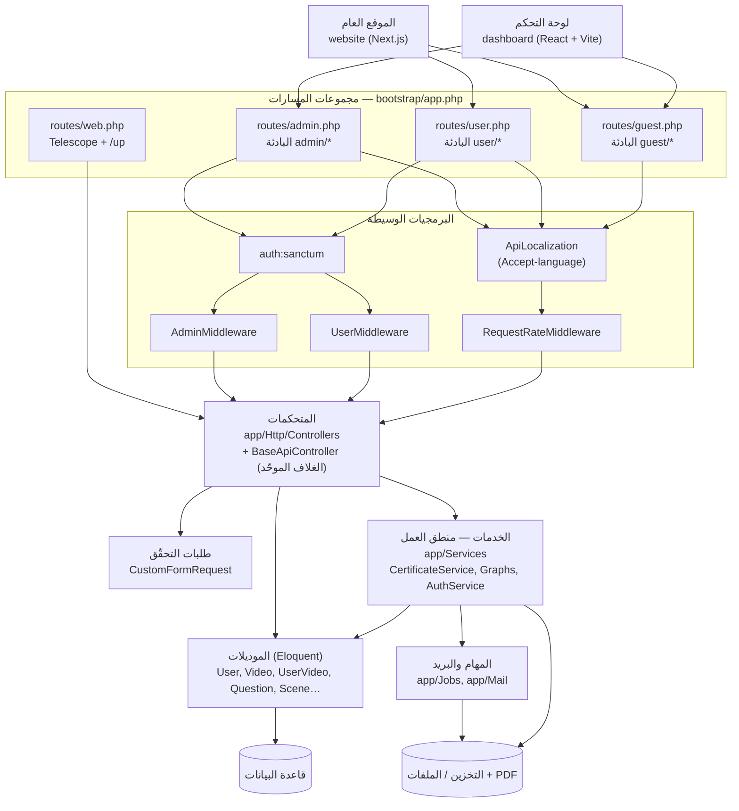

# دليل دراسة الواجهة الخلفية (Backend) لمنصة أمان

## مقدمة

«أمان» منصة تدريب وتوعية تتكوّن من واجهة خلفية واحدة (Laravel) تخدم تطبيقين أماميين: لوحة تحكم إدارية (`dashboard`) وموقع عام (`website`). هذا الدليل يشرح الواجهة الخلفية وحدها: بنيتها، قاعدة بياناتها، مصادقتها، نقاط النهاية فيها، ومنطق العمل الذي تقوم عليه (مسار التدريب وتوليد الشهادات).

**لمن هذا الدليل؟** للطالب أو المطوّر الجديد الذي سيعمل على هذه الواجهة الخلفية، ويحتاج فهمًا عمليًا لا سطحيًا: لماذا كُتب الكود بهذا الشكل، وأين المصائد.

**كيف يُقرأ؟** كل فصل يبدأ بـ«المفهوم أولًا» ثم «التطبيق في أمان»، وينتهي بأسئلة مراجعة مع أجوبتها. القراءة بالترتيب هي الأفضل، لكن الفصل الرابع (الـ API) يصلح كمرجع يُعاد إليه دائمًا. الملاحظات المعنونة بـ«المخاطر» أو «العلل المرصودة» تصف الكود كما هو فعلًا — تُقرأ للتمييز لا للتقليد.

## المتطلبات المسبقة

قبل البدء، يُفترض أنك تعرف:

- **PHP الحديث**: الأصناف، الواجهات (interfaces)، الـ traits، الـ enums، الـ namespaces، و Composer.
- **Laravel الأساسي**: دورة الطلب، الـ routing، المتحكمات (Controllers)، الـ Middleware، Eloquent ORM، الـ Migrations، الـ Service Container، الـ Queues.
- **REST و HTTP**: الأفعال (GET/POST/PUT/DELETE)، رموز الحالة، الترويسات (خصوصًا `Authorization` و`Accept-language`)، وصيغة JSON.
- **SQL وقواعد البيانات العلائقية**: الجداول، المفاتيح الأجنبية، الـ JOIN، والفهارس.
- **أساسيات سطر الأوامر و Git**.

من المفيد أيضًا — وليس شرطًا — معرفة مسبقة بـ Laravel Sanctum و spatie/laravel-permission.

## فهرس الفصول

| # | الفصل | الوصف |
|---|-------|-------|
| 1 | [نظرة عامة](01-نظرة-عامة.md) | المشروع والتقنيات وبنية المجلدات والتوجيه والـ Middleware والإعدادات والتشغيل. |
| 2 | [قاعدة البيانات والموديلات](02-قاعدة-البيانات-والموديلات.md) | مخطط الجداول والعلاقات، الموديلات، الحقول المترجمة، الـ Enums، الـ Seeders. |
| 3 | [المصادقة والصلاحيات](03-المصادقة-والصلاحيات.md) | رموز Sanctum، دخول المدير والمستخدم، OTP، إعادة كلمة المرور، الأدوار والصلاحيات. |
| 4 | [واجهات الـ API](04-واجهات-الـ-API.md) | كل نقاط النهاية حسب الجمهور (guest/user/admin) مع التحقّق والغلاف الموحّد والترقيم. |
| 5 | [المنطق وميزات النظام](05-المنطق-وميزات-النظام.md) | مسار التدريب، توليد الشهادات (PDF + QR + العربية)، الإحصاءات، تصدير Excel، الـ Jobs والبريد. |
| 6 | [التعريب والملاحظات التقنية](06-التعريب-والملاحظات-التقنية.md) | تعدد اللغات، الملفات والتخزين، تحديد المعدل، Telescope، الاختبارات، الأخطاء الشائعة. |

## خريطة معمارية عامة



القراءة السريعة للمخطط: الواجهتان تتحدثان إلى بادئات مختلفة من الـ API نفسه؛ كل بادئة لها سلسلة وسائط خاصة؛ المتحكمات نحيفة تفوّض المنطق إلى `Services`؛ الموديلات هي المنفذ الوحيد إلى قاعدة البيانات؛ والمخرجات الثقيلة (الشهادات، التصدير) تمرّ بالمهام والتخزين.

## مسار دراسة مقترح

**المرحلة 1 — الأرضية (الفصل 1).** اقرأ الفصل الأول كاملًا. عمليًا: هيّئ المشروع (`composer install`، `.env`، `key:generate`، `migrate`)، شغّل الخادم، افتح `/up` و`/telescope`، ثم افتح `bootstrap/app.php` وتتبّع مجموعات المسارات الأربع بعينك حتى تحفظها.

**المرحلة 2 — البيانات (الفصل 2).** اقرأ المخطط والموديلات. عمليًا: شغّل الـ Seeders، ثم افتح قاعدة البيانات واستعرض `videos`, `questions`, `scenes`, `user_videos`, `user_answers`. جرّب في `php artisan tinker` قراءة عمود مترجَم بلغتين، ولاحظ لماذا لا يمكن الترتيب عليه.

**المرحلة 3 — الدخول (الفصل 3).** عمليًا: نفّذ دخول مدير عبر `guest/*` واحصل على رمز، ثم استخدمه على نقطة `admin/*`، ثم أرسل الطلب نفسه بلا رمز ولاحظ شكل الـ 401. جرّب تدفّق OTP كاملًا وتابع البريد/الرمز في Telescope أو السجلّات.

**المرحلة 4 — الواجهات (الفصل 4).** استخدم الفصل كمرجع: اختر ثلاث نقاط نهاية من كل جمهور ونفّذها. عمليًا: جرّب الترقيم والفلترة والترتيب والتصدير على أي نقطة قائمة، وأرسل حمولة ناقصة لترى غلاف الـ 422.

**المرحلة 5 — منطق العمل (الفصل 5).** هذا لبّ المشروع. عمليًا: ألحق مستخدمًا ببرنامج، أجب الأسئلة حتى النهاية، أضف تقييمًا، ثم ولّد الشهادة وافتح ملف الـ PDF وتحقّق من الاسم العربي ورمز QR. ثم عد إلى `UserVideo` واقرأ شروط الأهلية سطرًا سطرًا.

**المرحلة 6 — التفاصيل الحاسمة (الفصل 6).** عمليًا: بدّل `Accept-language` على النقطة نفسها ولاحظ الفروق، ارفع ملفًا وتتبّع مساره في التخزين، ثم أفرغ `PLATFORM` وشاهد المصيدة الموثّقة في الفصل.

بعد إتمام المراحل: أعد حلّ أسئلة المراجعة في الفصول الستة من دون النظر إلى الأجوبة.

## أوامر سريعة

```bash
# التهيئة الأولى (داخل backend/)
composer install
# أنشئ backend/.env يدويًا (لا يوجد .env.example)
php artisan key:generate
php artisan migrate
php artisan db:seed
php artisan storage:link

# التشغيل — من جذر الـ monorepo (كل التطبيقات)
npm run dev

# التشغيل — الواجهة الخلفية وحدها
php artisan serve                 # http://localhost:8000
composer run dev                  # server + queue:listen + pail + vite

# الاختبارات
php artisan test
vendor/bin/phpunit

# قائمة الانتظار والمجدول
php artisan queue:work
php artisan schedule:work

# أدوات مساعدة
php artisan route:list
php artisan tinker
php artisan optimize:clear        # تفريغ كل الذواكر المؤقتة
```

المنافذ: الواجهة الخلفية `8000`، لوحة التحكم `5173`، الموقع `3000`.
